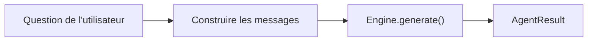
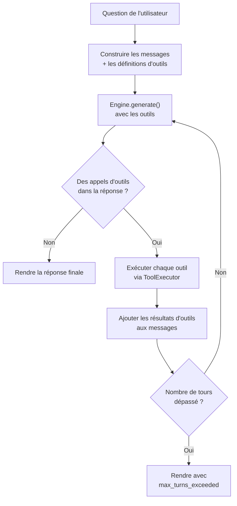
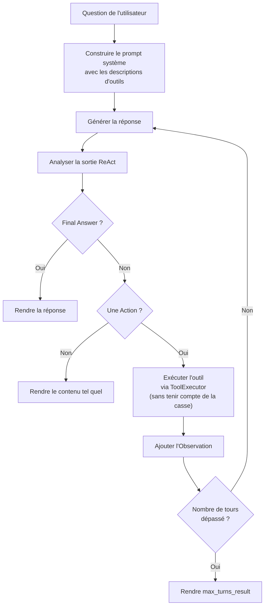
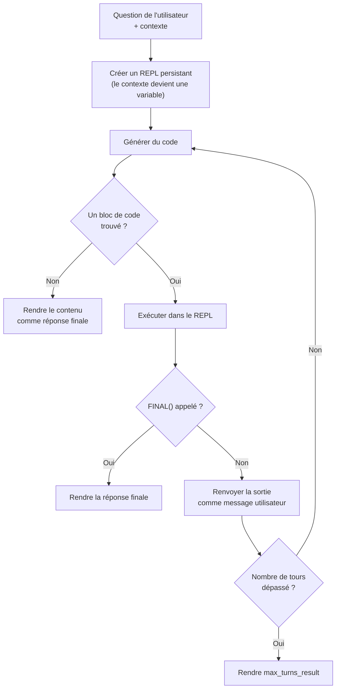
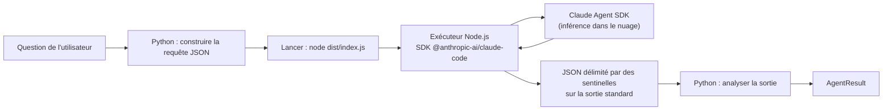

# La primitive de logique agentique

La primitive de logique agentique fournit des **agents interchangeables** qui traitent les questions avec des degrés de sophistication variables — de la simple réponse en un tour aux boucles d'appel d'outils multi-tours, au raisonnement façon ReAct, à l'exécution de code façon CodeAct, à la décomposition récursive et à la communication avec des agents externes.

---

## La classe abstraite BaseAgent

Tous les agents implémentent la classe de base abstraite `BaseAgent`, qui fournit à la fois le contrat `run()` et des méthodes concrètes qui évitent de réécrire le même code dans chaque sous-classe :

```python
class BaseAgent(ABC):
    agent_id: str
    accepts_tools: bool = False  # redéfini par ToolUsingAgent

    def __init__(
        self,
        engine: InferenceEngine,
        model: str,
        *,
        bus: Optional[EventBus] = None,
        temperature: float = 0.7,
        max_tokens: int = 1024,
    ) -> None: ...

    @abstractmethod
    def run(
        self,
        input: str,
        context: Optional[AgentContext] = None,
        **kwargs: Any,
    ) -> AgentResult:
        """Exécute l'agent sur *input* et renvoie un AgentResult."""
```

### L'attribut de classe `accepts_tools`

L'attribut de classe `accepts_tools` (`False` par défaut) permet à la CLI et au SDK de détecter tout seuls quels agents acceptent qu'on leur passe des outils. Les agents qui posent `accepts_tools = True` peuvent recevoir `--tools` en ligne de commande et `tools=` dans le SDK.

### Les méthodes concrètes d'aide

`BaseAgent` fournit cinq méthodes concrètes dont les sous-classes se servent pour ne pas dupliquer la logique commune :

| Méthode | À quoi elle sert |
|--------|---------|
| `_emit_turn_start(input)` | Publie `AGENT_TURN_START` sur le bus d'événements |
| `_emit_turn_end(**data)` | Publie `AGENT_TURN_END` sur le bus d'événements |
| `_build_messages(input, context, *, system_prompt)` | Assemble la liste des messages à partir du prompt système facultatif, du contexte de conversation et de la question de l'utilisateur |
| `_generate(messages, **extra_kwargs)` | Appelle `engine.generate()` avec les valeurs par défaut mémorisées (modèle, température, nombre maximum de jetons) |
| `_max_turns_result(tool_results, turns, content)` | Construit l'`AgentResult` standard pour le cas où `max_turns` est dépassé |
| `_strip_think_tags(text)` | Retire les blocs `<think>...</think>` de la sortie du modèle (méthode statique) |

### Le contrat `run()`

La méthode `run()` est le point d'entrée unique de toutes les implémentations d'agent. Elle reçoit :

- **`input`** — le texte de la question de l'utilisateur
- **`context`** — un `AgentContext` facultatif, avec l'historique de la conversation, les noms d'outils et les résultats de mémoire
- **`**kwargs`** — les paramètres supplémentaires propres à l'implémentation

Elle renvoie un `AgentResult` contenant le contenu de la réponse, les éventuels résultats d'outils, le nombre de tours effectués et des métadonnées.

### Les dataclasses associées

```python
@dataclass(slots=True)
class AgentContext:
    conversation: Conversation    # Messages antérieurs, pour le contexte multi-tours
    tools: List[str]              # Noms des outils disponibles
    memory_results: List[Any]     # Résultats de recherche mémoire récupérés d'avance
    metadata: Dict[str, Any]      # Paires clé-valeur arbitraires

@dataclass(slots=True)
class AgentResult:
    content: str                  # Le texte de la réponse de l'agent
    tool_results: List[ToolResult]  # Résultats des invocations d'outils
    turns: int                    # Nombre de tours d'inférence effectués
    metadata: Dict[str, Any]      # Métadonnées arbitraires
```

---

## ToolUsingAgent

`ToolUsingAgent` est une classe de base intermédiaire pour les agents qui acceptent et utilisent des outils. Elle étend `BaseAgent` avec :

- **`accepts_tools = True`** — active l'introspection des outils par la CLI et le SDK
- **`ToolExecutor`** — initialisé depuis la liste d'outils fournie, il prend en charge l'aiguillage avec l'analyse des arguments JSON, le suivi de la latence et l'intégration au bus d'événements
- **`max_turns`** — la limite d'itérations de la boucle, configurable (10 par défaut)

```python
class ToolUsingAgent(BaseAgent):
    accepts_tools: bool = True

    def __init__(
        self,
        engine: InferenceEngine,
        model: str,
        *,
        tools: Optional[List[BaseTool]] = None,
        bus: Optional[EventBus] = None,
        max_turns: int = 10,
        temperature: float = 0.7,
        max_tokens: int = 1024,
    ) -> None: ...
```

Tous les agents qui utilisent des outils (`OrchestratorAgent`, `NativeReActAgent`, `NativeOpenHandsAgent`, `RLMAgent`) étendent cette classe.

!!! info "Les agents qui contournent ToolUsingAgent"
    Certains agents étendent `BaseAgent` directement et posent `accepts_tools = False` : `SimpleAgent` (un seul tour, pas d'outils), `OpenHandsAgent` (la gestion des outils revient à openhands-sdk) et `ClaudeCodeAgent` (les outils sont gérés par le Claude Agent SDK). `SandboxedAgent` étend lui aussi `BaseAgent` directement, parce qu'il enveloppe un autre agent au lieu d'appeler des outils lui-même.

---

## Choisir un agent

Commence ici. Prends l'agent le plus simple qui fasse le travail — les agents simples sont plus rapides, consomment moins de jetons et se déboguent plus facilement. Ne va chercher un agent plus complexe que si la tâche l'exige.

| Cas d'usage | Agent | Pourquoi |
|---|---|---|
| Question-réponse simple, en un tour | `simple` | Aucun surcoût, un seul appel d'inférence |
| Plusieurs étapes avec des outils (calculatrice, recherche, fichiers) | `orchestrator` | Boucle d'appel de fonctions, la plus compatible avec les modèles au format OpenAI |
| Chaînes de raisonnement explicites | `native_react` | Boucle Pensée-Action-Observation fondée sur [ReAct (Yao et coll., 2023)](https://arxiv.org/abs/2210.03629) ; les traces de raisonnement sont visibles et déboguables |
| Génération et exécution de code | `native_openhands` | Motif CodeAct inspiré d'[OpenHands (Wang et coll., 2024)](https://arxiv.org/abs/2407.16741) ; génère et exécute du Python en ligne |
| Longs documents, décomposition récursive | `rlm` | Range le contexte dans un REPL persistant, décompose par des appels récursifs à un sous-modèle |
| Entrées non fiables | `sandboxed` enveloppant n'importe quel agent | Isolation par conteneur, réseau coupé et listes blanches de montages |

**Conseil général :** `orchestrator` est le choix par défaut pour la plupart des tâches qui utilisent des outils. Prends `native_react` quand tu veux voir les traces de raisonnement (pour déboguer ou auditer le comportement de l'agent, par exemple). Prends `native_openhands` quand la tâche consiste à écrire et à lancer du code. Prends `rlm` quand le contexte est trop long pour tenir dans une seule fenêtre de prompt.

---

## Les implémentations d'agents

### SimpleAgent

**Clé de registre :** `simple`

L'implémentation la plus simple — une chaîne question-réponse en un seul tour, sans outils. Étend `BaseAgent` directement (n'accepte pas d'outils).



Comment ça marche :

1. Appelle `_emit_turn_start()` pour publier `AGENT_TURN_START` sur le bus d'événements
2. Appelle `_build_messages()` pour assembler la liste des messages à partir du contexte de conversation et de la question de l'utilisateur
3. Appelle `_generate()` pour invoquer le moteur avec les valeurs par défaut mémorisées
4. Appelle `_emit_turn_end()` et renvoie un `AgentResult` avec `turns=1`

```python
from diapason.agents.simple import SimpleAgent

agent = SimpleAgent(engine, model="qwen3:8b", bus=bus)
result = agent.run("Quelle est la capitale de la France ?")
print(result.content)  # « La capitale de la France est Paris. »
```

### OrchestratorAgent

**Clé de registre :** `orchestrator`

Un agent multi-tours qui met en œuvre une **boucle d'appel d'outils**. Étend `ToolUsingAgent`. Le modèle peut demander des invocations d'outils, et les résultats lui sont renvoyés pour la suite du traitement, jusqu'à ce qu'il produise une réponse textuelle finale.

Deux modes sont gérés :

- **`function_calling`** (par défaut) — utilise le format d'appel de fonctions d'OpenAI, via `ToolExecutor.get_openai_tools()`
- **`structured`** — utilise le format de sortie structurée, pour les modèles qui le prennent en charge



Comment ça marche :

1. Construit les messages initiaux à partir du contexte et de la question de l'utilisateur
2. Convertit les outils disponibles au format d'appel de fonctions d'OpenAI, via `ToolExecutor.get_openai_tools()`
3. Entre dans une boucle (jusqu'à `max_turns` itérations) :
    - Appelle `engine.generate()` avec les messages et les définitions d'outils
    - Si la réponse contient des `tool_calls`, exécute chaque outil et ajoute les résultats comme messages `TOOL`
    - S'il n'y a aucun `tool_calls`, rend le contenu comme réponse finale
4. Si `max_turns` est dépassé, rend le dernier contenu ou un message d'avertissement

```python
from diapason.agents.orchestrator import OrchestratorAgent
from diapason.tools.calculator import CalculatorTool
from diapason.tools.think import ThinkTool

agent = OrchestratorAgent(
    engine,
    model="qwen3:8b",
    tools=[CalculatorTool(), ThinkTool()],
    bus=bus,
    max_turns=10,
)
result = agent.run("Combien font 2^10 + 3^5 ?")
# L'agent peut appeler l'outil calculatrice, obtenir « 1267 », puis répondre
```

### NativeReActAgent

**Clé de registre :** `native_react` (alias : `react`)

Un agent ReAct (Reasoning + Acting) qui met en œuvre une boucle **Pensée-Action-Observation**. Étend `ToolUsingAgent`. Le modèle est invité à produire du texte structuré avec les champs `Thought:`, `Action:`, `Action Input:` et `Final Answer:`, que l'agent analyse pour piloter l'exécution des outils.



Comment ça marche :

1. Construit un prompt système avec des descriptions d'outils enrichies, via `build_tool_descriptions()`. L'analyse ne tient pas compte de la casse.
2. Génère une réponse et analyse la sortie structurée ReAct
3. Si un `Final Answer:` est trouvé, le rend
4. Si une `Action:` est trouvée, exécute l'outil et lui renvoie le résultat sous forme d'`Observation:`
5. Boucle jusqu'à ce qu'une réponse finale soit produite ou que `max_turns` soit dépassé

!!! note "Compatibilité ascendante"
    L'ancien chemin d'import `from diapason.agents.react import ReActAgent` fonctionne toujours, par une passerelle de compatibilité. L'alias de registre `"react"` pointe lui aussi vers `NativeReActAgent`.

```python
from diapason.agents.native_react import NativeReActAgent

agent = NativeReActAgent(
    engine,
    model="qwen3:8b",
    tools=[CalculatorTool(), ThinkTool()],
    max_turns=10,
)
result = agent.run("Quelle est la racine carrée de 256 ?")
```

### NativeOpenHandsAgent

**Clé de registre :** `native_openhands`

Un agent façon CodeAct, qui génère et exécute du code Python. Étend `ToolUsingAgent`. Il peut aussi invoquer des outils par une sortie structurée `Action:` / `Action Input:`. Les URL présentes dans l'entrée sont récupérées d'avance et insérées telles quelles pour le modèle.

Comment ça marche :

1. Construit un prompt système détaillé, avec des descriptions d'outils enrichies (via le constructeur partagé `build_tool_descriptions()`) et les consignes d'exécution de code
2. Récupère d'avance les URL présentes dans l'entrée de l'utilisateur et en insère le contenu directement
3. À chaque tour :
    - Génère une réponse et retire les balises `<think>`
    - Si un bloc de code `\`\`\`python` est trouvé, l'exécute via `code_interpreter`
    - Si un `Action:` / `Action Input:` est trouvé, aiguille vers l'outil
    - Si ni l'un ni l'autre n'est trouvé, rend le contenu comme réponse finale
4. Gère le dépassement de la fenêtre de contexte par une troncature automatique

```python
from diapason.agents.native_openhands import NativeOpenHandsAgent

agent = NativeOpenHandsAgent(
    engine,
    model="qwen3:8b",
    tools=[CalculatorTool(), WebSearchTool()],
    max_turns=3,
    max_tokens=2048,
)
result = agent.run("Résume https://example.com/article")
```

### RLMAgent

**Clé de registre :** `rlm`

Un agent à modèle de langue récursif, fondé sur l'[article RLM](https://arxiv.org/abs/2512.24601). Plutôt que de passer un long contexte directement dans le prompt du modèle, RLM le range dans une variable Python d'un REPL persistant. Un « modèle racine » écrit du code Python pour inspecter, décomposer et traiter le contexte à l'aide d'appels récursifs à un sous-modèle, via `llm_query()` et `llm_batch()`. Étend `ToolUsingAgent`.



Comment ça marche :

1. Crée un REPL persistant avec les rappels `llm_query()` et `llm_batch()`. Les descriptions d'outils y sont injectées par le constructeur partagé `build_tool_descriptions()` quand des outils sont fournis.
2. Injecte dans le REPL, sous forme de variable, le contexte venu des métadonnées de l'`AgentContext` ou des résultats de mémoire
3. Génère du code et l'exécute dans le REPL
4. Si `FINAL(value)` ou `FINAL_VAR("name")` est appelé, rend la réponse finale
5. Si aucun bloc de code n'est trouvé, traite le contenu comme une réponse directe

L'agent accepte des paramètres configurables pour le sous-modèle des appels récursifs :

| Paramètre | Défaut | Description |
|-----------|---------|-------------|
| `sub_model` | le même que `model` | Modèle des appels au sous-modèle |
| `sub_temperature` | `0.3` | Température des appels au sous-modèle |
| `sub_max_tokens` | `1024` | Nombre maximum de jetons des appels au sous-modèle |
| `max_output_chars` | `10000` | Nombre maximum de caractères en sortie du REPL |
| `system_prompt` | `RLM_SYSTEM_PROMPT` | Remplace le prompt système |

```python
from diapason.agents.rlm import RLMAgent

agent = RLMAgent(
    engine,
    model="qwen3:8b",
    max_turns=10,
    sub_model="qwen3:1.7b",  # un modèle plus petit pour les sous-questions
    sub_temperature=0.3,
)
result = agent.run("Résume ce document", context=ctx)
```

### OpenHandsAgent (SDK)

**Clé de registre :** `openhands`

Une fine enveloppe autour du vrai paquet `openhands-sdk`, pour les tâches de développement logiciel pilotées par l'IA. Étend `BaseAgent` directement (n'utilise pas `ToolUsingAgent`, puisque la gestion des outils revient au SDK).

!!! warning "Dépendance facultative"
    Cet agent réclame le paquet `openhands-sdk` (`uv sync --extra openhands`). Le SDK exige Python 3.12+.

Comment ça marche :

1. Importe `openhands.sdk` à l'exécution (import paresseux)
2. Crée un LLM, un Agent et une Conversation depuis le SDK
3. Envoie l'entrée de l'utilisateur comme message et fait tourner la conversation
4. Extrait le contenu du message final de la conversation

```python
from diapason.agents.openhands import OpenHandsAgent

agent = OpenHandsAgent(
    engine,
    model="gpt-4",
    workspace="/path/to/project",
    api_key="sk-...",
)
result = agent.run("Corrige le test qui échoue dans test_utils.py")
```

### ClaudeCodeAgent

**Clé de registre :** `claude_code`

Enveloppe le SDK `@anthropic-ai/claude-code` par un pont en sous-processus Node.js, livré avec lui. Contrairement à tous les autres agents, l'inférence est entièrement prise en charge par le Claude Agent SDK — le moteur d'inférence de Diapason n'est pas utilisé. `ClaudeCodeAgent` est donc un véritable agent externe, dans le même esprit qu'`OpenHandsAgent`, mais mis en œuvre par un sous-processus plutôt que par un SDK Python importable.



Comment ça marche :

1. Au premier appel, copie le `claude_code_runner/` livré avec lui vers `~/.diapason/claude_code_runner/` et lance `npm install --production` si `node_modules` est absent
2. Construit une requête JSON avec `prompt`, `api_key`, `workspace`, `allowed_tools`, `system_prompt` et `session_id`
3. Lance `node dist/index.js` et écrit la requête sur son entrée standard
4. Lit la sortie standard et en extrait la charge JSON comprise entre les sentinelles `---DIAPASON_OUTPUT_START---` et `---DIAPASON_OUTPUT_END---`
5. À défaut de sentinelles, traite toute la sortie standard comme du contenu en texte brut

!!! warning "Node.js 22+ obligatoire"
    `ClaudeCodeAgent` lève `RuntimeError` au moment du `run()` si `node` est introuvable dans le `PATH`. Une variable d'environnement `ANTHROPIC_API_KEY` est nécessaire pour que le Claude Agent SDK s'authentifie.

```python
from diapason.agents.claude_code import ClaudeCodeAgent

agent = ClaudeCodeAgent(
    engine=None,   # inutilisé
    model="",      # inutilisé
    workspace="/path/to/project",
    timeout=120,
)
result = agent.run("Ajoute des annotations de type à toutes les fonctions de utils.py")
```

### SandboxedAgent et ContainerRunner

`SandboxedAgent` et `ContainerRunner` mettent en œuvre ensemble l'**exécution d'agents isolée par conteneur**, sur le modèle d'enveloppe de `GuardrailsEngine`. `SandboxedAgent` enveloppe n'importe quel `BaseAgent` et délègue l'exécution à un conteneur Docker (ou Podman) piloté par `ContainerRunner`.

```mermaid
graph LR
    Q["Question de l'utilisateur"] --> SA["SandboxedAgent.run()"]
    SA --> CR["ContainerRunner.run()"]
    CR --> VALIDATE["Valider les montages<br/>face à la liste blanche"]
    VALIDATE --> DOCKER["docker run --rm<br/>--network none<br/>-i image"]
    DOCKER --> STDIN["Écrire la charge JSON<br/>sur l'entrée standard"]
    STDIN --> CONTAINER["Conteneur : lancer l'agent,<br/>écrire la sortie sur stdout"]
    CONTAINER --> PARSE["Analyser le JSON délimité<br/>par des sentinelles"]
    PARSE --> R["AgentResult"]
```



**ContainerRunner** gère tout le cycle de vie du conteneur :

- Valide les chemins de montage face à une `MountAllowlist` avant de démarrer le conteneur (lève `ValueError` pour un chemin bloqué ou hors de la racine)
- Construit `docker run --rm --network none -i <image>` avec les montages liés en lecture seule, une fois validés
- Envoie une charge JSON sur l'entrée standard du conteneur (le prompt, l'identifiant de l'agent, le modèle et d'éventuels secrets)
- Lit la sortie standard et analyse le JSON délimité par des sentinelles
- En cas de dépassement du délai, tue le conteneur de force par `docker rm -f`
- `cleanup_orphans()` supprime les conteneurs restés en plan portant l'étiquette `diapason-sandbox=true`

**La sécurité des montages** (`sandbox/mount_security.py`) impose deux contrôles indépendants sur chaque chemin monté :

1. **Motifs bloqués :** les composants du chemin sont confrontés à `DEFAULT_BLOCKED_PATTERNS` (`.ssh`, `.env`, `*.pem`, `*.key`, configurations de services dans le nuage, etc.). Une correspondance lève `ValueError`.
2. **Racines autorisées :** si des `roots` sont configurées dans la liste blanche, le chemin résolu doit se trouver sous l'une d'elles. Une liste `roots` vide autorise n'importe quel chemin non bloqué.

```python
from diapason.sandbox import ContainerRunner, SandboxedAgent

runner = ContainerRunner(
    image="diapason-sandbox:latest",
    timeout=60,
    runtime="docker",
)
# Enveloppe n'importe quel BaseAgent
inner = SimpleAgent(engine, model="qwen3:8b")
sandboxed = SandboxedAgent(
    agent=inner,
    runner=runner,
    mounts=["/home/user/data"],
)
result = sandboxed.run("Résume les rapports dans /home/user/data")
```

!!! warning "accepts_tools = False"
    `SandboxedAgent` n'accepte pas d'outils par `--tools` ni par `tools=`. L'appel d'outils à l'intérieur du bac à sable revient à l'agent intérieur qu'il enveloppe.

---

## L'intégration au système d'outils

Toutes les sous-classes de `ToolUsingAgent` passent par le `ToolExecutor` pour aiguiller les appels d'outils. Le système d'outils est bâti sur la classe abstraite `BaseTool` :

```python
class BaseTool(ABC):
    tool_id: str

    @property
    @abstractmethod
    def spec(self) -> ToolSpec:
        """Renvoie la spécification de l'outil."""

    @abstractmethod
    def execute(self, **params: Any) -> ToolResult:
        """Exécute l'outil avec les paramètres donnés."""

    def to_openai_function(self) -> Dict[str, Any]:
        """Convertit au format d'appel de fonctions d'OpenAI."""
```

### Les outils intégrés

| Outil | Clé de registre | Description |
|------|-------------|-------------|
| `CalculatorTool` | `calculator` | Évaluateur d'expressions sûr, fondé sur l'AST |
| `ThinkTool` | `think` | Brouillon de raisonnement (rend l'entrée telle quelle) |
| `RetrievalTool` | `retrieval` | Recherche en mémoire, par un moteur de mémoire |
| `LLMTool` | `llm` | Appels à un sous-modèle (interroger un autre modèle) |
| `FileReadTool` | `file_read` | Lecture de fichier sûre, avec validation du chemin |

### ToolExecutor

Le `ToolExecutor` prend en charge l'aiguillage des outils, avec l'analyse des arguments JSON, le suivi de la latence et l'intégration au bus d'événements :

```python
class ToolExecutor:
    def __init__(self, tools: List[BaseTool], bus: Optional[EventBus] = None):
        self._tools = {t.spec.name: t for t in tools}
        self._bus = bus

    def execute(self, tool_call: ToolCall) -> ToolResult:
        """Analyse les arguments, aiguille vers l'outil, mesure la latence, émet les événements."""

    def get_openai_tools(self) -> List[Dict[str, Any]]:
        """Rend les outils au format d'appel de fonctions d'OpenAI."""
```

Pour chaque appel d'outil :

1. Cherche l'outil par son nom
2. Analyse la chaîne d'arguments JSON
3. Publie `TOOL_CALL_START` sur le bus d'événements
4. Exécute l'outil en le chronométrant
5. Publie `TOOL_CALL_END` avec le statut de réussite et la latence
6. Rend le `ToolResult`

---

## L'intégration au bus d'événements

Tous les agents s'intègrent à l'`EventBus`, pour la télémétrie et la collecte de traces :

| Événement | Publié par | Quand |
|-------|-------------|------|
| `AGENT_TURN_START` | Tous les agents (par la méthode `_emit_turn_start`) | Avant de commencer à traiter la question |
| `AGENT_TURN_END` | Tous les agents (par la méthode `_emit_turn_end`) | Après avoir produit une réponse |
| `TOOL_CALL_START` | ToolExecutor (toutes les sous-classes de `ToolUsingAgent`) | Avant d'exécuter un outil |
| `TOOL_CALL_END` | ToolExecutor (toutes les sous-classes de `ToolUsingAgent`) | Après avoir exécuté un outil |

!!! info "Les événements d'inférence"
    Les événements `INFERENCE_START` et `INFERENCE_END` sont publiés par l'enveloppe `InstrumentedEngine` (dans `telemetry/instrumented_engine.py`), pas par les agents eux-mêmes. La télémétrie reste ainsi facultative et transparente pour le code des agents.

Ces événements sont consommés par le `TelemetryStore` (pour les métriques) et le `TraceCollector` (pour les traces d'interaction).

---

## L'enregistrement des agents

Les agents s'enregistrent par le décorateur `@AgentRegistry.register("nom")` :

```python
from diapason.core.registry import AgentRegistry
from diapason.agents._stubs import BaseAgent

@AgentRegistry.register("my-agent")
class MyAgent(BaseAgent):
    agent_id = "my-agent"

    def run(self, input, context=None, **kwargs):
        ...
```

Pour lister tous les agents enregistrés :

```python
from diapason.core.registry import AgentRegistry

print(AgentRegistry.keys())
# ("simple", "orchestrator", "native_react", "react", "native_openhands", "rlm", "openhands")
```

Pour instancier un agent à partir de sa clé :

```python
agent = AgentRegistry.create("orchestrator", engine, model, tools=tools, bus=bus)
```
