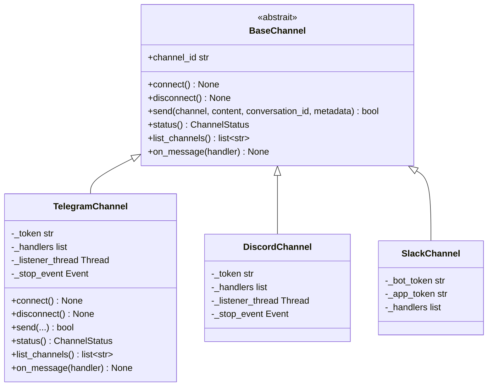
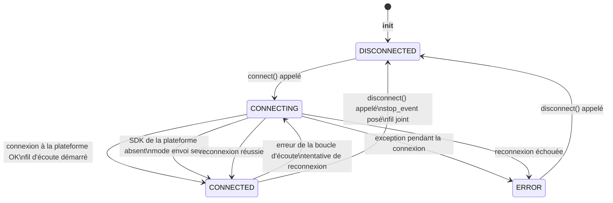
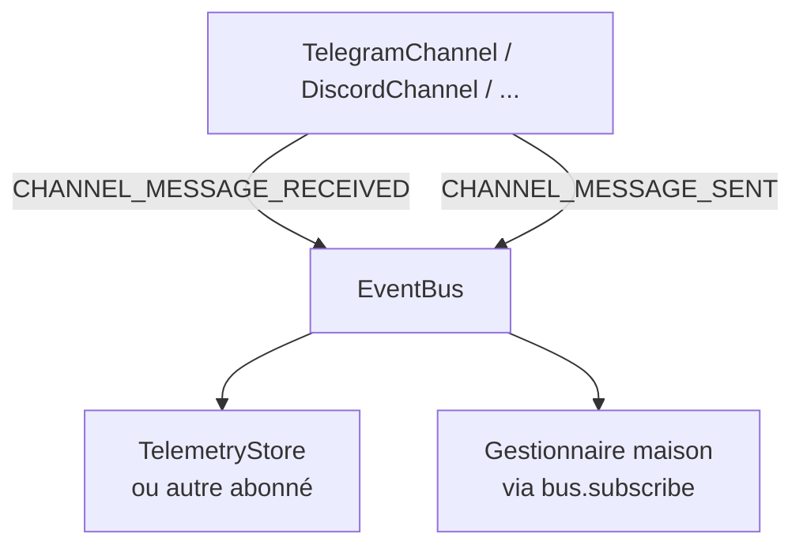

# L'architecture des canaux

Le module des canaux fournit une couche de messagerie indépendante du transport, pour recevoir et envoyer des messages par des plateformes externes. La conception suit le même motif registre-plus-ABC qu'ailleurs dans Diapason : une interface `BaseChannel` définit le contrat, et les implémentations concrètes de chaque plateforme (Telegram, Discord, Slack, WhatsApp, etc.) s'enregistrent pour être découvertes à l'exécution.

---

## Les principes de conception

- **Une ABC indépendante du transport.** `BaseChannel` définit six méthodes abstraites qui couvrent tout le cycle de vie : connexion, déconnexion, envoi, état, liste des canaux et enregistrement d'un gestionnaire de messages.
- **Une intégration directe à la plateforme.** Chaque canal se connecte directement à l'API de sa plateforme — il n'y a aucune passerelle intermédiaire.
- **Un fil d'écoute en arrière-plan.** Les messages entrants arrivent par un fil démon, pas par une boucle d'événements : les canaux fonctionnent donc depuis du code synchrone, sans exiger d'infrastructure asynchrone.
- **Une découverte pilotée par le registre.** Toutes les implémentations de canal s'enregistrent elles-mêmes par `@ChannelRegistry.register("name")` et sont découvrables à l'exécution.

---

## L'ABC BaseChannel



Toutes les sous-classes de `BaseChannel` doivent être enregistrées par `@ChannelRegistry.register("name")` pour être découvrables à l'exécution. `TelegramChannel`, par exemple, est enregistrée sous `"telegram"`, `DiscordChannel` sous `"discord"`, et ainsi de suite.

---

## Le cycle de vie d'un canal

Le cycle de vie de la connexion pour une implémentation de canal ordinaire, de l'instanciation jusqu'à la déconnexion :



L'énumération `ChannelStatus` (`CONNECTED`, `DISCONNECTED`, `CONNECTING`, `ERROR`) suit cet état et l'expose par `status()`.

---

## Le motif de la boucle d'écoute

La plupart des implémentations de canal reçoivent les messages dans un fil démon d'arrière-plan. Le motif est le même d'un canal à l'autre :

1. Le fil d'écoute est démarré dans `connect()`.
2. Il interroge l'API de la plateforme ou s'y met à l'écoute des messages.
3. Les messages entrants sont analysés en instances de la dataclasse `ChannelMessage`.
4. Tous les gestionnaires enregistrés sont appelés l'un après l'autre.
5. Si un `EventBus` est fourni, un événement `CHANNEL_MESSAGE_RECEIVED` est publié.
6. À la déconnexion ou à l'erreur, le fil gère la reconnexion ou sort proprement.

Les exceptions des gestionnaires sont attrapées une par une, pour qu'un gestionnaire en échec n'empêche pas les suivants de tourner :

```python
for handler in self._handlers:
    try:
        handler(msg)
    except Exception:
        logger.exception("Channel handler error")
```

---

## Le parcours des événements

Les événements des canaux sont publiés sur l'`EventBus` sous deux types :

| Événement | Publié par | Quand | Charge utile |
|-------|-------------|------|---------|
| `CHANNEL_MESSAGE_RECEIVED` | La boucle d'écoute | Un message est reçu de la plateforme | `channel`, `sender`, `content`, `message_id` |
| `CHANNEL_MESSAGE_SENT` | `send()` | Un message a bien été remis | `channel`, `content`, `conversation_id` |

Ces événements permettent aux autres modules de réagir à l'activité des canaux sans dépendre directement de l'implémentation du canal. Un abonné de journalisation peut par exemple consigner tous les messages envoyés et reçus, ou un agent peut être câblé pour répondre aux messages entrants d'un canal en s'abonnant à `CHANNEL_MESSAGE_RECEIVED`.



---

## L'enregistrement des gestionnaires

Plusieurs gestionnaires peuvent être enregistrés. Ils sont gardés dans une liste et appelés l'un après l'autre à l'intérieur du fil d'écoute. Rendre une valeur depuis un gestionnaire n'a aucun effet sur l'acheminement du message — le type de retour `Optional[str]` est réservé à un usage futur (l'acheminement d'une réponse automatique, par exemple).

```python
# Alias de type ChannelHandler
ChannelHandler = Callable[[ChannelMessage], Optional[str]]
```

---

## Le modèle des fils d'exécution

Les implémentations de canal utilisent le module `threading` de Python plutôt qu'asyncio. C'est un choix délibéré : le chemin d'inférence au cœur de Diapason est synchrone, et des fils démons se composent plus simplement avec du code synchrone que des coroutines.

| Composant | Fil | Notes |
|-----------|--------|-------|
| `connect()`, `send()`, `disconnect()` | Le fil appelant | Toutes les méthodes publiques sont sûres entre fils |
| La boucle d'écoute | Un fil démon d'arrière-plan | Démarré dans `connect()`, joint dans `disconnect()` |
| Les rappels des gestionnaires | Un fil démon d'arrière-plan | Appelés depuis le fil d'écoute — utilise des structures de données sûres entre fils |

!!! warning "La sûreté des gestionnaires entre fils"
    Les rappels des gestionnaires tournent sur le fil d'écoute, pas sur celui qui a appelé `connect()`. Si ton gestionnaire modifie un état partagé, protège-le par un verrou ou utilise des structures de données sûres entre fils, comme `queue.Queue`.

---

## Ajouter un nouveau canal

Pour ajouter un nouveau canal :

1. Crée un fichier dans `src/diapason/channels/`.
2. Hérite de `BaseChannel` et implémente les six méthodes abstraites.
3. Pose `channel_id` en attribut de classe.
4. Décore la classe avec `@ChannelRegistry.register("name")`.
5. Ajoute le nom du module à `_CHANNEL_MODULES` dans `channels/__init__.py`.

```python
from diapason.channels._stubs import BaseChannel, ChannelMessage, ChannelStatus
from diapason.core.registry import ChannelRegistry

@ChannelRegistry.register("my_platform")
class MyPlatformChannel(BaseChannel):
    channel_id = "my_platform"

    def connect(self) -> None: ...
    def disconnect(self) -> None: ...
    def send(self, channel, content, *, conversation_id="", metadata=None) -> bool: ...
    def status(self) -> ChannelStatus: ...
    def list_channels(self) -> list[str]: ...
    def on_message(self, handler) -> None: ...
```

Une fois enregistré, le canal est découvrable par `ChannelRegistry.get("my_platform")`.

---

## Voir aussi

- [Guide : les canaux](../user-guide/channels.md) — comment utiliser les canaux en pratique
- [Référence d'API : channels](../api-reference/diapason/channels/index.md) — toutes les signatures de classes et de types
- [Architecture : vue d'ensemble](overview.md) — où les canaux se situent dans l'ensemble du système
- [Architecture : les principes de conception](design-principles.md) — le motif du registre et les conventions des ABC
