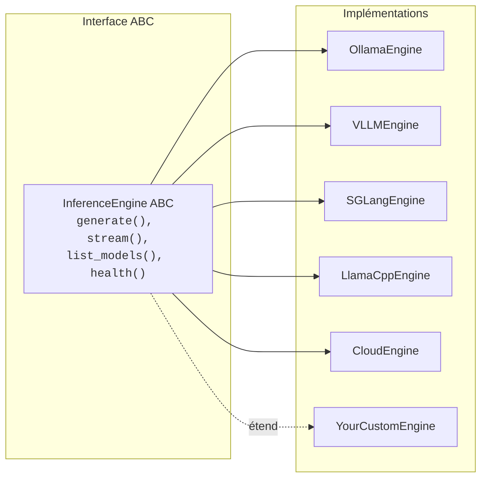

# Les principes de conception

Diapason suit un ensemble de principes de conception qui guident chaque décision d'architecture. Ils garantissent que le cadre reste extensible, portable et agréable à manipuler.

---

## 1. Tout est interchangeable

Chaque grand composant de Diapason est défini comme une **classe de base abstraite** (ABC), dont les implémentations concrètes s'enregistrent à l'exécution. Tu peux donc échanger, étendre ou remplacer n'importe quelle partie du système sans toucher au code existant.



Ce motif vaut pour les cinq primitives :

| Primitive | ABC | Implémentations |
|--------|-----|----------------|
| Moteur | `InferenceEngine` | Ollama, vLLM, SGLang, llama.cpp, Cloud |
| Mémoire | `MemoryBackend` | SQLite, FAISS, ColBERT, BM25, Hybrid |
| Agents | `BaseAgent` | Simple, Orchestrator, NativeReAct, NativeOpenHands, RLM, OpenHands, ClaudeCode, Operative, MonitorOperative |
| Apprentissage | `RouterPolicy` | Heuristic, TraceDriven, GRPO |
| Outils | `BaseTool` | Calculator, Think, Retrieval, LLM, FileRead |

Ajouter une implémentation demande deux choses : implémenter l'ABC, puis l'enregistrer. Le reste du système la découvre et l'utilise tout seul.

---

## 2. Piloté par les registres

Tous les composants extensibles utilisent le motif du **décorateur `@XRegistry.register("name")`**. L'enregistrement a lieu à l'import : aucune fonction fabrique ni fichier de configuration n'est à modifier.

```python
from diapason.core.registry import EngineRegistry
from diapason.engine._stubs import InferenceEngine

@EngineRegistry.register("my-engine")
class MyEngine(InferenceEngine):
    engine_id = "my-engine"

    def generate(self, messages, *, model, **kwargs):
        ...
    def stream(self, messages, *, model, **kwargs):
        ...
    def list_models(self):
        ...
    def health(self):
        ...
```

La classe de base générique `RegistryBase[T]` fournit :

- **Un cloisonnement par classe** — chaque sous-classe typée (`EngineRegistry`, `MemoryRegistry`, etc.) a son propre stockage d'entrées : les enregistrements ne fuient jamais d'un registre à l'autre
- **La détection des doublons** — enregistrer deux fois la même clé lève `ValueError`
- **L'instanciation à l'exécution** — `Registry.create(key, *args)` cherche et instancie en une seule étape
- **L'introspection** — `keys()`, `items()` et `contains()` pour découvrir les composants disponibles

!!! info "Pourquoi des décorateurs plutôt que des fichiers de configuration ?"
    Le motif du décorateur fait qu'ajouter un composant se joue dans un seul fichier.
    Il n'y a pas de registre central à éditer, pas de YAML à mettre à jour, pas de
    fabrique à modifier. Le composant s'enregistre lui-même, simplement parce qu'il
    est importé.

---

## 3. Hors ligne d'abord

Diapason est conçu pour fonctionner **entièrement sans accès au réseau**. Tout le cœur — inférence, mémoire, agents, outils, télémétrie — tourne sur la machine. Les API dans le nuage sont des extensions facultatives, jamais des prérequis.

| Fonctionnalité | Comportement hors ligne |
|---------|-----------------|
| Inférence | Ollama, vLLM, SGLang et llama.cpp tournent tous sur la machine |
| Mémoire | SQLite/FTS5 utilise le module `sqlite3` intégré à Python |
| Plongements | Les modèles `sentence-transformers` tournent sur la machine |
| Télémétrie | Sur SQLite, entièrement local |
| Traces | Sur SQLite, entièrement local |
| Outils | Calculator, Think et FileRead sont tous locaux |
| Configuration | Un fichier TOML sur le disque |

Les moteurs Cloud (OpenAI, Anthropic, Google) sont accessibles par le moteur `cloud`, facultatif, mais ils :

- ne s'enregistrent que si les paquets SDK correspondants sont installés
- ne s'activent que si les clés d'API sont posées en variables d'environnement
- ne sont jamais nécessaires à une fonctionnalité du cœur

```python
# Ceci marche sans la moindre connexion réseau
from diapason import Diapason

j = Diapason(engine_key="ollama")  # Serveur Ollama local
response = j.ask("Bonjour")
```

---

## 4. Attentif au matériel

Diapason **détecte tout seul le matériel** au démarrage et recommande le moteur d'inférence le mieux adapté. La fonction `detect_hardware()` sonde :

| Matériel | Méthode de détection |
|----------|-----------------|
| Cartes NVIDIA | `nvidia-smi` (nom, VRAM, nombre) |
| Cartes AMD | `rocm-smi` (nom du produit) |
| Apple Silicon | `system_profiler SPDisplaysDataType` |
| Processeur | `/proc/cpuinfo` ou `sysctl` (chaîne de marque) |
| Mémoire vive | `/proc/meminfo` ou `sysctl hw.memsize` |

La fonction `recommend_engine()` associe un moteur à chaque matériel :

| Matériel | Moteur recommandé |
|----------|-------------------|
| Pas de carte graphique | `llamacpp` (optimisé pour le processeur) |
| Apple Silicon | `ollama` (accélération Metal) |
| NVIDIA de centre de données (A100, H100, etc.) | `vllm` (haut débit) |
| NVIDIA grand public | `ollama` (mise en route facile) |
| Carte AMD | `vllm` (prise en charge de ROCm) |

Cette recommandation est écrite dans `config.toml` pendant `diapason init` et sert de moteur par défaut :

```bash
diapason init --force
# Détecte le matériel, écrit ~/.diapason/config.toml avec :
# [engine]
# default = "vllm"  # (pour une A100)
```

---

## 5. Télémétrie native

Chaque appel d'inférence enregistre tout seul les temps, le nombre de jetons, l'énergie consommée et le coût dans une base SQLite locale. La télémétrie est **de premier rang**, pas une pièce rapportée.

```python
@dataclass(slots=True)
class TelemetryRecord:
    timestamp: float
    model_id: str
    prompt_tokens: int
    completion_tokens: int
    total_tokens: int
    latency_seconds: float
    ttft: float              # Délai jusqu'au premier jeton
    cost_usd: float
    energy_joules: float
    power_watts: float
    engine: str
    agent: str
```

L'enveloppe `instrumented_generate()` s'occupe de toute la télémétrie de façon transparente :

1. Elle note l'instant de départ
2. Elle appelle la méthode `generate()` du moteur
3. Elle note l'instant d'arrivée et extrait le nombre de jetons
4. Elle publie un événement `TELEMETRY_RECORD` sur l'EventBus
5. Le `TelemetryStore`, abonné au bus, persiste l'enregistrement

Le `TelemetryAggregator` offre des requêtes en lecture seule sur les enregistrements stockés :

```bash
diapason telemetry stats          # Statistiques agrégées
diapason telemetry export --json  # Exporte tous les enregistrements
```

!!! note "La télémétrie fait au mieux"
    Si sa mise en place échoue (base verrouillée, par exemple), le système continue
    sans télémétrie plutôt que de lever une erreur. La télémétrie ne bloque jamais
    le flux des questions.

---

## 6. Python d'abord

Diapason offre une **API Python nette** par la classe `Diapason`. Aucun cadre ne te retient : le SDK est un paquet Python standard, aux types bâtis sur des dataclasses, et il n'exige aucun cadre web.

```python
from diapason import Diapason

j = Diapason()
response = j.ask("Bonjour")

# Contrôle complet
result = j.ask_full(
    "Explique l'informatique quantique",
    model="qwen3:8b",
    agent="orchestrator",
    tools=["think"],
    temperature=0.5,
    max_tokens=2048,
)

# Opérations sur la mémoire
j.memory.index("./docs/")
results = j.memory.search("informatique quantique")

# Libération des ressources
j.close()
```

Les choix de conception qui portent ce principe :

- **Des dataclasses** pour tous les types structurés (`Message`, `ModelSpec`, `Trace`, etc.)
- **Des annotations de type** dans tout le code
- **Pas de magie** — initialisation explicite, signatures de méthodes claires
- **Des dépendances facultatives** par les extras (`diapason[server]`, `diapason[memory-colbert]`, etc.)
- **Un empaquetage standard**, avec le backend de construction `hatchling` et le gestionnaire de paquets `uv`

---

## 7. Compatible OpenAI

Le serveur d'API (`diapason serve`) implémente le **format de l'API chat completions d'OpenAI** : Diapason remplace OpenAI sans rien changer dans une application existante.

Les routes prises en charge :

| Route | Méthode | Description |
|----------|--------|-------------|
| `/v1/chat/completions` | POST | Complétions de discussion (au fil de l'eau ou non) |
| `/v1/models` | GET | Liste les modèles disponibles |
| `/health` | GET | Contrôle de santé |

Les formats de requête et de réponse suivent la spécification de l'API OpenAI :

```bash
curl http://localhost:8000/v1/chat/completions \
  -H "Content-Type: application/json" \
  -d '{
    "model": "qwen3:8b",
    "messages": [{"role": "user", "content": "Bonjour"}],
    "temperature": 0.7,
    "max_tokens": 1024,
    "stream": false
  }'
```

Les réponses au fil de l'eau passent par des Server-Sent Events (SSE) et se terminent par `data: [DONE]`, exactement comme le protocole de flux d'OpenAI.

N'importe quelle bibliothèque cliente OpenAI peut se connecter à Diapason :

```python
from openai import OpenAI

client = OpenAI(base_url="http://localhost:8000/v1", api_key="not-needed")
response = client.chat.completions.create(
    model="qwen3:8b",
    messages=[{"role": "user", "content": "Bonjour"}],
)
```

---

## 8. Autonome

Diapason n'a besoin d'**aucun service extérieur** pour son cœur. Tout ce qu'il faut pour le faire tourner est fourni, ou repose sur les bibliothèques standard du système.

| Composant | Dépendance |
|-----------|-----------|
| Configuration | Un fichier TOML, `tomllib` intégré (Python 3.11+) ou `tomli` |
| Mémoire (par défaut) | Le module `sqlite3` intégré |
| Télémétrie | Le module `sqlite3` intégré |
| Traces | Le module `sqlite3` intégré |
| Client HTTP | `httpx` (léger, pur Python) |
| Ligne de commande | `click` + `rich` |
| Bus d'événements | Le module `threading` intégré |

Le seul prérequis extérieur est un moteur d'inférence en marche (Ollama, vLLM, etc.) — c'est le serveur de modèles lui-même, pas une dépendance de Diapason.

Les fonctionnalités facultatives qui demandent des paquets supplémentaires :

| Fonctionnalité | Extra | Paquets |
|---------|-------|----------|
| Mémoire FAISS | `diapason[memory-faiss]` | `faiss-cpu`, `sentence-transformers` |
| Mémoire ColBERT | `diapason[memory-colbert]` | `colbert-ai`, `torch` |
| Mémoire BM25 | `diapason[memory-bm25]` | `rank-bm25` |
| Serveur d'API | `diapason[server]` | `fastapi`, `uvicorn` |
| Inférence Cloud | `diapason[inference-cloud]` | `openai`, `anthropic`, `google-genai` |
| Moteur vLLM | `diapason[inference-vllm]` | `vllm` |
| Ingestion de PDF | `diapason[memory-pdf]` | `pdfplumber` |
| WhatsApp Baileys | `diapason[channel-whatsapp-baileys]` | Node.js 22+ |

Cette conception garantit qu'une installation minimale (`uv sync`) te donne un système pleinement fonctionnel : mémoire SQLite, inférence locale et ligne de commande complète — pas de Docker, pas de base de données extérieure, aucun compte dans le nuage.
