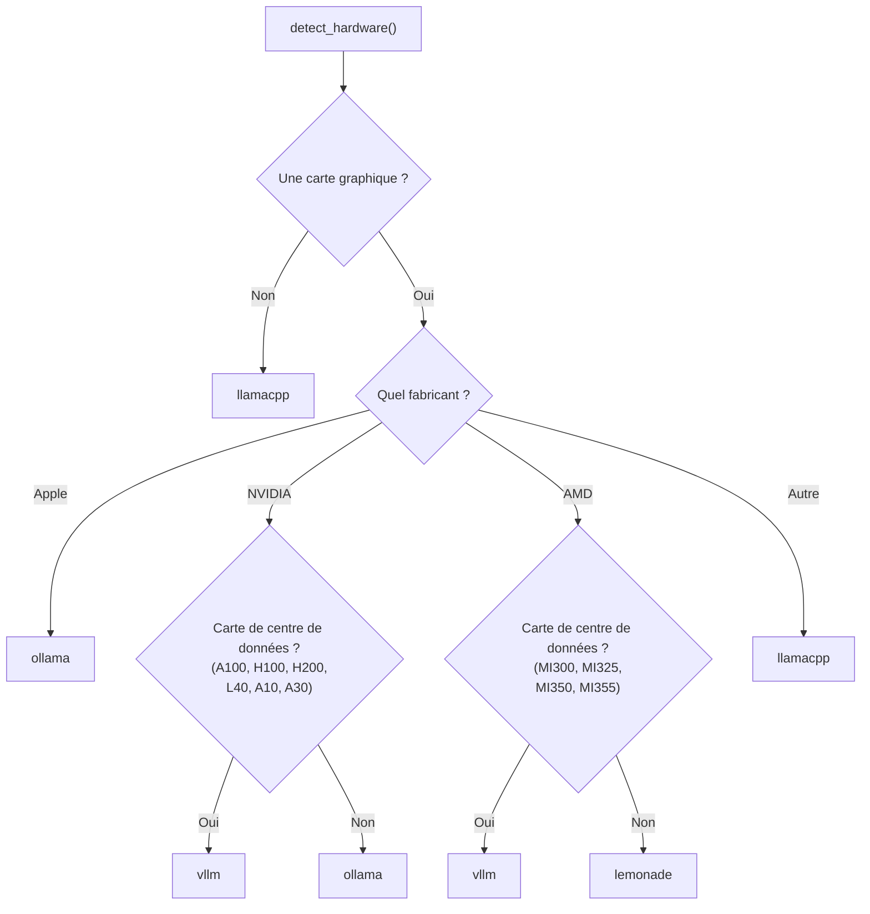

# La primitive du moteur d'inférence

La primitive Engine fournit le **moteur d'exécution de l'inférence** — la couche qui relie Diapason aux serveurs de modèles de langage. Tous les moteurs implémentent la même interface, ce qui rend le passage d'une inférence locale à une inférence distante immédiat, sans toucher au code de l'application.

---

## La classe abstraite InferenceEngine

Chaque moteur étend la classe de base abstraite `InferenceEngine` :

```python
class InferenceEngine(ABC):
    engine_id: str

    @abstractmethod
    def generate(
        self,
        messages: Sequence[Message],
        *,
        model: str,
        temperature: float = 0.7,
        max_tokens: int = 1024,
        **kwargs: Any,
    ) -> Dict[str, Any]:
        """Complétion synchrone — renvoie un dict avec 'content' et 'usage'."""

    @abstractmethod
    async def stream(
        self,
        messages: Sequence[Message],
        *,
        model: str,
        temperature: float = 0.7,
        max_tokens: int = 1024,
        **kwargs: Any,
    ) -> AsyncIterator[str]:
        """Émet les jetons sous forme de chaînes, au fur et à mesure."""

    @abstractmethod
    def list_models(self) -> List[str]:
        """Renvoie les identifiants des modèles disponibles sur ce moteur."""

    @abstractmethod
    def health(self) -> bool:
        """Renvoie True quand le moteur est joignable et en bonne santé."""

    def prepare(self, model: str) -> None:
        """Crochet de préchauffage facultatif, appelé avant la première requête."""
```

### Le format de retour

La méthode `generate()` renvoie un dictionnaire de la forme suivante :

```python
{
    "content": "Le texte de la réponse du modèle",
    "usage": {
        "prompt_tokens": 42,
        "completion_tokens": 128,
        "total_tokens": 170,
    },
    "model": "qwen3:8b",
    "finish_reason": "stop",
    "tool_calls": [...]  # Facultatif, présent si le modèle a demandé des appels d'outils
}
```

Quand le modèle demande des appels d'outils, ils sont extraits puis transmis au format OpenAI :

```python
{
    "tool_calls": [
        {
            "id": "call_abc123",
            "name": "calculator",
            "arguments": "{\"expression\": \"2 + 2\"}"
        }
    ]
}
```

### L'extraction des appels d'outils, quel que soit le fournisseur

Les moteurs normalisent les appels d'outils des différents fournisseurs vers le format plat standard qu'attendent les agents :

| Fournisseur | Format d'origine | Logique d'extraction |
|----------|-------------|-----------------|
| **OpenAI** | `choices[0].message.tool_calls[].function.{name, arguments}` | Extraction directe, `id` repris de `tool_calls[].id` |
| **Anthropic** | Des blocs `content[]` de `type: "tool_use"` | Filtre les blocs `tool_use`, transforme le dict `input` en `arguments` JSON |
| **Google** | `candidates[0].content.parts[]` avec `function_call` | Extrait `function_call.name` et `function_call.args`, sérialise les arguments en JSON |
| **LiteLLM** | Des dicts plats `{id, name, arguments}` (le proxy normalise en amont) | Transmis tels quels |
| **Ollama** | `message.tool_calls[].function.{name, arguments}` | Extrait depuis le format natif d'Ollama, sérialise le dict d'arguments en JSON |

Tous les fournisseurs produisent le même format de sortie, celui que consomment les agents :

```python
{
    "tool_calls": [
        {"id": "call_abc", "name": "calculator", "arguments": "{\"expression\": \"2+2\"}"}
    ]
}
```

---

## Comparaison des moteurs

| Moteur | Clé de registre | Protocole | Port par défaut | Carte graphique nécessaire | Idéal pour |
|---------|-------------|----------|-------------|-------------|----------|
| **Ollama** | `ollama` | API HTTP native | 11434 | Non (facultative) | Débuter, cartes graphiques grand public, Apple Silicon |
| **vLLM** | `vllm` | Compatible OpenAI | 8000 | NVIDIA recommandée | Cartes graphiques de centre de données (A100, H100), fort débit |
| **SGLang** | `sglang` | Compatible OpenAI | 30000 | NVIDIA recommandée | Génération structurée, décodage spéculatif |
| **llama.cpp** | `llamacpp` | Compatible OpenAI | 8080 | Non (optimisé pour le processeur) | Machines sans carte graphique, modèles GGUF, appareils embarqués |
| **MLX** | `mlx` | Compatible OpenAI | 8080 | Apple Silicon | Inférence native sur Apple Silicon, par MLX |
| **LM Studio** | `lmstudio` | Compatible OpenAI | 1234 | Non (facultative) | Interface graphique de bureau, gestion simple des modèles |
| **Exo** | `exo` | Compatible OpenAI | 52415 | Non (réparti) | Inférence répartie sur des appareils hétérogènes |
| **Nexa** | `nexa` | Compatible OpenAI | 18181 | Non (processeur ou carte graphique) | Inférence sur l'appareil, avec des modèles GGUF |
| **Lemonade** | `lemonade` | Compatible OpenAI | 13305 | Carte graphique ou NPU AMD | Cartes graphiques AMD grand public (RDNA), NPU Ryzen AI |
| **Uzu** | `uzu` | Compatible OpenAI | 8000 | Variable | Le moteur d'exécution Uzu |
| **Apple FM** | `apple_fm` | Compatible OpenAI | 8079 | Apple Silicon | Inférence sur l'appareil avec l'Apple Foundation Model |
| **LiteLLM** | `litellm` | Compatible OpenAI | — | Non | Proxy unifié vers plus de 100 fournisseurs de LLM |
| **Cloud** | `cloud` | SDK des fournisseurs | — | Non | Accès aux API d'OpenAI, Anthropic et Google |

### Ollama

Le moteur Ollama dialogue par l'API HTTP native d'Ollama, sur `/api/chat` et `/api/tags`. C'est le moteur par défaut sur Apple Silicon et sur les cartes graphiques NVIDIA grand public.

- **Hôte par défaut :** `http://localhost:11434`
- **Contrôle de santé :** `GET /api/tags`
- **Liste des modèles :** `GET /api/tags` (les noms de modèles y sont extraits)
- **Prise en charge des outils :** passe `tools` dans la charge utile de la requête et extrait `tool_calls` des réponses

### vLLM

Le moteur vLLM passe par l'API `/v1/chat/completions` compatible OpenAI. Il est recommandé pour les cartes graphiques de centre de données (NVIDIA A100, H100, L40, A10, A30 et AMD MI300, MI325, MI350, MI355).

- **Hôte par défaut :** `http://localhost:13305`
- **Contrôle de santé :** `GET /v1/models`
- **Repli sans outils :** si le serveur renvoie un HTTP 400 alors que des outils sont joints, le moteur réessaie tout seul sans eux

### SGLang

Le moteur SGLang passe lui aussi par l'API compatible OpenAI. Il partage la même classe de base `_OpenAICompatibleEngine` que vLLM et llama.cpp.

- **Hôte par défaut :** `http://localhost:30000`
- **Contrôle de santé :** `GET /v1/models`

### llama.cpp

Le moteur llama.cpp se connecte à une instance de `llama-server` par l'API compatible OpenAI. Il est recommandé pour les machines sans carte graphique et les modèles quantifiés au format GGUF.

- **Hôte par défaut :** `http://localhost:8080`
- **Contrôle de santé :** `GET /v1/models`

### Cloud

Le moteur Cloud donne accès aux modèles d'OpenAI, d'Anthropic et de Google par leurs SDK Python respectifs. Il détecte tout seul le fournisseur à partir du nom du modèle :

- Les modèles qui contiennent `"claude"` sont dirigés vers le client **Anthropic**
- Les modèles qui contiennent `"gemini"` sont dirigés vers le client **Google**
- Tous les autres sont dirigés vers le client **OpenAI**

!!! info "Les clés d'API"
    Les modèles distants exigent des clés d'API posées en variables d'environnement :
    `OPENAI_API_KEY`, `ANTHROPIC_API_KEY`, `GEMINI_API_KEY` (ou `GOOGLE_API_KEY`).
    Le moteur cloud n'est enregistré que si les paquets SDK correspondants sont installés.

### MLX

Le moteur MLX sert les modèles par le framework MLX, sur Apple Silicon. Il utilise l'API `/v1/chat/completions` compatible OpenAI.

- **Hôte par défaut :** `http://localhost:8080`
- **Contrôle de santé :** `GET /v1/models`
- **Idéal pour :** les Mac Apple Silicon (M1/M2/M3/M4) qui font tourner nativement des modèles au format MLX ou GGUF

### LM Studio

Le moteur LM Studio se connecte au serveur intégré de l'application de bureau LM Studio, qui expose une API compatible OpenAI.

- **Hôte par défaut :** `http://localhost:1234`
- **Contrôle de santé :** `GET /v1/models`
- **Idéal pour :** qui préfère une interface graphique pour gérer ses modèles et veut un serveur local sans rien configurer

### Exo

Le moteur Exo se connecte au moteur d'exécution réparti Exo, qui découpe les couches du modèle entre plusieurs appareils hétérogènes (un Mac et une machine Linux, par exemple). Exo prend en charge Apple Silicon ainsi que les cartes graphiques NVIDIA et AMD.

- **Hôte par défaut :** `http://localhost:52415`
- **Contrôle de santé :** `GET /v1/models`
- **Installation :** `pip install exo`, ou depuis les sources sur [github.com/exo-explore/exo](https://github.com/exo-explore/exo)
- **Idéal pour :** faire tourner des modèles trop gros pour une seule machine, en les répartissant sur plusieurs Apple Silicon ou sur un parc hétérogène

### Nexa

Le moteur Nexa se connecte au serveur d'inférence sur l'appareil du SDK Nexa, par une couche d'adaptation FastAPI (`nexa_shim.py`). Elle enveloppe `nexaai.LLM` dans une API compatible OpenAI, sur le port 18181.

- **Hôte par défaut :** `http://localhost:18181`
- **Contrôle de santé :** `GET /v1/models`
- **Installation :** `pip install nexaai`
- **Idéal pour :** l'inférence sur l'appareil avec des modèles GGUF, sur Apple Silicon ou sur processeur

### Lemonade

Le moteur Lemonade se connecte au serveur d'inférence [Lemonade](https://lemonade-server.ai/), optimisé pour les cartes graphiques AMD grand public (architecture RDNA) et les NPU Ryzen AI. Il utilise l'API `/v1/chat/completions` compatible OpenAI.

- **Hôte par défaut :** `http://localhost:13305`
- **Contrôle de santé :** `GET /v1/models`
- **Installation :** rends-toi sur [lemonade-server.ai](https://lemonade-server.ai/) pour les instructions propres à chaque plateforme
- **Idéal pour :** les cartes graphiques et les NPU Ryzen AI, et les machines de bureau et portables à base d'AMD

### Uzu

Le moteur Uzu se connecte au moteur d'exécution Uzu. À la différence des autres moteurs compatibles OpenAI, Uzu sert son API à la racine (sans préfixe `/v1`).

- **Hôte par défaut :** `http://localhost:8000`
- **Préfixe de l'API :** (aucun — les points d'entrée sont `/chat/completions` et `/models`)
- **Contrôle de santé :** `GET /models`
- **Idéal pour :** les charges d'inférence optimisées pour Uzu

### Apple FM

Le moteur Apple FM se connecte au SDK Foundation Model d'Apple par une couche d'adaptation FastAPI (`apple_fm_shim.py`). Elle enveloppe `python-apple-fm-sdk` dans une API compatible OpenAI. Il faut macOS 15 ou plus récent, sur Apple Silicon.

!!! note "Le comptage des jetons"
    Le SDK Apple FM n'expose pas le nombre de jetons. La couche d'adaptation renvoie 0 partout. Les mesures de débit et d'énergie par jeton s'en ressentiront.

- **Hôte par défaut :** `http://localhost:8079`
- **Contrôle de santé :** `GET /v1/models`
- **Installation :** `pip install python-apple-fm-sdk`
- **Idéal pour :** faire tourner nativement les Apple Foundation Models sur du matériel Apple Silicon

### LiteLLM

Le moteur LiteLLM se connecte à un serveur proxy LiteLLM, qui offre une interface unique compatible OpenAI vers plus de 100 fournisseurs de LLM (OpenAI, Anthropic, Google, Azure, AWS Bedrock, Groq, Together, et d'autres).

- **Clé de registre :** `litellm`
- **Idéal pour :** les équipes qui ont besoin d'un point d'entrée unique pour router vers plusieurs fournisseurs distants, avec une journalisation et un suivi des coûts unifiés

---

## La détection automatique du matériel

Diapason détecte tout seul le matériel de la machine pour recommander le meilleur moteur. La détection a lieu au chargement de la configuration, par `detect_hardware()` :

| Détection | Méthode | Information extraite |
|-----------|--------|---------------------|
| Carte graphique NVIDIA | `nvidia-smi` | Nom de la carte, VRAM (en Go), nombre |
| Carte graphique AMD | `rocm-smi` | Nom de la carte |
| Apple Silicon | `system_profiler SPDisplaysDataType` | Nom du modèle de puce |
| Processeur | `/proc/cpuinfo` ou `sysctl` | Chaîne de marque |
| Mémoire vive | `/proc/meminfo` ou `sysctl hw.memsize` | Total, en Go |

### La logique de recommandation du moteur

La fonction `recommend_engine()` associe le matériel au meilleur moteur :



---

## La découverte des moteurs

Le module `_discovery.py` fournit trois fonctions pour trouver et instancier les moteurs à l'exécution.

### `get_engine(config, engine_key=None)`

Renvoie un couple `(key, engine_instance)` pour le moteur demandé, ou `None` s'il n'est pas disponible :

1. Si `engine_key` est précisé, tente d'instancier ce moteur-là et de contrôler sa santé
2. Sinon, tente le moteur par défaut de la configuration
3. Si le moteur par défaut n'est pas en état, se rabat sur n'importe quel moteur sain, par `discover_engines()`

### `discover_engines(config)`

Sonde la santé de tous les moteurs enregistrés et renvoie la liste triée des couples `(key, engine)` en bonne santé. Le moteur par défaut de la configuration est trié en premier.

```python
from diapason.engine import discover_engines
from diapason.core.config import load_config

config = load_config()
healthy = discover_engines(config)
# [("ollama", OllamaEngine(...)), ("vllm", VLLMEngine(...))]
```

### `discover_models(engines)`

Appelle `list_models()` sur chaque moteur et renvoie un dictionnaire qui associe les clés de moteur à des listes d'identifiants de modèles :

```python
from diapason.engine import discover_engines, discover_models

engines = discover_engines(config)
models = discover_models(engines)
# {"ollama": ["qwen3:8b", "llama3.2:3b"], "vllm": ["mistral:7b"]}
```

---

## La couche de compatibilité OpenAI

La classe de base `_OpenAICompatibleEngine` fournit une implémentation partagée aux moteurs qui servent le point d'entrée standard `/v1/chat/completions`. vLLM, SGLang, llama.cpp, Lemonade et d'autres en héritent avec un minimum de redéfinitions — le plus souvent `engine_id` et `_default_host`, rien de plus.

```python
class _OpenAICompatibleEngine(InferenceEngine):
    engine_id: str = ""
    _default_host: str = "http://localhost:8000"

    def __init__(self, host: str | None = None, *, timeout: float = 120.0):
        self._host = (host or self._default_host).rstrip("/")
        self._client = httpx.Client(base_url=self._host, timeout=timeout)
```

Les comportements clés :

- **Génération synchrone :** `POST /v1/chat/completions` avec `stream=False`
- **Au fil de l'eau :** `POST /v1/chat/completions` avec `stream=True`, en analysant les lignes SSE `data:`
- **Liste des modèles :** `GET /v1/models`, en extrayant `data[].id`
- **Contrôle de santé :** `GET /v1/models`, avec un délai de 2 secondes
- **Repli sur les appels d'outils :** sur un HTTP 400 alors que la charge utile contient des outils, réessaie sans eux (pour les moteurs qui ne savent pas appeler de fonctions)

---

## La configuration

Les hôtes et les valeurs par défaut des moteurs se configurent dans `~/.diapason/config.toml`, par des **sous-sections imbriquées, une par moteur** :

```toml
[engine]
default = "ollama"

[engine.ollama]
host = "http://localhost:11434"

[engine.vllm]
host = "http://localhost:8000"

[engine.sglang]
host = "http://localhost:30000"

# [engine.llamacpp]
# host = "http://localhost:8080"
# binary_path = ""

# [engine.lemonade]
# host = "http://localhost:13305"
```

La dataclass `EngineConfig` et ses sous-dataclasses, une par moteur, portent ces réglages :

| Classe de configuration | Champ | Défaut | Description |
|---|---|---|---|
| `EngineConfig` | `default` | `"ollama"` (selon le matériel) | Moteur d'inférence préféré |
| `OllamaEngineConfig` | `host` | `http://localhost:11434` | URL du serveur Ollama |
| `VLLMEngineConfig` | `host` | `http://localhost:8000` | URL du serveur vLLM |
| `SGLangEngineConfig` | `host` | `http://localhost:30000` | URL du serveur SGLang |
| `LlamaCppEngineConfig` | `host` | `http://localhost:8080` | URL du serveur llama.cpp |
| `LlamaCppEngineConfig` | `binary_path` | `""` | Chemin du binaire llama.cpp (pour le mode géré) |
| `LemonadeEngineConfig` | `host` | `http://localhost:13305` | URL du serveur Lemonade |

!!! note "La compatibilité avec l'ancien format"
    Les anciens noms de champs à plat — `ollama_host`, `vllm_host`, `llamacpp_host`, `llamacpp_path`, `sglang_host` et `lemonade_host` sous `[engine]` — sont toujours acceptés, comme propriétés de compatibilité sur `EngineConfig`. Les nouvelles configurations doivent utiliser le format à sous-sections imbriquées.

---

## Les fonctions utilitaires

### `messages_to_dicts()`

Convertit une séquence d'objets `Message` en dictionnaires au format OpenAI, en prenant en charge les appels d'outils et leurs identifiants :

```python
from diapason.engine._base import messages_to_dicts
from diapason.core.types import Message, Role

messages = [Message(role=Role.USER, content="Bonjour")]
dicts = messages_to_dicts(messages)
# [{"role": "user", "content": "Bonjour"}]
```

### `EngineConnectionError`

Une exception maison, levée quand un moteur est injoignable. Tous les moteurs attrapent `httpx.ConnectError` et `httpx.TimeoutException` et les relèvent en `EngineConnectionError` :

```python
from diapason.engine import EngineConnectionError

try:
    result = engine.generate(messages, model="qwen3:8b")
except EngineConnectionError as exc:
    print(f"Moteur indisponible : {exc}")
```
