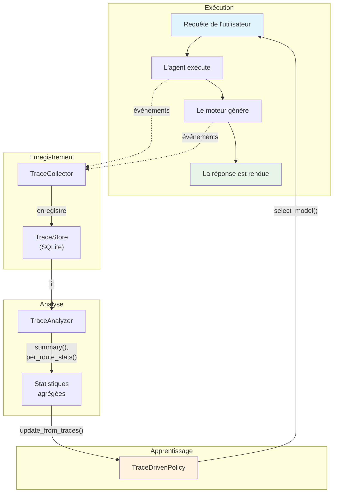

# Apprentissage et traces

Le système d'apprentissage est une **préoccupation transversale** : il relie les cinq primitives par une rétroaction fondée sur les traces. Il décide quel modèle traite chaque requête (les politiques de routage), enregistre l'interaction entière sous forme de trace, analyse les résultats et met à jour les politiques d'après ce qui a marché.

---

## La taxonomie des ABC LearningPolicy

Le système d'apprentissage définit une hiérarchie d'ABC de politiques d'apprentissage. L'ABC de base `LearningPolicy` se spécialise en deux sous-ABC, une par domaine qui s'apprend :

| ABC | Domaine | Description |
|-----|---------|-------------|
| `IntelligenceLearningPolicy` | Routage des modèles | Décide quel modèle traite une requête (remplace l'ancienne `RouterPolicy`) |
| `AgentLearningPolicy` | Comportement de l'agent | Conseille sur la stratégie de l'agent (exemples ICL, choix des outils, nombre de tours, par exemple) |

Toutes les politiques d'apprentissage sont enregistrées dans le `LearningRegistry` (dans `core/registry.py`).

## L'ABC RouterPolicy

L'ABC `RouterPolicy` et l'ABC `QueryAnalyzer` sont définies dans `learning/_stubs.py` :

```python
# learning/_stubs.py
class RouterPolicy(ABC):
    @abstractmethod
    def select_model(self, context: RoutingContext) -> str:
        """Rend la clé de registre du modèle la mieux adaptée à *context*."""

class QueryAnalyzer(ABC):
    @abstractmethod
    def analyze(self, query: str) -> RoutingContext:
        """Analyse une requête brute et rend un RoutingContext."""
```

!!! note "Compatibilité ascendante"
    Les emplacements canoniques sont désormais `diapason.learning._stubs` (pour `RouterPolicy` et `QueryAnalyzer`) et `diapason.core.types` (pour `RoutingContext`). L'ancien chemin d'import `diapason.intelligence._stubs` fonctionne toujours, par une cale de compatibilité ascendante, mais le code neuf doit importer depuis `diapason.learning._stubs`.

### RoutingContext

La dataclass `RoutingContext` est maintenant définie dans `core/types.py` (déplacée depuis `learning/_stubs.py`) :

```python
# core/types.py
@dataclass(slots=True)
class RoutingContext:
    query: str = ""            # Le texte brut de la requête
    query_length: int = 0      # Nombre de caractères
    has_code: bool = False     # Des motifs de code ont-ils été détectés
    has_math: bool = False     # Des mots-clés mathématiques ont-ils été détectés
    language: str = "en"       # Langue détectée
    urgency: float = 0.5      # 0 = faible priorité, 1 = temps réel
    metadata: Dict[str, Any] = field(default_factory=dict)
```

---

## RouterPolicyRegistry et LearningRegistry

Les politiques de routage sont enregistrées dans le `RouterPolicyRegistry` et choisies à l'exécution. En plus, le `LearningRegistry` (dans `core/registry.py`) gère l'ensemble plus large des politiques d'apprentissage de toute la taxonomie.

Le système est livré avec ces politiques de routage :

| Clé de registre | Classe de politique | État | Description |
|-------------|-------------|--------|-------------|
| `heuristic` | `HeuristicRouter` | Actif | Routage par règles, six règles de priorité |
| `learned` | `TraceDrivenPolicy` | Actif | Apprend des résultats consignés dans les traces |
| `grpo` | `GRPORouterPolicy` | Ébauche | Emplacement réservé à un futur entraînement par renforcement |
| `sft` | `SFTRouterPolicy` | Actif | Politique de routage guidée par les traces (apprend l'association requête→modèle) ; `SFTPolicy` est un alias de compatibilité ascendante |

Et ces politiques d'apprentissage supplémentaires (enregistrées dans le `LearningRegistry`) :

| Clé de registre | Classe de politique | Taxonomie | Description |
|-------------|-------------|----------|-------------|
| `agent_advisor` | `AgentAdvisorPolicy` | `AgentLearningPolicy` | Conseille sur la stratégie de l'agent d'après les motifs relevés dans les traces |
| `icl_updater` | `ICLUpdaterPolicy` | `AgentLearningPolicy` | Mise à jour par apprentissage en contexte — découvre dans les traces des exemples ICL et des savoir-faire multi-outils |

On choisit une politique dans `config.toml` ou avec le drapeau `--router` de la CLI :

```toml
[learning.routing]
policy = "heuristic"
```

```bash
diapason ask --router learned "Quelle est la capitale de la France ?"
```

### Le motif `ensure_registered()`

Les modules d'apprentissage s'enregistrent paresseusement, pour survivre au vidage du registre dans les tests :

```python
def ensure_registered() -> None:
    """Enregistre TraceDrivenPolicy si elle n'y est pas déjà."""
    if not RouterPolicyRegistry.contains("learned"):
        RouterPolicyRegistry.register_value("learned", TraceDrivenPolicy)

ensure_registered()  # Appelé au moment de l'import du module
```

Ainsi les politiques restent disponibles même après un `RouterPolicyRegistry.clear()` en fin de test : réimporter le module les réenregistre.

---

## HeuristicRouter (la politique heuristique)

Le `HeuristicRouter` est la politique de routage par défaut. Défini dans `learning/router.py`, il applique six règles de priorité statiques pour choisir le meilleur modèle selon les caractéristiques de la requête.

### Les règles de routage

| Priorité | Règle | Condition | Action |
|----------|------|-----------|--------|
| 1 | Détection de code | La requête contient des motifs de code (accents graves, `def`, `class`, `import`, `function`, `=>`, etc.) | Préférer un modèle dont le nom contient « code » ou « coder » ; sinon, se rabattre sur le plus gros modèle |
| 2 | Détection mathématique | La requête contient des mots-clés mathématiques (`solve`, `integral`, `equation`, `calculate`, `compute`, etc.) | Choisir le plus gros modèle disponible |
| 3 | Requête courte | Moins de 50 caractères, ni code ni mathématiques | Choisir le plus petit modèle disponible (réponse plus rapide) |
| 4 | Requête longue ou complexe | Plus de 500 caractères OU présence de mots-clés de raisonnement (`explain`, `analyze`, `compare`, `step-by-step`, etc.) | Choisir le plus gros modèle disponible |
| 5 | Urgence élevée | `urgency > 0.8` | Impose le plus petit modèle (la réponse la plus rapide) |
| 6 | Repli par défaut | Aucune des règles ci-dessus ne s'applique | Utiliser `default_model`, puis `fallback_model`, puis le premier disponible |

!!! note "La priorité 5 l'emporte sur toutes les autres"
    Le contrôle d'urgence (règle 5) est évalué **en premier** dans le code — si l'urgence dépasse 0,8, le routeur rend immédiatement le plus petit modèle, quel que soit le contenu de la requête.

### L'utilisation

```python
from diapason.learning.router import HeuristicRouter, build_routing_context

router = HeuristicRouter(
    available_models=["qwen3:8b", "llama3.2:3b", "deepseek-coder-v2:16b"],
    default_model="qwen3:8b",
    fallback_model="llama3.2:3b",
)

ctx = build_routing_context("Write a Python function to sort a list")
model = router.select_model(ctx)  # Rend "deepseek-coder-v2:16b" (son nom contient "coder")
```

### build_routing_context()

La fonction `build_routing_context()` (dans `learning/router.py`) analyse une requête brute et produit une dataclass `RoutingContext` :

```python
from diapason.learning.router import build_routing_context

ctx = build_routing_context("Solve the integral of x^2 dx")
# ctx.has_math = True, ctx.has_code = False, ctx.query_length = 32

ctx = build_routing_context("```python\ndef hello():\n    pass\n```")
# ctx.has_code = True, ctx.has_math = False
```

**La détection de code** s'appuie sur des expressions régulières qui reconnaissent :

- Les blocs de code entre accents graves (` ``` ` ou `` `inline` ``)
- Les mots-clés de langage (`def`, `class`, `import`, `function`, `const`, `var`, `let`)
- Les motifs de syntaxe (`if (`, `->`, `=>`, `{ }`, `for x in`, `#include`, `System.out`)

**La détection mathématique** s'appuie sur des expressions régulières qui reconnaissent :

- Les termes mathématiques (`solve`, `integral`, `equation`, `proof`, `derivative`, `matrix`)
- Les mots-clés de calcul (`calculate`, `compute`, `sigma`, `sum`, `limit`, `probability`)

### L'enregistrement

Le module `heuristic_policy.py` branche `HeuristicRouter` dans le `RouterPolicyRegistry` :

```python
# learning/heuristic_policy.py
def ensure_registered() -> None:
    if not RouterPolicyRegistry.contains("heuristic"):
        RouterPolicyRegistry.register_value("heuristic", HeuristicRouter)

ensure_registered()
```

---

## TraceDrivenPolicy (la politique apprise)

La `TraceDrivenPolicy` apprend de l'historique des traces quel modèle se comporte le mieux pour chaque type de requête. Là où le routeur heuristique applique des règles figées, cette politique s'adapte aux résultats réellement obtenus.

### La classification des requêtes

Les requêtes sont rangées dans de grandes catégories, pour être regroupées :

| Catégorie | Condition |
|----------|-----------|
| `code` | Contient des motifs de code (accents graves, `def`, `class`, `import`, `function`) |
| `math` | Contient des mots-clés mathématiques (`solve`, `integral`, `equation`, `calculate`, `compute`) |
| `short` | Moins de 50 caractères |
| `long` | Plus de 500 caractères |
| `general` | Aucune des précédentes |

### Le choix du modèle

Quand `select_model()` est appelée :

1. Classe la requête dans une catégorie
2. Si la carte de politique a une entrée pour cette catégorie **et** que la confiance (le nombre d'échantillons) dépasse `min_samples` (5 par défaut), utilise le modèle appris
3. Sinon, se rabat sur : `default_model` -> `fallback_model` -> le premier modèle disponible

### Les mises à jour par lot avec `update_from_traces()`

Le mécanisme principal lit toutes les traces d'un `TraceAnalyzer` et recalcule la carte de politique :

```python
from diapason.learning.trace_policy import TraceDrivenPolicy
from diapason.traces.analyzer import TraceAnalyzer
from diapason.traces.store import TraceStore

store = TraceStore("traces.db")
analyzer = TraceAnalyzer(store)
policy = TraceDrivenPolicy(
    analyzer=analyzer,
    available_models=["qwen3:8b", "llama3.2:3b", "deepseek-coder-v2:16b"],
    default_model="qwen3:8b",
)

# Recalcule les décisions de routage d'après l'historique des traces
result = policy.update_from_traces()
# {"updated": True, "query_classes": 3, "total_traces": 150, "changes": {...}}
```

L'algorithme de mise à jour :

1. Récupère toutes les traces (filtrées sur une plage de temps, au besoin)
2. Groupe les traces par classification de requête
3. Pour chaque classe de requête, note chaque modèle avec un **score composite** :
    - 60 % le taux de succès (la part des traces dont `outcome` vaut `"success"`)
    - 40 % la note de retour moyenne (les appréciations de qualité de l'utilisateur)
4. Retient, pour chaque classe de requête, le modèle au score composite le plus élevé
5. Rend un résumé des changements

### Les mises à jour en ligne avec `observe()`

Pour mettre la politique à jour en temps réel après chaque interaction :

```python
policy.observe(
    query="Write a Python function",
    model="deepseek-coder-v2:16b",
    outcome="success",
    feedback=0.9,
)
```

La mise à jour en ligne reste prudente : elle ne change le modèle préféré d'une classe de requête que si le nouveau donne des résultats nettement meilleurs (`feedback > 0.7`) et que la politique existante compte moins de `min_samples` observations.

---

## SFTRouterPolicy (le routeur guidé par les traces)

La `SFTRouterPolicy` (dans `learning/sft_policy.py`) est une `IntelligenceLearningPolicy` qui apprend ses décisions de routage de l'historique des traces. Elle analyse les résultats des traces, les groupe par classe de requête (`code`, `math`, `short`, `long`, `general`) et construit une association `query_class → model` à partir du modèle le mieux noté de chaque classe. Un alias de compatibilité ascendante, `SFTPolicy = SFTRouterPolicy`, reste offert au code qui utilisait l'ancien nom.

```python
from diapason.learning.sft_policy import SFTRouterPolicy
# ou par l'alias de compatibilité ascendante :
from diapason.learning.sft_policy import SFTPolicy
```

---

## AgentAdvisorPolicy

La `AgentAdvisorPolicy` (dans `learning/agent_advisor.py`) est une `AgentLearningPolicy` qui conseille sur la stratégie de l'agent -- recommander un jeu d'outils, un nombre de tours maximum ou un type d'agent, par exemple -- d'après les motifs observés dans l'historique des traces.

```python
from diapason.learning.agent_advisor import AgentAdvisorPolicy
```

---

## ICLUpdaterPolicy

L'`ICLUpdaterPolicy` (dans `learning/icl_updater.py`) est une `AgentLearningPolicy` qui se sert de l'apprentissage en contexte pour découvrir dans les traces des exemples réutilisables et des enchaînements de savoir-faire multi-outils. Elle analyse les suites d'appels d'outils qui ont réussi pour recommander des exemples ICL et des bibliothèques de savoir-faire qui modifient le comportement de l'agent.

```python
from diapason.learning.icl_updater import ICLUpdaterPolicy
```

---

## GRPORouterPolicy (ébauche)

La `GRPORouterPolicy` est un emplacement réservé à un futur routage par apprentissage par renforcement. Pour l'instant, appeler `select_model()` lève `NotImplementedError` :

```python
class GRPORouterPolicy(RouterPolicy):
    def select_model(self, context: RoutingContext) -> str:
        raise NotImplementedError(
            "GRPORouterPolicy n'est pas encore implémentée. "
            "L'entraînement GRPO arrivera dans une phase ultérieure."
        )
```

---

## L'ABC RewardFunction

L'ABC `RewardFunction` définit comment noter une inférence terminée, en vue de l'entraînement :

```python
class RewardFunction(ABC):
    @abstractmethod
    def compute(
        self,
        context: RoutingContext,
        model_key: str,
        response: str,
        **kwargs: Any,
    ) -> float:
        """Rend une récompense dans [0, 1]."""
```

### HeuristicRewardFunction

La fonction de récompense intégrée calcule une combinaison pondérée de trois facteurs :

| Facteur | Poids (défaut) | Normalisation | Plage du score |
|--------|-----------------|---------------|-------------|
| **Latence** | 0.4 | `1 - (latency / max_latency)` | 0 = 30 s et plus, 1 = instantané |
| **Coût** | 0.3 | `1 - (cost / max_cost)` | 0 = 0,01 $ et plus, 1 = gratuit |
| **Efficacité** | 0.3 | `completion_tokens / total_tokens` | 0 = tout en prompt, 1 = tout en complétion |

```python
from diapason.learning.heuristic_reward import HeuristicRewardFunction

reward_fn = HeuristicRewardFunction(
    weight_latency=0.4,
    weight_cost=0.3,
    weight_efficiency=0.3,
    max_latency=30.0,   # secondes
    max_cost=0.01,       # USD
)

reward = reward_fn.compute(
    context=routing_context,
    model_key="qwen3:8b",
    response="La réponse est 42.",
    latency_seconds=1.2,
    cost_usd=0.0,
    prompt_tokens=50,
    completion_tokens=10,
)
# Rend un flottant dans [0, 1]
```

---

## Le système de traces

Le système de traces enregistre la suite complète des étapes de chaque interaction d'agent : c'est la matière première dont le système d'apprentissage se sert pour progresser.

### TraceStore

`TraceStore` est un magasin SQLite en ajout seul, pour les traces d'interaction :

```python
from diapason.traces.store import TraceStore

store = TraceStore("~/.diapason/traces.db")
store.save(trace)                          # Persiste une trace complète
trace = store.get("abc123")                # Retrouve une trace par son identifiant
traces = store.list_traces(                # Interroge avec des filtres
    agent="orchestrator",
    model="qwen3:8b",
    outcome="success",
    since=1700000000.0,
    limit=100,
)
count = store.count()                      # Nombre total de traces
```

**Le schéma de la base :**

- la table `traces` -- une ligne par interaction (trace_id, query, agent, model, engine, result, outcome, feedback, timing, tokens, metadata)
- la table `trace_steps` -- une ligne par étape d'une trace (step_type, timestamp, duration, input, output, metadata)

**L'intégration à l'EventBus :** le magasin peut s'abonner aux événements `TRACE_COMPLETE` pour persister automatiquement :

```python
store.subscribe_to_bus(bus)
# Tout événement TRACE_COMPLETE enregistre désormais la trace tout seul
```

### TraceCollector

`TraceCollector` enveloppe n'importe quel `BaseAgent` et enregistre automatiquement une `Trace` à chaque appel de `run()` :

```python
from diapason.traces.collector import TraceCollector

agent = OrchestratorAgent(engine, model, tools=tools, bus=bus)
collector = TraceCollector(agent, store=trace_store, bus=bus)

result = collector.run("Combien font 2+2 ?")
# La trace est enregistrée toute seule dans trace_store
```

Comment ça marche :

1. S'abonne aux événements de l'EventBus avant de lancer l'agent :
    - `INFERENCE_START` / `INFERENCE_END` -- crée des étapes `GENERATE`
    - `TOOL_CALL_START` / `TOOL_CALL_END` -- crée des étapes `TOOL_CALL`
    - `MEMORY_RETRIEVE` -- crée des étapes `RETRIEVE`
2. Lance la méthode `run()` de l'agent enveloppé
3. Se désabonne des événements
4. Ajoute une dernière étape `RESPOND`
5. Construit un objet `Trace` avec toutes les étapes recueillies
6. L'enregistre dans le `TraceStore` et publie `TRACE_COMPLETE`

### TraceAnalyzer

`TraceAnalyzer` offre une couche de lecture seule au-dessus des traces stockées, et calcule des statistiques agrégées :

```python
from diapason.traces.analyzer import TraceAnalyzer

analyzer = TraceAnalyzer(store)

# Le résumé d'ensemble
summary = analyzer.summary()
# TraceSummary(total_traces=150, avg_latency=2.3, success_rate=0.85, ...)

# Statistiques groupées par décision de routage (model, agent)
route_stats = analyzer.per_route_stats()
# [RouteStats(model="qwen3:8b", agent="orchestrator", count=45, avg_latency=1.8, ...), ...]

# Statistiques groupées par outil
tool_stats = analyzer.per_tool_stats()
# [ToolStats(tool_name="calculator", call_count=23, avg_latency=0.01, success_rate=1.0), ...]

# Trouver les traces qui correspondent à certaines caractéristiques de requête
code_traces = analyzer.traces_for_query_type(has_code=True)

# Exporter les traces en dictionnaires simples (pour la sérialisation JSON)
exported = analyzer.export_traces(limit=1000)
```

**Les statistiques calculées :**

| Dataclass | Champs |
|-----------|--------|
| `TraceSummary` | total_traces, total_steps, avg_steps_per_trace, avg_latency, avg_tokens, success_rate, step_type_distribution |
| `RouteStats` | model, agent, count, avg_latency, avg_tokens, success_rate, avg_feedback |
| `ToolStats` | tool_name, call_count, avg_latency, success_rate |

---

## La boucle d'apprentissage

La boucle d'apprentissage guidée par les traces relie toutes les pièces :



### Le cycle pas à pas :

1. **La requête arrive** -- le système doit choisir un modèle
2. **La politique de routage choisit le modèle** -- `TraceDrivenPolicy.select_model()` consulte la carte de politique apprise ; faute de données suffisantes, elle se rabat sur l'heuristique
3. **L'agent exécute** -- l'agent traite la requête, en appelant les outils et la mémoire au besoin
4. **Les événements sont captés** -- le `TraceCollector` capte tous les événements de l'exécution (inférence, appels d'outils, récupération en mémoire)
5. **La trace est enregistrée** -- une `Trace` complète, avec tous ses objets `TraceStep`, est enregistrée dans le `TraceStore`
6. **Analyse** -- de temps en temps, le `TraceAnalyzer` calcule les statistiques agrégées des traces stockées
7. **Mise à jour de la politique** -- `TraceDrivenPolicy.update_from_traces()` recalcule l'association `query_class -> model` d'après les taux de succès et les notes de retour
8. **Un meilleur routage** -- la requête suivante profite des décisions de routage mises à jour

### Le modèle de données d'une trace

Chaque interaction produit une `Trace` qui contient plusieurs objets `TraceStep` :

```
Trace
  trace_id: "a1b2c3d4e5f6"
  query: "Combien font 2+2 ?"
  agent: "orchestrator"
  model: "qwen3:8b"
  engine: "ollama"
  steps:
    [0] GENERATE  -- inférence du modèle, 0,8 s, 150 jetons
    [1] TOOL_CALL -- calculator, 0,01 s, success
    [2] GENERATE  -- inférence du modèle, 0,5 s, 80 jetons
    [3] RESPOND   -- réponse finale
  result: "2+2 = 4"
  outcome: "success"
  feedback: 1.0
  total_latency_seconds: 1.31
  total_tokens: 230
```

**Les types d'étape :**

| StepType | Description | Créé par |
|----------|-------------|------------|
| `ROUTE` | Décision de choix du modèle | La politique de routage |
| `RETRIEVE` | Recherche en mémoire | Le moteur de mémoire |
| `GENERATE` | Appel d'inférence au LLM | Le moteur |
| `TOOL_CALL` | Exécution d'un outil | ToolExecutor |
| `RESPOND` | Réponse finale | TraceCollector |

---

## Le cadre d'optimisation

Le sous-système d'optimisation (`learning/optimize/`) offre une recherche guidée
par LLM dans l'espace de configuration des cinq primitives de Diapason. Il
automatise la recherche des configurations optimales en justesse, en latence, en
coût et en consommation d'énergie.

### Les composants

| Composant | Description |
|-----------|-------------|
| `SearchSpace` | Définit les dimensions réglables des cinq primitives |
| `LLMOptimizer` | Propose des configurations grâce à un moteur LLM |
| `OptimizationEngine` | Orchestre la boucle proposer–évaluer–analyser |
| `OptimizationStore` | Persistance SQLite des essais et des campagnes |
| `TrialRunner` | Évalue les configurations proposées sur les mesures de référence |

### La frontière de Pareto

Le moteur calcule une frontière de Pareto sur plusieurs objectifs (justesse
contre latence contre coût) : il y repère les configurations où aucune métrique
ne peut s'améliorer sans en dégrader une autre.

### Le pendant Rust

Le cadre d'optimisation a son équivalent Rust complet dans la caisse
`diapason-learning`, dont les liaisons PyO3 exposent `OptimizationStore` et
`LLMOptimizer` à Python.

---

## La recherche de spécification guidée par LLM (apprentissage de harnais piloté par la frontière)

La recherche de spécification guidée par LLM se sert d'un modèle propriétaire de frontière (le « professeur ») comme méta-ingénieur du harnais entier de l'élève local — pas seulement de ses poids. Plutôt que de pousser du savoir dans les poids d'un petit modèle, on pousse le jugement d'ingénierie d'un modèle de frontière dans la configuration qui l'entoure : les prompts, le routage, la classe d'agent, les outils disponibles et leurs descriptions.

### Où ça vit

`learning/spec_search/` est le cinquième sous-système du pilier Apprentissage, aux côtés de `learning/routing/`, `learning/optimize/`, `learning/training/` et `learning/intelligence/`.

### La boucle en quatre phases

```
Déclencheur → Diagnostiquer → Planifier → Exécuter → Consigner
```

1. **Diagnostiquer** — le TeacherAgent (un modèle de frontière muni d'outils de diagnostic) analyse les traces, compare l'élève et le professeur, et dégage de deux à cinq groupes d'échecs, preuves à l'appui.
2. **Planifier** — le LearningPlanner transforme le diagnostic en un LearningPlan typé, avec attribution déterministe du palier de risque et rétrogradation d'un remplacement en correctif.
3. **Exécuter** — boucle par édition : l'EditApplier valide puis applique, le BenchmarkGate note, le CheckpointStore entérine ou revient en arrière.
4. **Consigner** — la LearningSession est persistée en SQLite et en artefact JSON.

### Les composants clés

| Composant | Module | Rôle |
|-----------|--------|---------|
| `SpecSearchOrchestrator` | `orchestrator.py` | Le pilote de session, au sommet |
| `TeacherAgent` | `diagnose/teacher_agent.py` | La boucle d'appels d'outils du modèle de frontière |
| `DiagnosisRunner` | `diagnose/runner.py` | L'orchestration de la phase 1 |
| `LearningPlanner` | `plan/planner.py` | Diagnostic → LearningPlan typé |
| `EditApplier` + registre | `execute/base.py` | L'interface abstraite d'application |
| `BenchmarkGate` | `gate/benchmark_gate.py` | Accepte ou rejette d'après les mesures |
| `CheckpointStore` | `checkpoint/store.py` | Retour en arrière de la config, adossé à Git |
| `SessionStore` | `storage/session_store.py` | Persistance SQLite des sessions |

### Le rapport avec les sous-systèmes existants

| Existant | Relation |
|----------|-------------|
| `LearningOrchestrator` | Voisin — on n'y touche pas |
| `LLMOptimizer` / `OptimizationStore` | Voisins — recherche en grille contre recherche de cause |
| `LearnedRouterPolicy` | Réutilisé — les éditions de routage le mettent à jour |
| `TraceJudge` | Réutilisé — la notation des mesures |
| `PersonalBenchmarkSynthesizer` | Étendu — rafraîchissement automatique, réponses de référence |
| `TraceStore` | Réutilisé — accès en lecture seule depuis les outils de diagnostic |

### Le système de paliers de risque

Chaque édition reçoit un palier, pris dans une table de correspondance déterministe :

| Palier | Opérations | Comportement |
|------|-----|----------|
| `auto` | Routage et paramètres du modèle, ajout, retrait ou description d'un outil, paramètres de l'agent | Appliquer si le contrôle passe |
| `review` | Éditions du prompt système, classe d'agent, exemples few-shot | Mettre en file d'attente pour approbation de l'utilisateur |
| `manual` | Réglage fin LoRA (v2) | Ne jamais appliquer automatiquement |

Voir le [guide de la recherche de spécification guidée par LLM](../user-guide/llm-guided-spec-search.md) pour l'architecture et les briques.
