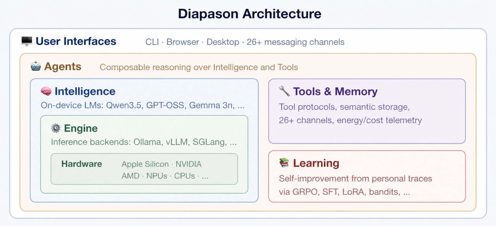

# Vue d'ensemble de l'architecture

Diapason est un cadre de recherche pour l'étude des systèmes d'IA qui tournent sur la machine. Son architecture s'organise autour de **cinq abstractions fondamentales** — Intelligence, Moteur, Logique agentique, Mémoire et Apprentissage — qui travaillent ensemble par une boucle de retour pilotée par les traces.



---

## Description des primitives

### Intelligence

La primitive Intelligence s'occupe de la **définition des modèles et du catalogue**. Elle tient un catalogue des modèles connus (`BUILTIN_MODELS`) avec leurs métadonnées : nombre de paramètres, longueur de contexte, VRAM nécessaire et moteurs pris en charge. L'`IntelligenceConfig` porte l'identité complète du modèle configuré — le chemin de ses poids, son format de quantification, son moteur préféré, sa chaîne de repli et ses réglages de génération par défaut (`temperature`, `max_tokens`, `top_p`, `top_k`, `repetition_penalty`, `stop_sequences`).

Les modèles découverts à l'exécution auprès des moteurs en marche sont fusionnés d'office dans le `ModelRegistry` : le système garde ainsi une vue à jour de ce qui est disponible. L'aiguillage des questions est passé dans la primitive Apprentissage — voir la documentation [Apprentissage et traces](learning.md).

### Moteur

La primitive Moteur fournit l'**exécution de l'inférence** — la couche qui fait réellement tourner les modèles de langage. Tous les moteurs implémentent la classe abstraite `InferenceEngine` et offrent la même interface : `generate()`, `stream()`, `list_models()` et `health()`. Parmi les moteurs pris en charge : Ollama, vLLM, SGLang, llama.cpp et Cloud (OpenAI, Anthropic, Google).

Chaque moteur se configure dans sa propre sous-section de `config.toml` (`[engine.ollama]`, `[engine.vllm]`, `[engine.llamacpp]`, par exemple). La découverte des moteurs sonde la santé de tous les moteurs enregistrés et rend ceux qui répondent, classés avec ton moteur par défaut en tête. Si le moteur préféré est injoignable, le système bascule tout seul sur n'importe quel moteur disponible.

### Logique agentique

La primitive Logique agentique implémente des **agents interchangeables** qui traitent les questions avec des degrés de sophistication variables. La hiérarchie des agents s'organise autour de `BaseAgent` (classe abstraite, avec des méthodes concrètes d'aide) et de `ToolUsingAgent` (base intermédiaire pour les agents qui acceptent des outils, avec `accepts_tools = True`). Neuf types d'agents existent : `SimpleAgent` (un seul tour, sans outils), `OrchestratorAgent` (boucle d'appel d'outils multi-tours, modes function_calling et structured), `NativeReActAgent` (boucle Pensée-Action-Observation), `NativeOpenHandsAgent` (exécution de code façon CodeAct), `RLMAgent` (modèle de langage récursif, avec REPL persistant), `OpenHandsAgent` (enveloppe le vrai `openhands-sdk`), `ClaudeCodeAgent` (le SDK d'agent Claude, par un sous-processus Node.js), `OperativeAgent` (agent planifié persistant, avec gestion d'état) et `MonitorOperativeAgent` (agent à longue portée, avec des axes de stratégie configurables).

Le module bac à sable (`diapason.sandbox`) ajoute une enveloppe `SandboxedAgent`, qui fait tourner n'importe quel `BaseAgent` dans un conteneur Docker ou Podman en imposant la sécurité des montages, et un `ContainerRunner`, qui gère le cycle de vie du conteneur.

Le comportement des agents se règle par `[agent]`, dans `config.toml` : l'agent par défaut, la limite de tours, la liste d'outils, un prompt système facultatif et le drapeau `context_from_memory` (autrefois `context_injection`), qui commande l'injection automatique du contexte mémoire. La configuration du bac à sable vit dans `[sandbox]`. Tous les agents implémentent la classe abstraite `BaseAgent` avec une méthode `run()`, et s'enregistrent par `@AgentRegistry.register("name")`.

### Mémoire

La primitive Mémoire fournit un **stockage persistant et interrogeable** pour les documents et les connaissances. Cinq moteurs existent : SQLite/FTS5 (le défaut, sans aucune dépendance), FAISS (recherche par vecteurs denses), ColBERTv2 (interaction tardive), BM25 (fréquence des termes, la méthode classique) et Hybrid (fusion par rang réciproque du creux et du dense). Les moteurs de stockage se configurent sous `[tools.storage]` dans `config.toml` (la section `[memory]` reste acceptée comme alias de compatibilité).

La chaîne de la mémoire comprend l'ingestion des documents, leur découpage en morceaux, le calcul des plongements et l'injection du contexte. Quand tu envoies une question et que `agent.context_from_memory` est actif, les documents pertinents sont retrouvés et placés en tête du prompt, avec l'indication de leur source.

### Apprentissage et traces

Le système d'apprentissage est la cinquième primitive : il relie les quatre autres par une **boucle de retour pilotée par les traces**. Chaque interaction d'agent peut produire une `Trace` qui capture la suite complète des étapes — les décisions d'aiguillage, les recherches en mémoire, les appels d'inférence, les appels d'outils et les réponses finales. Le `TraceAnalyzer` calcule des statistiques à partir des traces accumulées, et la `TraceDrivenPolicy` s'en sert pour apprendre quelles combinaisons modèle/agent/outil donnent les meilleurs résultats selon le type de question.

Le système d'apprentissage se configure par des sous-sections imbriquées de `config.toml` : `[learning.routing]` commande la politique d'aiguillage (heuristic, learned, sft, grpo), `[learning.intelligence]` la politique d'apprentissage au niveau du modèle, `[learning.agent]` les politiques du conseiller d'agent et du metteur à jour ICL, et `[learning.metrics]` fixe les poids de la fonction de récompense composite. Ce pilier comprend aussi la recherche de spécifications guidée par un LLM, une boucle pilotée par un modèle de frontière qui améliore le harnais local — voir [L'architecture de l'apprentissage : la recherche de spécifications guidée par un LLM](learning.md#llm-guided-spec-search-frontier-driven-harness-learning).

---

## Le motif du registre

Tous les composants extensibles de Diapason passent par un **registre à décorateurs** pour être trouvés à l'exécution. Le motif est implémenté dans `RegistryBase[T]`, une classe de base générique qui donne un stockage isolé à chaque sous-classe typée.

```python
from diapason.core.registry import EngineRegistry

@EngineRegistry.register("ollama")
class OllamaEngine(InferenceEngine):
    ...
```

Chaque registre fournit :

| Méthode | Description |
|--------|-------------|
| `register(key)` | Décorateur qui enregistre une classe sous une clé |
| `register_value(key, value)` | Enregistrement impératif |
| `get(key)` | Récupère par clé (lève `KeyError` si elle manque) |
| `create(key, *args, **kwargs)` | Cherche puis instancie |
| `items()` | Toutes les paires `(key, entry)` |
| `keys()` | Toutes les clés enregistrées |
| `contains(key)` | Dit si la clé existe |
| `clear()` | Vide toutes les entrées (pour les tests) |

Les **registres typés** du système :

| Registre | Paramètre de type | Rôle |
|----------|---------------|---------|
| `ModelRegistry` | `Any` (ModelSpec) | Les métadonnées des modèles |
| `EngineRegistry` | `Type[InferenceEngine]` | Les moteurs d'inférence |
| `MemoryRegistry` | `Type[MemoryBackend]` | Les moteurs de mémoire |
| `AgentRegistry` | `Type[BaseAgent]` | Les implémentations d'agents |
| `ToolRegistry` | `Any` (classes BaseTool) | Les implémentations d'outils |
| `RouterPolicyRegistry` | `Any` (classes RouterPolicy) | Les politiques d'aiguillage |
| `BenchmarkRegistry` | `Any` (classes BaseBenchmark) | Les implémentations de bancs d'essai |
| `ChannelRegistry` | `Any` (classes BaseChannel) | Les implémentations de canaux |

!!! info "Ajouter un nouveau composant"
    Pour ajouter un moteur, implémente la classe abstraite qui convient et
    décore-la avec le décorateur du registre correspondant. Aucune fabrique n'est
    à modifier — le composant devient trouvable tout seul à l'exécution.

---

## L'arborescence des sources

```
src/diapason/
    core/               L'infrastructure commune à toutes les primitives
        registry.py         RegistryBase[T] et les registres typés qui en dérivent
        types.py            Message, ModelSpec, Trace, TelemetryRecord, etc.
        config.py           DiapasonConfig, détection du matériel, lecture du TOML
        events.py           Le bus d'événements pub/sub (EventType, Event)

    intelligence/       Primitive Intelligence -- définition et catalogue des modèles
        model_catalog.py    La liste BUILTIN_MODELS, merge_discovered_models()
        _stubs.py           (cale de compatibilité -- ré-exporte learning._stubs)
        router.py           (cale de compatibilité -- ré-exporte learning.router)

    engine/             Primitive Moteur -- l'exécution de l'inférence
        _stubs.py           La classe abstraite InferenceEngine
        _base.py            EngineConnectionError, messages_to_dicts()
        _openai_compat.py   Base commune aux moteurs compatibles OpenAI
        _discovery.py       discover_engines(), discover_models(), get_engine()
        ollama.py           Moteur Ollama (API HTTP native)
        openai_compat_engines.py  Enregistrement piloté par les données (vLLM, SGLang, llama.cpp, MLX, LM Studio)
        cloud.py            Moteur distant (SDK OpenAI, Anthropic, Google)

    agents/             Primitive Logique agentique -- les agents interchangeables
        _stubs.py           BaseAgent (classe abstraite), ToolUsingAgent, AgentContext, AgentResult
        simple.py           SimpleAgent (un seul tour, sans outils)
        orchestrator.py     OrchestratorAgent (boucle d'outils multi-tours, function_calling + structured)
        native_react.py     NativeReActAgent (boucle Pensée-Action-Observation)
        native_openhands.py NativeOpenHandsAgent (exécution de code façon CodeAct)
        rlm.py              RLMAgent (modèle de langage récursif, REPL persistant)
        openhands.py        OpenHandsAgent (enveloppe le vrai openhands-sdk)
        react.py            Cale de compatibilité (ré-exporte NativeReActAgent sous ReActAgent)
        claude_code.py      ClaudeCodeAgent (SDK d'agent Claude, par un sous-processus Node.js)
        claude_code_runner/ Le lanceur Node.js embarqué pour le SDK d'agent Claude

    sandbox/            Bac à sable en conteneur, pour isoler l'exécution des agents
        runner.py           ContainerRunner (cycle de vie Docker/Podman), enveloppe SandboxedAgent
        mount_security.py   MountAllowlist, validate_mounts() (sécurité des chemins)

    memory/             Primitive Mémoire -- stockage persistant et interrogeable
        _stubs.py           MemoryBackend (classe abstraite), RetrievalResult
        sqlite.py           Moteur SQLite/FTS5 (le défaut, sans dépendance)
        faiss_backend.py    Moteur FAISS, recherche dense
        colbert_backend.py  Moteur ColBERTv2, interaction tardive
        bm25.py             Moteur BM25 (Okapi), fréquence des termes
        hybrid.py           Moteur hybride, fusion RRF
        chunking.py         ChunkConfig, Chunk, chunk_text()
        ingest.py           Ingestion des documents (lecture des fichiers, parcours des dossiers)
        context.py          Injection du contexte (inject_context, attribution des sources)
        embeddings.py       Embedder (classe abstraite), SentenceTransformerEmbedder

    learning/           Système d'apprentissage -- politiques d'aiguillage et récompenses
        _stubs.py           Classes abstraites RouterPolicy, QueryAnalyzer, RewardFunction, RoutingContext
        router.py           HeuristicRouter, DefaultQueryAnalyzer, build_routing_context()
        heuristic_policy.py Branche HeuristicRouter dans le RouterPolicyRegistry
        trace_policy.py     TraceDrivenPolicy (apprend du résultat des traces)
        grpo_policy.py      GRPORouterPolicy (ébauche pour un futur apprentissage par renforcement)
        heuristic_reward.py HeuristicRewardFunction (latence/coût/efficacité)

    traces/             Système de traces -- l'enregistrement des interactions
        store.py            TraceStore (persistance SQLite)
        collector.py        TraceCollector (enveloppe les agents, enregistre les traces)
        analyzer.py         TraceAnalyzer (statistiques agrégées)

    tools/              Système d'outils -- les implémentations interchangeables
        _stubs.py           BaseTool (classe abstraite), ToolSpec, ToolExecutor
        calculator.py       CalculatorTool (évaluation sûre, fondée sur l'AST)
        think.py            ThinkTool (brouillon de raisonnement)
        retrieval.py        RetrievalTool (recherche en mémoire)
        llm.py              LLMTool (appels à un sous-modèle)
        file_read.py        FileReadTool (lecture de fichier sûre)

    telemetry/          Télémétrie -- l'enregistrement des mesures d'inférence
        store.py            TelemetryStore (SQLite, abonné au bus d'événements)
        aggregator.py       TelemetryAggregator (statistiques par modèle/moteur)
        wrapper.py          L'enveloppe instrumented_generate()

    server/             Serveur d'API -- API HTTP compatible OpenAI
        app.py              La fabrique d'application FastAPI
        routes.py           /v1/chat/completions, /v1/models, /health

    bench/              Cadre de bancs d'essai
        _stubs.py           BaseBenchmark (classe abstraite), BenchmarkSuite
        latency.py          LatencyBenchmark (latence par appel)
        throughput.py       ThroughputBenchmark (jetons par seconde)

    security/           Les garde-fous de sécurité
        _stubs.py           La classe abstraite BaseScanner
        types.py            ThreatLevel, RedactionMode, ScanFinding, ScanResult
        scanner.py          SecretScanner, PIIScanner
        guardrails.py       GuardrailsEngine (enveloppe InferenceEngine)
        file_policy.py      is_sensitive_file(), DEFAULT_SENSITIVE_PATTERNS
        audit.py            AuditLogger (événements de sécurité, en SQLite)

    channels/           La messagerie par canaux
        _stubs.py           BaseChannel (classe abstraite), ChannelMessage, ChannelStatus
        whatsapp_baileys.py WhatsAppBaileysChannel (protocole Baileys, par une passerelle Node.js)
        whatsapp_baileys_bridge/ La passerelle Baileys Node.js embarquée

    scheduler/          Le système de planification des tâches
        scheduler.py        TaskScheduler (cron/intervalle/une fois, scrutation en tâche de fond)
        store.py            SchedulerStore (persistance SQLite + journaux d'exécution)
        tools.py            Outils MCP du planificateur (schedule_task, list, pause, resume, cancel)

    cli/                Les commandes de la CLI (bâties sur Click)
        ask.py              diapason ask -- interroger l'assistant
        serve.py            diapason serve -- démarrer le serveur d'API

    sdk.py              La classe Diapason -- le SDK Python de haut niveau
    mcp/                La couche MCP (Model Context Protocol)
```

---

## Comment les primitives s'articulent

### Le bus d'événements : le tissu conjonctif

Toutes les primitives communiquent par un **bus d'événements pub/sub sûr entre fils d'exécution**, défini dans `core/events.py`. La distribution est synchrone : les abonnés sont appelés dans l'ordre de leur inscription, à l'intérieur du fil qui publie.

Les **types d'événements** du système :

| Événement | Publié par | Rôle |
|-------|----------|---------|
| `INFERENCE_START` / `INFERENCE_END` | Moteur / Agent | Suivre les appels d'inférence |
| `TOOL_CALL_START` / `TOOL_CALL_END` | ToolExecutor | Suivre l'usage des outils |
| `MEMORY_STORE` / `MEMORY_RETRIEVE` | Moteurs de mémoire | Suivre les opérations de mémoire |
| `AGENT_TURN_START` / `AGENT_TURN_END` | Agents | Suivre le cycle de vie des agents |
| `TELEMETRY_RECORD` | TelemetryStore | Publier les relevés de télémétrie |
| `TRACE_STEP` / `TRACE_COMPLETE` | TraceCollector | Les étapes du cycle de vie d'une trace |
| `CHANNEL_MESSAGE_RECEIVED` / `CHANNEL_MESSAGE_SENT` | WhatsAppBaileysChannel | Suivre la messagerie par canaux |
| `SECURITY_SCAN` / `SECURITY_ALERT` / `SECURITY_BLOCK` | GuardrailsEngine | Suivre l'analyse de sécurité |
| `scheduler_task_start` / `scheduler_task_end` | TaskScheduler | Suivre l'exécution des tâches planifiées |

### Le sens des dépendances

Les primitives forment un graphe de dépendances orienté :

1. **La logique agentique** dépend du Moteur (pour l'inférence) et de la Mémoire (pour le contexte)
2. **L'Intelligence** fournit aux agents le choix du modèle, par les politiques d'Apprentissage
3. **L'Apprentissage** lit les traces, que produit la logique agentique
4. **La Mémoire** est indépendante, mais consommée par les agents et les outils
5. **Le Moteur** est indépendant, mais consommé par les agents et le SDK

Cela crée une boucle de retour : les agents produisent des traces, les traces nourrissent l'apprentissage, l'apprentissage améliore l'aiguillage, et un meilleur aiguillage améliore les performances des agents.
