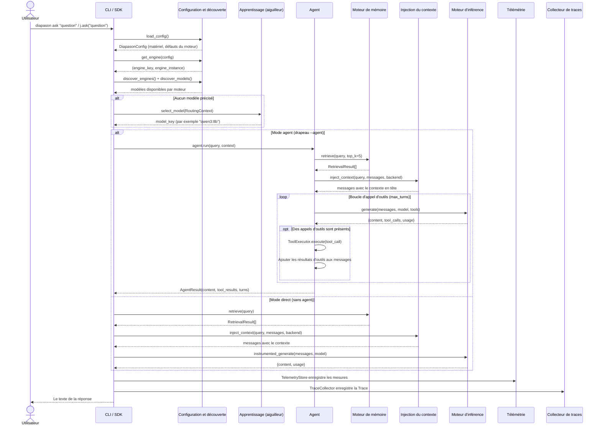

# Le parcours d'une question

Cette page suit le trajet complet d'une question d'utilisateur à travers Diapason, depuis le moment où elle entre par la ligne de commande ou par le SDK jusqu'à la réponse finale et à son enregistrement dans la télémétrie.

---

## Le diagramme de séquence



---

## Le mode direct et le mode agent

Diapason traite une question par deux chemins possibles, choisis par le drapeau `--agent` en ligne de commande ou par le paramètre `agent` du SDK.

### Le mode direct (celui par défaut)

En mode direct, la question part droit au moteur d'inférence, avec le contexte mémoire en option. C'est le chemin le plus court : un seul appel d'inférence, aucune boucle d'outils.

```bash
# En ligne de commande
diapason ask "Quelle est la capitale de la France ?"

# Dans le SDK
j = Diapason()
response = j.ask("Quelle est la capitale de la France ?")
```

### Le mode agent

En mode agent, la question est prise en charge par un agent nommé, capable d'enchaîner plusieurs tours d'inférence et d'appeler des outils. L'`OrchestratorAgent` est le choix le plus courant : il ouvre une boucle d'appel d'outils sur plusieurs tours.

```bash
# En ligne de commande
diapason ask --agent orchestrator --tools calculator,think "Combien font 2^10 + 3^5 ?"

# Dans le SDK
response = j.ask("Combien font 2^10 + 3^5 ?", agent="orchestrator", tools=["calculator"])
```

---

## Le parcours, étape par étape

### Étape 1 : le chargement de la configuration

Tout commence par le chargement de la configuration du système :

```python
config = load_config()  # Lit ~/.diapason/config.toml
```

Cette étape :

- Détecte le matériel de la machine (fabricant et modèle de la carte graphique, processeur, mémoire vive)
- Recommande le moteur d'inférence le mieux adapté au matériel détecté
- Superpose les réglages que tu as écrits toi-même dans le fichier TOML
- Rend une dataclass `DiapasonConfig` portant tous les réglages

### Étape 2 : la découverte du moteur

Le système cherche ensuite un moteur d'inférence en marche :

```python
resolved = get_engine(config, engine_key)
# Rend (engine_key, engine_instance), ou None
```

La découverte se déroule ainsi :

1. Si un moteur précis a été demandé (drapeau `--engine`), essayer celui-là
2. Sinon, essayer le moteur par défaut de la configuration (`"ollama"`, par exemple)
3. Si le moteur par défaut ne répond pas, sonder tous les moteurs enregistrés et prendre le premier en bonne santé
4. Si aucun moteur n'est disponible, s'arrêter avec un message d'erreur

### Étape 3 : la découverte des modèles et leur enregistrement

Une fois le moteur trouvé, le système découvre les modèles disponibles :

```python
register_builtin_models()          # Enregistre les modèles connus (le catalogue)
all_engines = discover_engines(config)
all_models = discover_models(all_engines)
for ek, model_ids in all_models.items():
    merge_discovered_models(ek, model_ids)  # Enregistre les modèles découverts à l'exécution
```

### Étape 4 : l'aiguillage du modèle

Si aucun modèle n'a été précisé explicitement, la politique d'aiguillage en choisit un :

```python
from diapason.learning import ensure_registered
from diapason.learning.router import build_routing_context
ensure_registered()  # S'assure que les politiques d'apprentissage sont enregistrées

policy_key = router_policy or config.learning.routing.policy
router_cls = RouterPolicyRegistry.get(policy_key)
router = router_cls(
    available_models=all_models.get(engine_name, []),
    default_model=config.intelligence.default_model,
    fallback_model=config.intelligence.fallback_model,
)

ctx = build_routing_context(query_text)
model_name = router.select_model(ctx)
```

La fonction `build_routing_context()` (dans `learning/router.py`) examine la question : motifs de code, mots-clés mathématiques, longueur, urgence. L'aiguilleur applique ensuite ses règles — heuristiques ou apprises — pour choisir le modèle le mieux adapté.

### Étape 5 : l'injection du contexte mémoire

Si l'injection du contexte mémoire est active (`true` par défaut) et que le moteur de mémoire a des documents indexés :

```python
backend = _get_memory_backend(config)
if backend is not None:
    ctx_cfg = ContextConfig(
        top_k=config.memory.context_top_k,        # Défaut : 5
        min_score=config.memory.context_min_score,  # Défaut : 0.1
        max_context_tokens=config.memory.context_max_tokens,  # Défaut : 2048
    )
    messages = inject_context(query_text, messages, backend, config=ctx_cfg)
```

Les morceaux pertinents sont extraits du moteur de mémoire et placés en tête, dans un message système qui porte le contexte retrouvé et l'indication de sa source.

!!! tip "Couper l'injection du contexte"
    Passe `--no-context` en ligne de commande, ou `context=False` dans le SDK, pour sauter l'injection du contexte mémoire.

### Étape 6 : la génération

**En mode direct**, la question part au moteur par l'enveloppe instrumentée :

```python
result = instrumented_generate(
    engine, messages,
    model=model_name,
    bus=bus,
    temperature=temperature,
    max_tokens=max_tokens,
)
```

L'enveloppe `instrumented_generate()` :

1. Publie `INFERENCE_START` sur le bus d'événements
2. Note l'heure de départ
3. Appelle `engine.generate()`
4. Note l'heure de fin et calcule la latence
5. Publie `INFERENCE_END`, avec les durées et le compte de jetons
6. Publie `TELEMETRY_RECORD`, avec le `TelemetryRecord` complet

**En mode agent**, l'agent gère lui-même ses appels d'inférence et peut enchaîner plusieurs tours, avec des appels d'outils entre deux.

### Étape 7 : l'exécution des outils (en mode agent seulement)

Quand l'`OrchestratorAgent` trouve des appels d'outils dans la réponse du modèle :

1. Chaque appel d'outil est confié au `ToolExecutor`
2. L'exécuteur publie `TOOL_CALL_START`, lance l'outil, puis publie `TOOL_CALL_END`
3. Les résultats d'outils sont ajoutés à l'historique des messages, sous la forme de messages `TOOL`
4. Les messages ainsi complétés repartent au moteur pour le tour suivant
5. La boucle continue jusqu'à ce que le modèle réponde sans appel d'outil, ou que `max_turns` soit atteint

### Étape 8 : l'enregistrement de la télémétrie

Après chaque appel d'inférence, un `TelemetryRecord` est créé puis conservé :

```python
@dataclass(slots=True)
class TelemetryRecord:
    timestamp: float
    model_id: str
    prompt_tokens: int
    completion_tokens: int
    total_tokens: int
    latency_seconds: float
    ttft: float              # Délai jusqu'au premier jeton
    cost_usd: float
    energy_joules: float
    power_watts: float
    engine: str
    agent: str
    metadata: Dict[str, Any]
```

Le `TelemetryStore` s'abonne aux événements `TELEMETRY_RECORD` de l'EventBus et écrit les enregistrements dans `~/.diapason/telemetry.db`.

### Étape 9 : l'enregistrement de la trace

Quand un `TraceCollector` enveloppe l'agent, une `Trace` complète est bâtie à partir des événements capturés pendant l'exécution :

1. Tous les événements `INFERENCE_START`/`END` deviennent des étapes `GENERATE`
2. Tous les événements `TOOL_CALL_START`/`END` deviennent des étapes `TOOL_CALL`
3. Tous les événements `MEMORY_RETRIEVE` deviennent des étapes `RETRIEVE`
4. Une dernière étape `RESPOND` capture la sortie
5. La trace est enregistrée dans le `TraceStore`, et `TRACE_COMPLETE` est publié

### Étape 10 : la remise de la réponse

La réponse finale est remise à l'utilisateur :

- **En ligne de commande :** écrite sur la sortie standard (ou en JSON avec `--json`)
- **Dans le SDK :** rendue comme chaîne par `ask()`, ou comme dict par `ask_full()`

---

## Ce qui passe sur l'EventBus pendant une question

Voici les événements publiés au cours d'une question ordinaire, en mode agent :

```
AGENT_TURN_START    {agent: "orchestrator", input: "Combien font 2+2 ?"}
INFERENCE_START     {model: "qwen3:8b", engine: "ollama", turn: 1}
INFERENCE_END       {model: "qwen3:8b", engine: "ollama", turn: 1}
TELEMETRY_RECORD    {model_id: "qwen3:8b", latency: 0.8, tokens: 150}
TOOL_CALL_START     {tool: "calculator", arguments: {expression: "2+2"}}
TOOL_CALL_END       {tool: "calculator", success: true, latency: 0.01}
INFERENCE_START     {model: "qwen3:8b", engine: "ollama", turn: 2}
INFERENCE_END       {model: "qwen3:8b", engine: "ollama", turn: 2}
TELEMETRY_RECORD    {model_id: "qwen3:8b", latency: 0.5, tokens: 80}
AGENT_TURN_END      {agent: "orchestrator", turns: 2, content_length: 12}
TRACE_COMPLETE      {trace: Trace(...)}
```

---

## Le parcours d'une question dans le SDK

La classe `Diapason`, dans `sdk.py`, offre le même parcours par une API Python :

```python
from diapason import Diapason

j = Diapason(model="qwen3:8b", engine_key="ollama")

# Le mode direct
response = j.ask("Bonjour")

# Le mode agent, avec des outils
response = j.ask(
    "Combien font 2^10 ?",
    agent="orchestrator",
    tools=["calculator"],
)

# Le résultat complet, avec ses métadonnées
result = j.ask_full("Bonjour")
# {
#     "content": "Bonjour ! Comment puis-je t'aider ?",
#     "usage": {"prompt_tokens": 10, "completion_tokens": 15, "total_tokens": 25},
#     "model": "qwen3:8b",
#     "engine": "ollama",
# }

j.close()
```

Le SDK s'occupe tout seul de l'initialisation paresseuse du moteur, de la mise en place de la télémétrie, de l'injection du contexte mémoire et de la libération des ressources. La méthode `ask()` délègue à `ask_full()` et n'en extrait que la chaîne de contenu.
