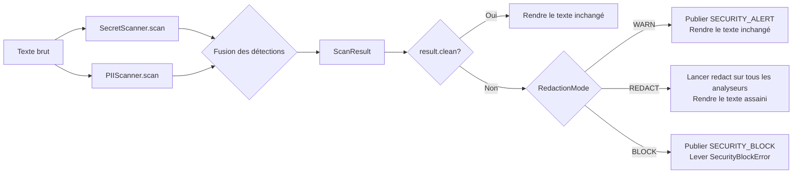
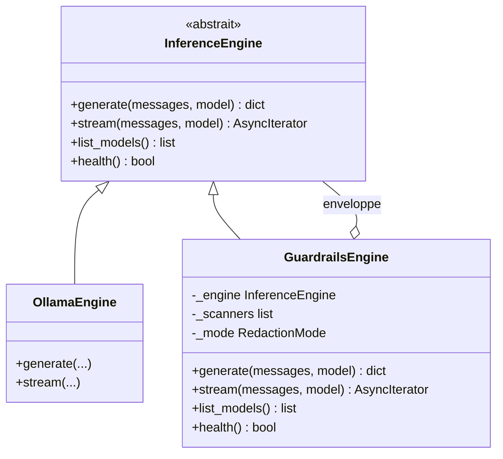
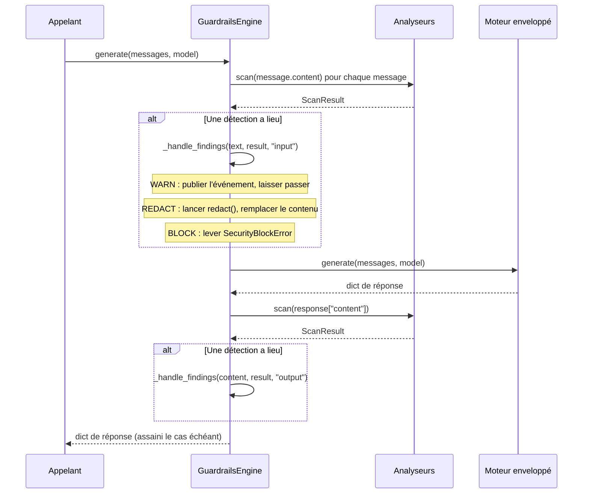
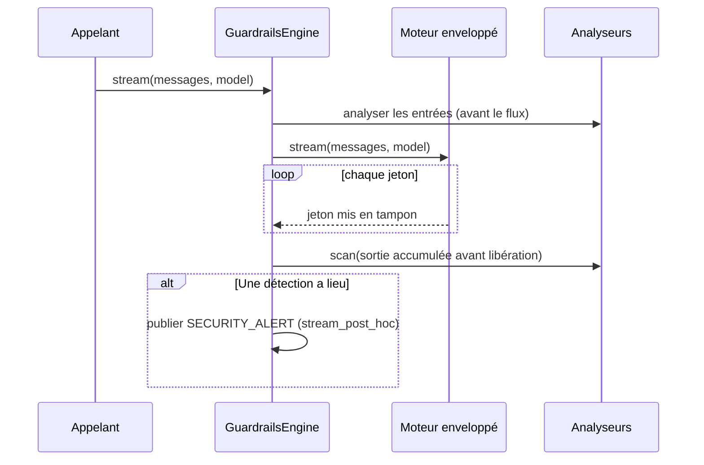
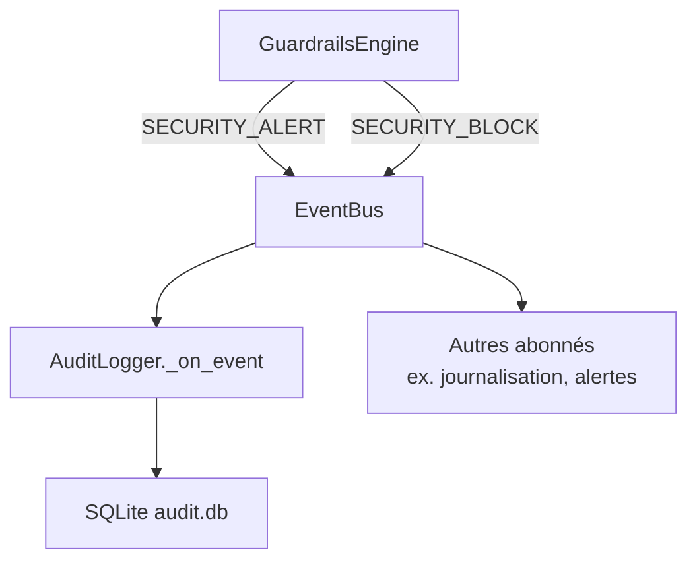
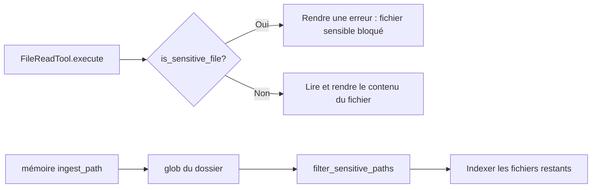

# L'architecture de la sécurité

Le module de sécurité est une préoccupation transversale : il enveloppe le pipeline d'inférence au lieu de le remplacer. Les analyseurs travaillent sur des chaînes de texte brut, indépendamment de tout modèle et de tout agent, et le décorateur `GuardrailsEngine` les compose autour de n'importe quel moteur `InferenceEngine` sans rien changer à l'interface publique du moteur.

---

## Les principes de conception

- **Actifs et structurels.** Les constructeurs d'exécution installent par défaut les garde-fous, l'analyse des frontières, les capacités, les limites de débit et le journal d'audit. Qui se sert directement de la bibliothèque peut toujours composer les mêmes contrôles à la main.
- **Indifférent à l'analyseur.** La classe de base abstraite `BaseScanner` définit une interface à deux méthodes (`scan`, `redact`). N'importe quel analyseur s'y branche, y compris le tien.
- **Des modes qui échouent sans danger.** Les trois modes de masquage (WARN, REDACT, BLOCK) couvrent tout le spectre, de la simple visibilité à l'application stricte : tu peux resserrer progressivement sans toucher au code.
- **Un audit qui ne garde pas les secrets.** L'`AuditLogger` enregistre des empreintes, des longueurs, des actions et des métadonnées de motifs dans un journal SQLite chaîné ; les valeurs détectées, elles, ne sont jamais conservées.

---

## Le pipeline des analyseurs

Chaque passe d'analyse lance tous les analyseurs enregistrés l'un après l'autre et fusionne leurs détections dans un unique `ScanResult`. L'ordre d'exécution des analyseurs ne change rien à la justesse du résultat, seulement à l'ordre dans lequel les motifs sont rapportés.

En mode REDACT, l'étape de masquage applique la méthode `redact()` de chaque analyseur l'une après l'autre. Les analyseurs suivants voient donc la sortie déjà masquée des précédents : les motifs ne se marchent pas dessus.

---

## Le patron d'enveloppe de GuardrailsEngine

`GuardrailsEngine` implémente l'intégralité de la classe abstraite `InferenceEngine` et délègue chaque appel à l'instance de moteur qu'il enveloppe. Autrement dit, n'importe quel moteur — `OllamaEngine`, `VLLMEngine`, `LlamaCppEngine` — devient conscient de la sécurité sans qu'on touche au moteur lui-même.

Puisque `GuardrailsEngine` est lui-même un `InferenceEngine`, il s'imbrique autant de fois qu'on veut (enveloppé à son tour dans un moteur instrumenté, par exemple) et se passe à n'importe quel code qui accepte un moteur.

### La séquence d'appel de generate()

### Le comportement de stream()

Quand l'analyse de sortie est active en flux, la couche de sécurité met la
complétion en tampon et l'analyse avant de la libérer. Une sortie propre garde
la découpe d'origine de ses morceaux ; une sortie sensible est masquée ou
bloquée avant qu'un seul morceau de contenu n'atteigne l'appelant.

---

## Le flux des événements

Les événements de sécurité passent par l'`EventBus` sous trois types :

| Événement | Quand il est publié | Clés de la charge utile |
|-------|----------------|--------------|
| `SECURITY_SCAN` | (Réservé pour un usage futur) | — |
| `SECURITY_ALERT` | Une détection en mode WARN ou REDACT | `direction`, `findings`, `mode` |
| `SECURITY_BLOCK` | Une détection en mode BLOCK | `direction`, `findings`, `mode` |

Le champ `direction` vaut soit `"input"`, soit `"output"`. La valeur `findings` est une liste de dicts dont les clés sont `pattern`, `threat` et `description`.

L'`AuditLogger` s'abonne aux trois types d'événements et les écrit dans SQLite. Cet abonnement est établi à la construction :

---

## L'intégration de la politique des fichiers

La politique des fichiers (`file_policy.py`) fonctionne indépendamment du pipeline des analyseurs. Elle répond à une seule question, par oui ou par non : ce chemin de fichier est-il considéré comme sensible ?

### Les points d'intégration

**`FileReadTool`** appelle `is_sensitive_file()` avant de lire le moindre chemin. Si le chemin correspond à un motif sensible, l'outil rend une erreur au lieu du contenu du fichier. Rien ne permet de contourner cela au niveau de l'outil.

**Le chemin d'ingestion de la mémoire** (`memory/ingest.py`) se sert de `filter_sensitive_paths()` pour retirer les fichiers sensibles du listing d'un dossier avant l'indexation. Les fichiers qui correspondent à un motif sensible sont sautés en silence.

La politique des fichiers ne publie aucun événement et ne se sert pas du bus. C'est une fonction pure — déterministe, sans état et sans effet de bord.

---

## L'architecture du journal d'audit

`AuditLogger` tient une seule table SQLite (`security_events`), au schéma suivant :

| Colonne | Type | Description |
|--------|------|-------------|
| `id` | `INTEGER PRIMARY KEY` | L'identifiant de ligne, auto-incrémenté |
| `timestamp` | `REAL` | L'horodatage Unix de l'événement |
| `event_type` | `TEXT` | La chaîne de la valeur `SecurityEventType` |
| `findings_json` | `TEXT` | Les métadonnées des motifs et les empreintes ; le texte détecté, lui, est vide |
| `content_preview` | `TEXT` | Un marqueur SHA-256 et la longueur d'origine, jamais le contenu brut |
| `action_taken` | `TEXT` | La chaîne du mode (`warn`, `redact`, `block`) |

La base est écrite en mode « ajout seul ». Il n'y a ni rotation ni troncature intégrée — gère la rétention de l'extérieur, en supprimant les vieilles entrées avec l'outillage SQLite, ou en utilisant un journal d'audit par session.

Le chemin par défaut est `~/.diapason/audit.db`, configurable via `security.audit_log_path` dans `config.toml`.

---

## Les liens avec les autres modules

| Module | Comment la sécurité s'y intègre |
|--------|------------------------|
| Moteur | `GuardrailsEngine` enveloppe n'importe quel `InferenceEngine` |
| Outils | `FileReadTool` appelle `is_sensitive_file()` |
| Mémoire | Le chemin d'ingestion appelle `filter_sensitive_paths()` |
| EventBus | Les événements de sécurité sont publiés sur `SECURITY_ALERT` et `SECURITY_BLOCK` |
| Configuration | La dataclass `SecurityConfig`, chargée depuis `[security]` dans `config.toml` |

---

## Voir aussi

- [Guide : la sécurité](../user-guide/security.md) — comment configurer et utiliser le système de sécurité
- [Référence d'API : security](../api-reference/diapason/security/index.md) — toutes les signatures de classes et de fonctions
- [Architecture : le parcours d'une question](query-flow.md) — où la sécurité se situe dans le cycle de vie d'une requête
