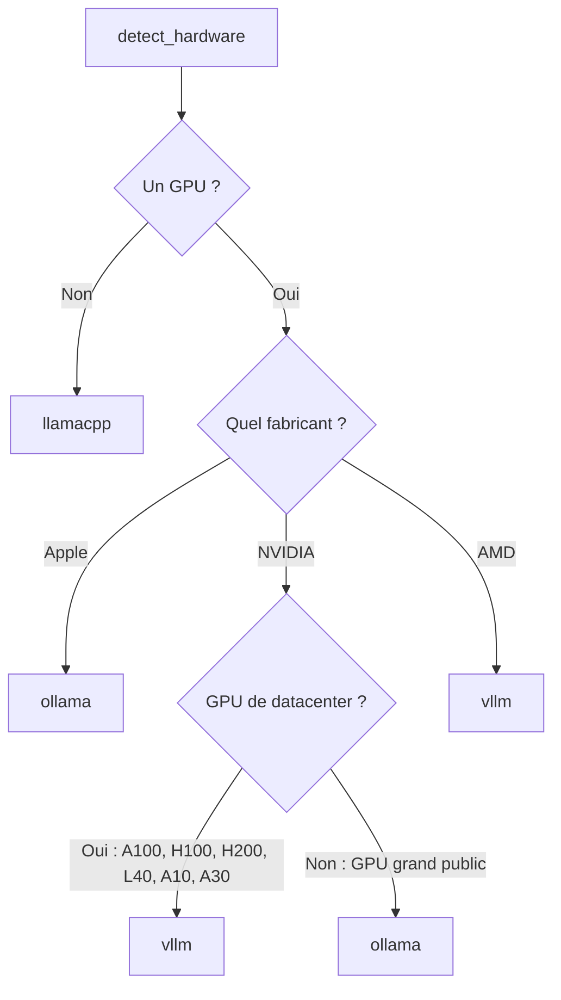

# Configuration

Diapason lit un fichier de configuration TOML : il y trouve le moteur d'inférence à employer, l'identité du modèle, les backends de mémoire, le comportement de l'agent, et le reste. Cette page est la référence complète de chaque option, organisée par primitive.

## Où vit le fichier de configuration

Le fichier de configuration se trouve ici :

```
~/.diapason/config.toml
```

Diapason crée le dossier `~/.diapason/` et y dépose une configuration par défaut quand tu lances `diapason init`.

## Déplacer le dossier Diapason

Diapason garde **tout** son état — configuration, bases de données, caches, journaux,
identifiants, compétences, recettes, connecteurs — sous une **racine unique**, pour ne
jamais encombrer ton dossier personnel au-delà d'un seul répertoire. Par défaut cette
racine est `~/.diapason`, mais tu peux la déplacer.

La racine est résolue dans cet ordre de priorité :

1. **`$DIAPASON_HOME`** — la substitution explicite. Respectée par l'installateur
   comme par l'exécution Python.
2. **`$XDG_DATA_HOME/diapason`** — utilisée quand `$XDG_DATA_HOME` est défini (un seul
   dossier `diapason` imbriqué dessous, selon la spécification XDG Base Directory).
3. **`~/.diapason`** — le défaut. Sans aucune variable d'environnement, le chemin résolu
   est exactement celui-là : les installations existantes ne bougent pas.

```bash
# Déplacer tout l'arbre d'installation et d'exécution au moment de l'installation :
DIAPASON_HOME=~/apps/diapason curl -fsSL https://carlitoetienne01-spec.github.io/Diapason/install.sh | bash

# Ou pour un seul lancement / dans ton profil shell :
export DIAPASON_HOME=~/apps/diapason
```

Pour savoir où vivent tes données :

```bash
diapason config path
```

!!! note "Migration"
    Le défaut n'ayant pas changé, **aucune migration de données n'est nécessaire** pour
    les installations existantes. Si tu définis `DIAPASON_HOME` (ou `XDG_DATA_HOME`) sur
    une machine qui a déjà des données dans `~/.diapason`, Diapason regardera au nouvel
    endroit et ne verra pas les anciennes — déplace-les toi-même si tu veux les garder :
    `mv ~/.diapason "$DIAPASON_HOME"`.

`$DIAPASON_CONFIG` continue de pointer vers un fichier `config.toml` précis,
indépendamment de la racine, si tu n'as besoin de changer que le chemin du fichier de
configuration.

## Générer la configuration

### La première fois

```bash
diapason init
```

Cette commande :

1. Lance la détection automatique du matériel (fabricant / modèle / VRAM du GPU, marque et cœurs du processeur, mémoire vive)
2. Choisit le moteur recommandé pour ton matériel
3. Écrit `~/.diapason/config.toml` avec des valeurs par défaut raisonnables

### Régénérer la configuration

Pour écraser une configuration existante :

```bash
diapason init --force
```

!!! warning
    `--force` écrase ton fichier de configuration. Sauvegarde-le d'abord si tu y as mis des réglages personnels.

## Les sections de configuration

Le fichier est organisé en sections TOML qui correspondent aux cinq primitives. Chaque champ a une valeur par défaut : tu n'as à indiquer que ce que tu veux changer.

---

### `[engine]` — le moteur d'inférence

Détermine quel moteur d'inférence est utilisé et comment on le joint. Les réglages d'un moteur vivent désormais dans une **sous-section imbriquée** propre à ce moteur, au lieu de champs à plat.

```toml
[engine]
default = "ollama"

[engine.ollama]
host = "http://localhost:11434"

[engine.vllm]
host = "http://localhost:8000"

[engine.sglang]
host = "http://localhost:30000"

# [engine.llamacpp]
# host = "http://localhost:8080"
# binary_path = ""
```

**`[engine]`, au premier niveau :**

| Champ | Type | Défaut | Description |
|-------|------|--------|-------------|
| `default` | chaîne | détecté automatiquement | Le moteur par défaut. Au choix : `ollama`, `vllm`, `llamacpp`, `sglang`, `cloud`. Rempli automatiquement par `diapason init` d'après la détection du matériel. |

**`[engine.ollama]` :**

| Champ | Type | Défaut | Description |
|-------|------|--------|-------------|
| `host` | chaîne | `http://localhost:11434` | L'URL de base du serveur d'API Ollama. |

**`[engine.vllm]` :**

| Champ | Type | Défaut | Description |
|-------|------|--------|-------------|
| `host` | chaîne | `http://localhost:8000` | L'URL de base du serveur vLLM compatible OpenAI. |

**`[engine.sglang]` :**

| Champ | Type | Défaut | Description |
|-------|------|--------|-------------|
| `host` | chaîne | `http://localhost:30000` | L'URL de base du serveur SGLang. |

**`[engine.llamacpp]` :**

| Champ | Type | Défaut | Description |
|-------|------|--------|-------------|
| `host` | chaîne | `http://localhost:8080` | L'URL de base du serveur HTTP de llama.cpp (`llama-server`). |
| `binary_path` | chaîne | `""` | Le chemin du binaire llama.cpp, s'il n'est pas dans `$PATH`. |

!!! tip "Repli sur un autre moteur"
    Si le moteur par défaut est injoignable, Diapason sonde automatiquement tous les moteurs enregistrés et se rabat sur le premier en bonne santé.

!!! note "Compatibilité ascendante"
    Les anciens noms de champs à plat (`ollama_host`, `vllm_host`, `llamacpp_host`, `llamacpp_path`, `sglang_host`) restent acceptés par compatibilité. Une nouvelle configuration doit utiliser les sous-sections imbriquées.

---

### `[intelligence]` — l'identité du modèle et les valeurs de génération par défaut

Détermine quel modèle est utilisé, où sont ses poids, sa quantification, et les paramètres d'échantillonnage par défaut pour la génération. Les paramètres de génération comme `temperature` et `max_tokens` vivent ici, et non plus sous `[agent]`.

```toml
[intelligence]
default_model = ""
fallback_model = ""
# model_path = ""
# checkpoint_path = ""
# quantization = "none"
# preferred_engine = ""
# provider = ""
temperature = 0.7
max_tokens = 1024
# top_p = 0.9
# top_k = 40
# repetition_penalty = 1.0
# stop_sequences = ""
```

**Les champs d'identité du modèle :**

| Champ | Type | Défaut | Description |
|-------|------|--------|-------------|
| `default_model` | chaîne | `""` | L'identifiant du modèle préféré (par ex. `qwen3:8b`). Laissé vide, c'est la politique de routage qui choisit le modèle à la volée. |
| `fallback_model` | chaîne | `""` | Le modèle à employer si le modèle par défaut est indisponible. |
| `model_path` | chaîne | `""` | Le chemin ou l'identifiant de dépôt HuggingFace des poids locaux (par ex. `"./models/qwen3-8b.gguf"` ou `"Qwen/Qwen3-8B"`). |
| `checkpoint_path` | chaîne | `""` | Le chemin d'un point de contrôle affiné ou d'un dossier d'adaptateur LoRA. |
| `quantization` | chaîne | `"none"` | Le format de quantification. Valeurs acceptées : `none`, `fp8`, `int8`, `int4`, `gguf_q4`, `gguf_q8`. |
| `preferred_engine` | chaîne | `""` | Force un moteur pour ce modèle (par ex. `"vllm"`). Prend le pas sur `engine.default`. |
| `provider` | chaîne | `""` | Indication de fournisseur du modèle : `local`, `openai`, `anthropic`, `google`, `minimax`. Sert au moteur Cloud pour aiguiller les appels d'API. |

**Les valeurs de génération par défaut** (chacune peut être redéfinie appel par appel) :

| Champ | Type | Défaut | Description |
|-------|------|--------|-------------|
| `temperature` | flottant | `0.7` | La température d'échantillonnage. Plus elle est basse, plus la sortie est déterministe. |
| `max_tokens` | entier | `1024` | Le nombre maximum de jetons à produire par appel. |
| `top_p` | flottant | `0.9` | La masse de probabilité pour l'échantillonnage par noyau. |
| `top_k` | entier | `40` | Échantillonnage top-k : à chaque pas, seuls les k meilleurs jetons sont retenus. |
| `repetition_penalty` | flottant | `1.0` | Pénalise les jetons répétés. Au-dessus de 1, la répétition diminue. |
| `stop_sequences` | chaîne | `""` | Les chaînes d'arrêt, séparées par des virgules. La génération s'interrompt dès que l'une d'elles est produite. |

Quand `default_model` et `fallback_model` sont tous deux vides, Diapason s'en remet à la politique de routage configurée (voir `[learning]`) pour choisir un modèle parmi ceux que le moteur actif propose.

### Priorité de sélection du moteur

Pour décider quel moteur servira un modèle, `SystemBuilder`, `sdk.py` et `cli/ask.py` regardent dans cet ordre :

```
1. L'option --engine de la CLI ou le paramètre engine_key= du SDK
2. config.intelligence.preferred_engine
3. config.engine.default
4. Le premier moteur en bonne santé découvert à l'exécution
```

Tu peux ainsi épingler un modèle précis à un moteur précis sans toucher au moteur par défaut :

```toml
[engine]
default = "ollama"

[intelligence]
default_model = "llama3.2:3b"
model_path = "./models/llama-3.2-3b.Q4_K_M.gguf"
quantization = "gguf_q4"
preferred_engine = "llamacpp"
```

---

### `[agent]` — le comportement de l'agent

Détermine l'agent par défaut, le nombre de tours, le choix des outils, l'invite système et l'injection du contexte mémoire.

```toml
[agent]
default_agent = "simple"
max_turns = 10
# tools = ""
# objective = ""
# system_prompt = ""
# system_prompt_path = ""
context_from_memory = true
```

| Champ | Type | Défaut | Description |
|-------|------|--------|-------------|
| `default_agent` | chaîne | `"simple"` | L'agent employé par défaut. Disponibles : `simple`, `orchestrator`, `react`, `operative`, `monitor_operative`. |
| `max_turns` | entier | `10` | Le nombre maximum de tours d'appel d'outils pour l'agent orchestrateur avant qu'il doive rendre une réponse finale. |
| `tools` | chaîne | `""` | La liste des outils actifs par défaut, séparés par des virgules (par ex. `"calculator,think"`). |
| `objective` | chaîne | `""` | Une phrase brève disant le but, pour le routage, l'apprentissage et la documentation. |
| `system_prompt` | chaîne | `""` | L'invite système écrite sur place. Quand elle est renseignée, elle l'emporte sur `system_prompt_path`. |
| `system_prompt_path` | chaîne | `""` | Le chemin d'un fichier d'invite système (`.txt` ou `.md`). |
| `context_from_memory` | booléen | `true` | Injecter ou non automatiquement le contexte mémoire pertinent dans les requêtes. |

!!! note "Les paramètres de génération ont déménagé"
    `temperature` et `max_tokens` sont passés de `[agent]` à `[intelligence]`. Les anciennes configurations qui les portent sous `[agent]` sont migrées automatiquement vers `[intelligence]` au chargement.

!!! note "Compatibilité ascendante"
    L'ancien nom `default_tools` reste accepté par compatibilité à la place de `tools`. Une nouvelle configuration doit utiliser `tools`.

!!! info "Injection de contexte"
    Quand `context_from_memory = true` et que des documents ont été indexés, chaque requête cherche d'elle-même les fragments pertinents en mémoire et les place en tête comme contexte système. Le modèle accède ainsi à ta base de connaissances indexée sans aucune manœuvre. Pour désactiver : `--no-context` sur la CLI, ou `context=False` dans le SDK.

---

### `[learning]` — les politiques d'apprentissage

Détermine si le système d'apprentissage est actif et configure les politiques de chaque primitive par des sous-sections imbriquées.

```toml
[learning]
enabled = false
update_interval = 100
# auto_update = false

[learning.routing]
policy = "heuristic"
# min_samples = 5

# [learning.intelligence]
# policy = "none"

# [learning.agent]
# policy = "none"

# [learning.metrics]
# accuracy_weight = 0.6
# latency_weight = 0.2
# cost_weight = 0.1
# efficiency_weight = 0.1
```

**`[learning]`, au premier niveau :**

| Champ | Type | Défaut | Description |
|-------|------|--------|-------------|
| `enabled` | booléen | `false` | Si le système d'apprentissage est actif. |
| `update_interval` | entier | `100` | Le nombre de traces entre deux mises à jour automatiques des politiques. |
| `auto_update` | booléen | `false` | Déclencher ou non les mises à jour de politique dès que l'intervalle est atteint. |

**`[learning.routing]` — la politique de routage :**

| Champ | Type | Défaut | Description |
|-------|------|--------|-------------|
| `policy` | chaîne | `"heuristic"` | La politique de routage pour le choix du modèle. Disponibles : `heuristic`, `learned` (guidée par les traces), `sft` (affinage supervisé), `grpo` (ébauche d'apprentissage par renforcement). |
| `min_samples` | entier | `5` | Le nombre minimum de traces requis avant de faire confiance à une décision de routage apprise. |

**`[learning.intelligence]` — la politique d'apprentissage de l'intelligence :**

| Champ | Type | Défaut | Description |
|-------|------|--------|-------------|
| `policy` | chaîne | `"none"` | La politique d'apprentissage de l'intelligence. Disponibles : `none`, `sft`. Choisis `sft` pour apprendre le routage des modèles à partir des traces accumulées. |

**`[learning.agent]` — la politique d'apprentissage de l'agent :**

| Champ | Type | Défaut | Description |
|-------|------|--------|-------------|
| `policy` | chaîne | `"none"` | La politique d'apprentissage de l'agent. Disponibles : `none`, `agent_advisor`, `icl_updater`. |
| `max_icl_examples` | entier | `20` | Le nombre maximum d'exemples en contexte gardés dans la bibliothèque ICL. |
| `advisor_confidence_threshold` | flottant | `0.7` | Le score de confiance minimum pour que le conseiller recommande un changement de stratégie. |

**`[learning.metrics]` — les poids des métriques de récompense et d'optimisation :**

| Champ | Type | Défaut | Description |
|-------|------|--------|-------------|
| `accuracy_weight` | flottant | `0.6` | Le poids de la justesse du résultat dans le score de récompense composite. |
| `latency_weight` | flottant | `0.2` | Le poids de la latence d'inférence dans le score de récompense composite. |
| `cost_weight` | flottant | `0.1` | Le poids du coût par appel dans le score de récompense composite. |
| `efficiency_weight` | flottant | `0.1` | Le poids de l'efficacité en jetons dans le score de récompense composite. |

**Les politiques de routage :**

| Politique | Description |
|-----------|-------------|
| `heuristic` | Choix par règles : 6 règles de priorité. Tient compte de la disponibilité du modèle, du nombre de paramètres, de la longueur de contexte et de la nature de la question. C'est le défaut. |
| `learned` | Politique guidée par les traces, qui apprend des résultats des interactions passées conservées dans le système de traces. |
| `sft` | Politique d'affinage supervisé, qui apprend le routage à partir de traces étiquetées. |
| `grpo` | Ébauche de Group Relative Policy Optimization, pour un routage par renforcement à venir. |

**Les politiques d'agent :**

| Politique | Description |
|-----------|-------------|
| `agent_advisor` | Conseille sur la stratégie de l'agent (jeux d'outils, nombre de tours) d'après les motifs relevés dans les traces. |
| `icl_updater` | Mise à jour de l'apprentissage en contexte — repère dans les traces les exemples ICL réutilisables et les enchaînements de plusieurs outils. |

Tu peux aussi forcer la politique de routage pour une seule question depuis la CLI :

```bash
diapason ask --router heuristic "Bonjour"
```

!!! note "Compatibilité ascendante"
    Les anciens noms à plat `default_policy`, `intelligence_policy`, `agent_policy`, ainsi que la chaîne `reward_weights` séparée par des virgules, restent acceptés par compatibilité. Une nouvelle configuration doit utiliser les sous-sections imbriquées. Le champ `tools_policy` a disparu : emploie `learning.agent.policy = "icl_updater"` à la place.

---

### `[tools.storage]` — le backend de stockage

Détermine le backend de stockage employé pour la mémoire documentaire et l'injection de contexte. Le champ `context_injection` a déménagé vers `agent.context_from_memory`.

```toml
[tools.storage]
default_backend = "sqlite"
db_path = "~/.diapason/memory.db"
context_top_k = 5
context_min_score = 0.1
context_max_tokens = 2048
chunk_size = 512
chunk_overlap = 64
```

| Champ | Type | Défaut | Description |
|-------|------|--------|-------------|
| `default_backend` | chaîne | `"sqlite"` | Le backend de stockage. Disponibles : `sqlite` (FTS5), `faiss`, `colbert`, `bm25`, `hybrid`. |
| `db_path` | chaîne | `~/.diapason/memory.db` | Le chemin de la base SQLite de mémoire. Utilisé par le backend `sqlite`. |
| `context_top_k` | entier | `5` | Le nombre de meilleurs résultats de mémoire injectés comme contexte. |
| `context_min_score` | flottant | `0.1` | Le score de pertinence minimum pour qu'un résultat entre dans le contexte. |
| `context_max_tokens` | entier | `2048` | Le nombre maximum de jetons consacrés au contexte injecté. |
| `chunk_size` | entier | `512` | La taille des fragments de document (en jetons) au moment de l'indexation. |
| `chunk_overlap` | entier | `64` | Le recouvrement entre deux fragments voisins (en jetons) au moment de l'indexation. |

**Les backends de mémoire :**

| Backend | Extra nécessaire | Description |
|---------|------------------|-------------|
| `sqlite` | aucun | SQLite avec la recherche plein texte FTS5. Aucune dépendance. C'est le défaut. |
| `faiss` | `memory-faiss` | Facebook AI Similarity Search, avec des plongements sentence-transformer. |
| `colbert` | `memory-colbert` | Recherche à interaction tardive ColBERTv2. Demande PyTorch. |
| `bm25` | `memory-bm25` | Recherche creuse BM25 via `rank-bm25`. |
| `hybrid` | selon les sous-backends | Fusion de rangs réciproques, qui combine plusieurs backends. |

!!! note "Compatibilité ascendante"
    La section TOML `[memory]` est toujours prise en charge et correspond à `[tools.storage]`. Une nouvelle configuration doit utiliser `[tools.storage]`. Le champ `context_injection`, sous `[memory]` comme sous `[tools.storage]`, est migré automatiquement vers `agent.context_from_memory` au chargement.

---

### `[tools.mcp]` — MCP (Model Context Protocol)

Détermine le serveur MCP et le branchement des fournisseurs d'outils MCP externes. L'adaptateur MCP prend en charge la version 2025-11-25 du protocole.

```toml
[tools.mcp]
enabled = true
# servers = ""  # liste JSON de configurations de serveurs MCP externes
```

| Champ | Type | Défaut | Description |
|-------|------|--------|-------------|
| `enabled` | booléen | `true` | Activer ou non l'adaptateur MCP, qui expose et consomme des outils via MCP. |
| `servers` | chaîne | `""` | La liste, encodée en JSON, des objets de configuration des serveurs MCP externes. |

---

### `[server]` — le serveur d'API

Détermine le serveur d'API compatible OpenAI que `diapason serve` démarre.

```toml
[server]
host = "0.0.0.0"
port = 8000
agent = "orchestrator"
model = ""
workers = 1
```

| Champ | Type | Défaut | Description |
|-------|------|--------|-------------|
| `host` | chaîne | `"0.0.0.0"` | L'adresse d'écoute du serveur. Mets `"127.0.0.1"` pour le restreindre à la machine locale. |
| `port` | entier | `8000` | Le port du serveur. |
| `agent` | chaîne | `"orchestrator"` | L'agent employé pour les requêtes de complétion de discussion. |
| `model` | chaîne | `""` | Le modèle par défaut du serveur. Laissé vide, il prend `intelligence.default_model`, ou le premier modèle disponible. |
| `workers` | entier | `1` | Le nombre de processus uvicorn. |

Les options de la CLI l'emportent sur les valeurs de la configuration :

```bash
diapason serve --host 127.0.0.1 --port 9000 --model qwen3:8b --agent simple
```

---

### `[telemetry]` — la conservation de la télémétrie

Détermine si la télémétrie d'inférence est enregistrée, et où.

```toml
[telemetry]
enabled = true
db_path = "~/.diapason/telemetry.db"
```

| Champ | Type | Défaut | Description |
|-------|------|--------|-------------|
| `enabled` | booléen | `true` | Enregistrer ou non la télémétrie de chaque appel d'inférence. Sont consignés les durées, le nombre de jetons, le modèle, le moteur et le coût. |
| `db_path` | chaîne | `~/.diapason/telemetry.db` | Le chemin de la base SQLite de télémétrie. |

!!! info "La télémétrie reste locale"
    Toutes les données de télémétrie sont conservées chez toi, dans une base SQLite. Rien n'est jamais envoyé à un service extérieur.

---

### `[traces]` — l'enregistrement des traces

Détermine le système de traces, qui consigne les séquences d'interaction complètes pour le système d'apprentissage.

```toml
[traces]
enabled = false
db_path = "~/.diapason/traces.db"
```

| Champ | Type | Défaut | Description |
|-------|------|--------|-------------|
| `enabled` | booléen | `false` | Enregistrer ou non une trace pour chaque interaction d'agent. |
| `db_path` | chaîne | `~/.diapason/traces.db` | Le chemin de la base SQLite des traces. |

---

### `[skills]` — le système de compétences

Détermine le système de compétences — des compositions réutilisables d'outils et d'instructions d'agent. Une compétence apprend à un agent à mieux se servir des outils et à mieux raisonner. Voir le [guide des compétences](../user-guide/skills.md) pour la documentation complète.

```toml
[skills]
enabled = true
skills_dir = "~/.diapason/skills/"
active = "*"
auto_discover = true
auto_sync = false
max_depth = 5
sandbox_dangerous = true
```

| Champ | Type | Défaut | Description |
|-------|------|--------|-------------|
| `enabled` | booléen | `true` | Activer ou non le système de compétences. Désactivé, aucune compétence n'est chargée ni proposée aux agents. |
| `skills_dir` | chaîne | `~/.diapason/skills/` | Le dossier où les compétences sont installées. |
| `active` | chaîne | `"*"` | La liste des noms de compétences à activer, séparés par des virgules, ou `"*"` pour toutes celles découvertes. |
| `auto_discover` | booléen | `true` | Balayer ou non `skills_dir` au démarrage pour y trouver des compétences. |
| `auto_sync` | booléen | `false` | Récupérer ou non les sources configurées au début d'une session (fraîcheur vérifiée toutes les 24 h). |
| `max_depth` | entier | `5` | La profondeur maximale d'imbrication des sous-compétences dans une compétence composée. |
| `sandbox_dangerous` | booléen | `true` | Avertir ou non au sujet des compétences aux capacités dangereuses (`shell:execute`, `network:listen`, `filesystem:write`). |

#### `[[skills.sources]]` — les sources d'import de compétences

Configure une ou plusieurs sources de compétences à importer automatiquement. Chaque entrée `[[skills.sources]]` définit une source où puiser.

```toml
[[skills.sources]]
source = "hermes"
filter = { category = ["research", "coding", "productivity"] }
auto_update = true

[[skills.sources]]
source = "openclaw"
filter = { search = "web3|crypto" }

[[skills.sources]]
source = "github"
url = "https://github.com/myorg/internal-skills"
auto_update = true
```

| Champ | Type | Défaut | Description |
|-------|------|--------|-------------|
| `source` | chaîne | `""` | Le type de source : `"hermes"`, `"openclaw"` ou `"github"`. |
| `url` | chaîne | `""` | L'URL du dépôt. Obligatoire quand `source = "github"`. |
| `filter` | table | `{}` | Les critères de filtrage. Clés acceptées : `category` (liste de chaînes), `search` (expression régulière). |
| `auto_update` | booléen | `false` | Récupérer ou non les derniers commits lors de la synchronisation de cette source. |

#### `[learning.skills]` — la boucle d'apprentissage des compétences

Détermine l'optimisation automatique des descriptions de compétences et de leurs exemples, à partir des traces. Demande `[traces] enabled = true` pour que l'optimiseur ait des traces à analyser.

```toml
[learning.skills]
auto_optimize = false
optimizer = "dspy"
min_traces_per_skill = 20
optimization_interval_seconds = 86400
overlay_dir = "~/.diapason/learning/skills/"
```

| Champ | Type | Défaut | Description |
|-------|------|--------|-------------|
| `auto_optimize` | booléen | `false` | Lancer ou non l'optimisation des compétences après chaque cycle d'apprentissage. |
| `optimizer` | chaîne | `"dspy"` | La politique d'optimisation : `"dspy"` (amorçage par quelques exemples) ou `"gepa"` (évolutionnaire). |
| `min_traces_per_skill` | entier | `20` | Le nombre de traces minimum pour qu'une compétence soit éligible à l'optimisation. |
| `optimization_interval_seconds` | entier | `86400` | Ne lancer l'optimisation qu'une fois par intervalle (par défaut : une fois par jour). |
| `overlay_dir` | chaîne | `~/.diapason/learning/skills/` | Où sont rangées les surcouches de compétences optimisées. |

---

### `[channel]` — la messagerie par canaux

Détermine la passerelle de messagerie qui relie Diapason à plusieurs plateformes. Chaque plateforme prise en charge a sa propre sous-section.

```toml
[channel]
enabled = false
default_channel = ""
default_agent = "simple"

# [channel.telegram]
# bot_token = ""

# [channel.discord]
# bot_token = ""

# [channel.slack]
# bot_token = ""
# app_token = ""

# [channel.webhook]
# url = ""
# secret = ""
# method = "POST"
```

| Champ | Type | Défaut | Description |
|-------|------|--------|-------------|
| `enabled` | booléen | `false` | Activer ou non la messagerie par canaux. |
| `default_channel` | chaîne | `""` | Le canal employé quand aucun n'est précisé. |
| `default_agent` | chaîne | `"simple"` | L'agent qui traite les messages des canaux. |

---

### `[security]` — les garde-fous de sécurité

Détermine la chaîne d'analyse de sécurité appliquée au contenu entrant et sortant.

```toml
[security]
enabled = true
mode = "warn"
scan_input = true
scan_output = true
secret_scanner = true
pii_scanner = true
enforce_tool_confirmation = true
```

| Champ | Type | Défaut | Description |
|-------|------|--------|-------------|
| `enabled` | booléen | `true` | Activer ou non les garde-fous de sécurité. |
| `mode` | chaîne | `"warn"` | Ce qui arrive en cas de trouvaille : `"warn"` (journaliser seulement), `"redact"` (remplacer le contenu sensible) ou `"block"` (lever une erreur). |
| `scan_input` | booléen | `true` | Analyser ou non les messages entrants. |
| `scan_output` | booléen | `true` | Analyser ou non la sortie du modèle. |
| `secret_scanner` | booléen | `true` | Activer la détection de secrets (clés d'API, jetons, mots de passe). |
| `pii_scanner` | booléen | `true` | Activer la détection de données personnelles (courriels, numéros d'assurance sociale, cartes bancaires). |
| `enforce_tool_confirmation` | booléen | `true` | Accepté mais **pas appliqué pour l'instant**. Que tu sois consulté ou non dépend du point d'entrée. Voir [Accès système](../user-guide/system-access.md#confirmation-behaviour). |

!!! tip "Choisir un mode de sécurité"
    Prends `"warn"` pendant le développement, pour voir ce qui serait signalé sans rien casser.
    Prends `"redact"` en production, pour nettoyer automatiquement le contenu sensible.
    Prends `"block"` dans un environnement strict, où la moindre donnée sensible doit arrêter la génération.

---

## Détection automatique du matériel

Quand tu lances `diapason init`, Diapason sonde ta machine pour repérer le matériel disponible. La détection se déroule dans cet ordre :

### Détection du GPU

1. **GPU NVIDIA** — cherche `nvidia-smi` dans `$PATH`. S'il est là, interroge le nom du GPU, la VRAM (en Mo) et le nombre de GPU avec :

    ```
    nvidia-smi --query-gpu=name,memory.total,count --format=csv,noheader,nounits
    ```

2. **GPU AMD** — cherche `rocm-smi` dans `$PATH`. S'il est là, interroge le nom du produit avec :

    ```
    rocm-smi --showproductname
    ```

3. **Apple Silicon** — sur macOS uniquement. Lance `system_profiler SPDisplaysDataType` et cherche « Apple » dans la ligne du modèle de puce.

Si rien de tout cela ne trouve de GPU, la machine est considérée comme n'ayant que son processeur.

### Détection du processeur et de la mémoire

- **Marque du processeur** : lue dans `sysctl -n machdep.cpu.brand_string` sur macOS, ou extraite de `model name` dans `/proc/cpuinfo` sur Linux.
- **Nombre de cœurs** : donné par `os.cpu_count()` de Python.
- **Mémoire vive** : lue dans `sysctl -n hw.memsize` sur macOS, ou extraite de `MemTotal` dans `/proc/meminfo` sur Linux.

### La dataclass du matériel détecté

Le résultat de la détection est rangé dans une dataclass `HardwareInfo` :

```python
@dataclass
class HardwareInfo:
    platform: str      # "linux", "darwin", "windows"
    cpu_brand: str     # p. ex. "AMD EPYC 7763"
    cpu_count: int     # p. ex. 128
    ram_gb: float      # p. ex. 512.0
    gpu: GpuInfo | None

@dataclass
class GpuInfo:
    vendor: str             # "nvidia", "amd", "apple"
    name: str               # p. ex. "NVIDIA A100-SXM4-80GB"
    vram_gb: float          # p. ex. 80.0
    compute_capability: str # (NVIDIA seulement)
    count: int              # p. ex. 8
```

---

## Comment le moteur est recommandé

À partir du matériel détecté, `recommend_engine()` choisit le meilleur moteur par défaut :



| Matériel | Moteur recommandé | Raison |
|----------|-------------------|--------|
| Pas de GPU | `llamacpp` | Inférence efficace sur processeur, avec des modèles quantifiés GGUF |
| Apple Silicon | `ollama` | Accélération Metal native, gestion des modèles facile |
| GPU NVIDIA grand public (RTX 3090, 4090, etc.) | `ollama` | Mise en route simple, bonnes performances pour un seul utilisateur |
| GPU NVIDIA de datacenter (A100, H100, H200, L40, A10, A30) | `vllm` | Service par lots à haut débit, traitement par lots continu |
| GPU AMD | `vllm` | Prise en charge de ROCm par vLLM |

---

## Exemples de configuration

### Mac Apple Silicon

```toml
# ~/.diapason/config.toml
# MacBook Pro Apple Silicon (M3 Max, 128 Go de mémoire unifiée)

[engine]
default = "ollama"

[engine.ollama]
host = "http://localhost:11434"

[intelligence]
default_model = "qwen3:8b"
fallback_model = "llama3.2:3b"
temperature = 0.7
max_tokens = 1024

[agent]
default_agent = "simple"
max_turns = 10
context_from_memory = true

[tools.storage]
default_backend = "sqlite"

[server]
host = "127.0.0.1"
port = 8000
agent = "orchestrator"

[learning]
enabled = false

[learning.routing]
policy = "heuristic"

[telemetry]
enabled = true
```

### Datacenter NVIDIA (plusieurs GPU)

```toml
# ~/.diapason/config.toml
# serveur à 8 NVIDIA A100 de 80 Go

[engine]
default = "vllm"

[engine.vllm]
host = "http://localhost:8000"

[engine.ollama]
host = "http://localhost:11434"

[intelligence]
default_model = "Qwen/Qwen2.5-72B-Instruct"
fallback_model = "Qwen/Qwen2.5-7B-Instruct"
temperature = 0.5
max_tokens = 4096

[agent]
default_agent = "orchestrator"
max_turns = 15
tools = "calculator,think,retrieval"
context_from_memory = true

[tools.storage]
default_backend = "faiss"
context_top_k = 10
context_min_score = 0.05
context_max_tokens = 4096
chunk_size = 1024
chunk_overlap = 128

[server]
host = "0.0.0.0"
port = 8000
agent = "orchestrator"
model = "Qwen/Qwen2.5-72B-Instruct"
workers = 1

[learning]
enabled = false

[learning.routing]
policy = "heuristic"

[telemetry]
enabled = true
```

### Processeur seul (pas de GPU)

```toml
# ~/.diapason/config.toml
# machine sans GPU

[engine]
default = "llamacpp"

[engine.llamacpp]
host = "http://localhost:8080"

[intelligence]
default_model = ""
fallback_model = ""
temperature = 0.7
max_tokens = 512

[agent]
default_agent = "simple"
max_turns = 5
context_from_memory = true

[tools.storage]
default_backend = "sqlite"
context_top_k = 3
context_max_tokens = 1024
chunk_size = 256
chunk_overlap = 32

[server]
host = "127.0.0.1"
port = 8000

[learning]
enabled = false

[learning.routing]
policy = "heuristic"

[telemetry]
enabled = true
```

### Apprentissage guidé par les traces, activé

```toml
# ~/.diapason/config.toml
# installation de recherche, apprentissage guidé par les traces actif

[engine]
default = "ollama"

[engine.ollama]
host = "http://localhost:11434"

[intelligence]
default_model = "qwen3:8b"
temperature = 0.7
max_tokens = 1024

[agent]
default_agent = "orchestrator"
max_turns = 10
context_from_memory = true

[tools.storage]
default_backend = "sqlite"

[learning]
enabled = true
update_interval = 50
auto_update = true

[learning.routing]
policy = "learned"
min_samples = 10

[learning.intelligence]
policy = "sft"

[learning.agent]
policy = "agent_advisor"
advisor_confidence_threshold = 0.8

[learning.metrics]
accuracy_weight = 0.6
latency_weight = 0.2
cost_weight = 0.1
efficiency_weight = 0.1

[traces]
enabled = true

[telemetry]
enabled = true
```

---

## Guide de migration

Si tu as déjà un `~/.diapason/config.toml` d'une version précédente, voici ce qui a changé et comment le mettre à jour.

### Moteur : des sous-sections imbriquées

=== "Ancien format"

    ```toml
    [engine]
    default = "ollama"
    ollama_host = "http://localhost:11434"
    vllm_host = "http://localhost:8000"
    llamacpp_path = "/usr/local/bin/llama-server"
    ```

=== "Nouveau format"

    ```toml
    [engine]
    default = "ollama"

    [engine.ollama]
    host = "http://localhost:11434"

    [engine.vllm]
    host = "http://localhost:8000"

    [engine.llamacpp]
    binary_path = "/usr/local/bin/llama-server"
    ```

!!! note
    Les anciens noms à plat fonctionnent toujours par compatibilité. Tu n'as à mettre ta configuration à jour que si tu veux employer les nouveaux champs (`binary_path`, par exemple).

### Intelligence : les paramètres de génération

=== "Ancien format"

    ```toml
    [agent]
    temperature = 0.7
    max_tokens = 1024
    ```

=== "Nouveau format"

    ```toml
    [intelligence]
    temperature = 0.7
    max_tokens = 1024
    ```

!!! note
    Les anciennes configurations qui portent `temperature` ou `max_tokens` sous `[agent]` sont migrées automatiquement vers `[intelligence]` au chargement. Aucune retouche à la main n'est nécessaire, mais la mise à jour rend les choses plus claires.

### Agent : des champs renommés et ajoutés

=== "Ancien format"

    ```toml
    [agent]
    default_tools = "calculator,think"
    ```

=== "Nouveau format"

    ```toml
    [agent]
    tools = "calculator,think"
    ```

Le nom `default_tools` fonctionne toujours, par compatibilité.

### Mémoire : l'injection de contexte a déménagé

=== "Ancien format"

    ```toml
    [memory]
    context_injection = true
    default_backend = "sqlite"
    ```

=== "Nouveau format"

    ```toml
    [agent]
    context_from_memory = true

    [tools.storage]
    default_backend = "sqlite"
    ```

!!! note
    `context_injection`, sous `[memory]` comme sous `[tools.storage]`, est migré automatiquement vers `agent.context_from_memory` au chargement.

### Apprentissage : des sous-sections imbriquées

=== "Ancien format"

    ```toml
    [learning]
    default_policy = "heuristic"
    intelligence_policy = "sft"
    agent_policy = "agent_advisor"
    tools_policy = "icl_updater"
    reward_weights = "accuracy=0.6,latency=0.2,cost=0.1,efficiency=0.1"
    update_interval = 100
    ```

=== "Nouveau format"

    ```toml
    [learning]
    enabled = true
    update_interval = 100

    [learning.routing]
    policy = "heuristic"

    [learning.intelligence]
    policy = "sft"

    [learning.agent]
    policy = "agent_advisor"

    [learning.metrics]
    accuracy_weight = 0.6
    latency_weight = 0.2
    cost_weight = 0.1
    efficiency_weight = 0.1
    ```

!!! note
    Les noms à plat `default_policy`, `intelligence_policy`, `agent_policy` et `reward_weights` restent acceptés par compatibilité. Le champ `tools_policy` a disparu : emploie `learning.agent.policy = "icl_updater"` à la place.

---

## Configuration par programme

Tu peux configurer Diapason entièrement depuis Python, sans fichier TOML :

```python
from diapason import Diapason
from diapason.core.config import (
    AgentConfig,
    EngineConfig,
    IntelligenceConfig,
    DiapasonConfig,
    LearningConfig,
    OllamaEngineConfig,
    StorageConfig,
    ToolsConfig,
)

config = DiapasonConfig(
    engine=EngineConfig(
        default="ollama",
        ollama=OllamaEngineConfig(host="http://my-server:11434"),
    ),
    intelligence=IntelligenceConfig(
        default_model="qwen3:8b",
        temperature=0.7,
        max_tokens=2048,
    ),
    agent=AgentConfig(
        default_agent="orchestrator",
        max_turns=15,
        context_from_memory=True,
    ),
    tools=ToolsConfig(
        storage=StorageConfig(
            default_backend="sqlite",
            context_top_k=10,
        ),
    ),
)

j = Diapason(config=config)
response = j.ask("Bonjour")
j.close()
```

Ou charger depuis un chemin à toi :

```python
j = Diapason(config_path="/path/to/my-config.toml")
```

---

## Variables d'environnement

Diapason tient compte des variables d'environnement suivantes :

| Variable | Description |
|----------|-------------|
| `OPENAI_API_KEY` | La clé d'API pour l'inférence dans le nuage chez OpenAI. Nécessaire au moteur `cloud` avec les modèles OpenAI. |
| `ANTHROPIC_API_KEY` | La clé d'API pour l'inférence dans le nuage chez Anthropic. Nécessaire au moteur `cloud` avec les modèles Claude. |
| `GOOGLE_API_KEY` | La clé d'API pour l'inférence Google Gemini. Nécessaire au moteur `google`. |
| `MINIMAX_API_KEY` | La clé d'API pour l'inférence dans le nuage chez MiniMax. Nécessaire au moteur `cloud` avec les modèles MiniMax (MiniMax-M2.7, MiniMax-M2.7-highspeed, MiniMax-M2.5, MiniMax-M2.5-highspeed). |
| `TAVILY_API_KEY` | La clé d'API de l'outil de recherche web Tavily. Nécessaire à l'outil `web_search`. |

## Pour aller plus loin

- [Démarrage rapide](quickstart.md) — lance ta première question
- [Référence de la CLI](../user-guide/cli.md) — toutes les commandes, en détail
- [Vue d'ensemble de l'architecture](../architecture/overview.md) — comment les pièces s'emboîtent
- [La primitive Intelligence](../architecture/intelligence.md) — l'identité du modèle et les valeurs de génération par défaut
- [Apprentissage et traces](../architecture/learning.md) — les politiques de routage et la boucle de retour guidée par les traces

---

## Apprentissage et recherche de spécification

La recherche de spécification guidée par un LLM emploie un modèle de pointe pour améliorer toute seule la configuration de ton agent local. Voir le [guide](../user-guide/llm-guided-spec-search.md) pour la marche à suivre complète.

### `[learning.spec_search]`

| Clé | Type | Défaut | Description |
|-----|------|--------|-------------|
| `enabled` | booléen | `true` | Ouvre ou ferme tout le sous-système de recherche de spécification |
| `autonomy_mode` | chaîne | `"tiered"` | `auto`, `tiered` ou `manual` |
| `teacher_model` | chaîne | `"claude-opus-4-6"` | Le modèle de pointe qui diagnostique et planifie |
| `max_cost_per_session_usd` | flottant | `5.0` | Le budget d'API du modèle enseignant, par session |
| `max_tool_calls_per_diagnosis` | entier | `30` | Le nombre maximum d'appels d'outils de l'enseignant en phase de diagnostic |

### `[learning.spec_search.triggers]`

| Clé | Type | Défaut | Description |
|-----|------|--------|-------------|
| `scheduled_enabled` | booléen | `true` | Active les sessions quotidiennes programmées |
| `scheduled_cron` | chaîne | `"0 3 * * *"` | L'expression cron du déclenchement programmé |
| `scheduled_min_new_traces` | entier | `20` | Le nombre minimum de traces nouvelles pour déclencher |
| `cluster_enabled` | booléen | `true` | Active le déclenchement sur un amas d'échecs |
| `cluster_check_interval_minutes` | entier | `60` | À quelle fréquence chercher des amas |
| `cluster_min_size` | entier | `5` | Le nombre minimum de traces dans un amas |
| `cluster_failure_threshold` | flottant | `0.3` | Un retour inférieur ou égal à cette valeur compte comme un échec |

### `[learning.spec_search.gate]`

| Clé | Type | Défaut | Description |
|-----|------|--------|-------------|
| `min_improvement` | flottant | `0.0` | Le gain de score global minimum pour accepter |
| `max_regression` | flottant | `0.05` | La chute de score maximale sur un amas avant de refuser |
| `benchmark_subsample_size` | entier | `50` | Le nombre de tâches par passage du portier |
| `full_benchmark` | booléen | `false` | Désactive l'échantillonnage (plus lent, plus juste) |

### `[learning.spec_search.benchmark]`

| Clé | Type | Défaut | Description |
|-----|------|--------|-------------|
| `synthesis_feedback_threshold` | flottant | `0.7` | Le retour minimum pour qu'une trace entre dans le banc d'essai |
| `max_benchmark_size` | entier | `200` | Le nombre maximum de tâches dans le banc d'essai |
| `auto_refresh` | booléen | `true` | Extrait automatiquement les nouvelles traces bien notées |
| `max_synthesis_cost_usd_per_refresh` | flottant | `2.0` | Le plafond de coût par rafraîchissement du banc d'essai |

### `[learning.spec_search.tier_overrides]`

Change le palier de risque par défaut d'une opération. Les clés sont des noms d'opérations, les valeurs des noms de paliers (`auto`, `review`, `manual`).

```toml
[learning.spec_search.tier_overrides]
# patch_system_prompt = "auto"     # passer en auto une fois la confiance acquise
# replace_system_prompt = "auto"
```
