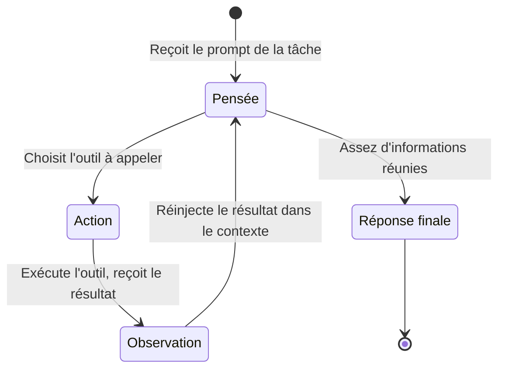

# Compagnon de code

Ce tutoriel parcourt `examples/code_companion/` — trois scripts pour développeurs qui s'appuient sur un agent `native_react` (ReAct) pour automatiser des tâches de code courantes : relire le diff d'une pull request, enquêter sur une erreur, générer des tests. Chacun adapte le même motif de base à un flux de travail différent, ce qui le rend facile à étendre à tes propres usages d'intelligence sur le code.

!!! tip "Prérequis"
    - Python 3.10 ou plus récent
    - Diapason installé : `uv sync --extra dev` depuis la racine du dépôt
    - Un moteur d'inférence en marche — Ollama en local, ou une clé d'API cloud dans `.env`
    - Pour `reviewer.py` et `code_review.py` : un dépôt git avec au moins deux branches ou deux commits

## Les trois scripts

| Script | À quoi il sert | Outils utilisés |
|---|---|---|
| `reviewer.py` | Relire un diff git entre deux branches | `git_diff`, `git_log`, `file_read`, `think` |
| `debugger.py` | Enquêter sur une erreur et proposer un correctif | `file_read`, `shell_exec`, `think` |
| `test_gen.py` | Générer des tests complets pour un module Python | `file_read`, `think`, `file_write` |

Les trois emploient l'agent `native_react` avec le même motif SDK. Ce qui change, c'est la panoplie d'outils fournie et la façon dont le prompt est construit.

## La boucle de l'agent ReAct

L'agent `native_react` met en œuvre le cycle Pensée-Action-Observation. Au lieu de produire une seule réponse, il itère jusqu'à avoir réuni assez d'informations :



Cette boucle permet à l'agent d'explorer le code au fil de ce qu'il trouve. Le relecteur peut par exemple lire un diff, remarquer un appel de fonction suspect, puis aller lire le source de cette fonction avant de rendre son verdict — sans qu'aucune de ces bifurcations ne soit écrite en dur dans le script.

## Le motif de base du SDK

Les trois scripts suivent la même structure. Une fois ce motif compris, tu peux l'adapter à n'importe quelle tâche d'intelligence sur le code :

```python title="Le motif de base du SDK" hl_lines="4 5 6"
from diapason import Diapason

j = Diapason(model="qwen3:8b", engine_key="ollama")  # (1)!
try:
    response = j.ask(
        prompt,                      # (2)!
        agent="native_react",        # (3)!
        tools=["git_diff", "think"], # (4)!
    )
    print(response)
finally:
    j.close()  # (5)!
```

1. `model` et `engine_key` sont tous deux facultatifs. Sans eux, ce sont les valeurs par défaut détectées toutes seules dans `~/.diapason/config.toml` qui s'appliquent.
2. Le prompt décrit la tâche en détail : quels outils employer, quelles étapes suivre, à quoi doit ressembler la sortie.
3. `"native_react"` choisit le `NativeReActAgent`. L'alias `"react"` marche aussi.
4. La liste d'outils est passée telle quelle. N'importe quel nom d'outil enregistré convient — lance `diapason agent info native_react` pour voir tout ce qui est disponible.
5. Appelle toujours `j.close()` pour libérer les ressources du moteur. Un bloc `try/finally` garantit le nettoyage même si l'agent lève une exception.

## La revue de code

Le script `reviewer.py` relit le diff entre deux références git et rend un retour structuré : les problèmes trouvés, des suggestions et un verdict d'ensemble.

```bash title="Terminal"
# Relire une branche de fonctionnalité contre main (le défaut)
python examples/code_companion/reviewer.py --branch feature-x

# Relire une plage de commits précise
python examples/code_companion/reviewer.py --branch HEAD --base develop

# Un modèle cloud pour les gros diffs
python examples/code_companion/reviewer.py \
    --branch feature-x --model gpt-4o --engine cloud
```

L'agent procède en quatre étapes :

1. Appeler `git_diff` pour voir ce qui a changé entre les deux références
2. Appeler `git_log` pour comprendre l'historique des commits et l'intention
3. Appeler `file_read` sur les fichiers qui demandent plus de contexte
4. Appeler `think` pour raisonner sur la qualité du code, les bugs et les choix de conception

La sortie finale tient en quatre sections : **Résumé**, **Problèmes trouvés**, **Suggestions** et **Verdict d'ensemble** (APPROVE, REQUEST CHANGES ou COMMENT).

| Option | Défaut | Description |
|---|---|---|
| `--branch` | `HEAD` | Branche ou commit à relire |
| `--base` | `main` | Branche de référence pour le diff |
| `--model` | `qwen3:8b` | Identifiant du modèle |
| `--engine` | `ollama` | Moteur d'inférence |

## L'assistant de débogage

Le script `debugger.py` prend un message d'erreur, éventuellement un chemin de fichier, et rend une analyse de la cause racine assortie d'un correctif concret.

```bash title="Terminal"
# Enquêter sur un TypeError
python examples/code_companion/debugger.py \
    --error "TypeError: NoneType has no attribute 'split'"

# Donner le fichier où l'erreur s'est produite accélère l'analyse
python examples/code_companion/debugger.py \
    --error "KeyError: 'user_id'" \
    --file src/app/views.py

# Un modèle cloud pour les traces d'appels compliquées
python examples/code_companion/debugger.py \
    --error "Segfault in libfoo.so" \
    --model gpt-4o --engine cloud
```

L'agent se sert de `file_read` pour examiner le source concerné, de `shell_exec` pour lancer des commandes de diagnostic (chercher un symbole au grep, vérifier les imports, inspecter le contenu d'un dossier) et de `think` pour raisonner sur les causes racines avant de proposer un correctif.

!!! note "La sûreté de shell_exec"
    L'outil `shell_exec` lance ses commandes dans le dossier de travail courant. En production, `ToolExecutor` applique les politiques de capacités RBAC — assure-toi que la capacité `shell_exec` est autorisée pour le rôle de l'agent. Voir [Architecture : la sécurité](../architecture/security.md).

La sortie tient en trois sections : **Cause racine**, **Correctif proposé** (un vrai changement de code) et **Prévention** (annotations de type, validation, tests).

| Option | Défaut | Description |
|---|---|---|
| `--error` | (obligatoire) | Message d'erreur ou trace d'appels |
| `--file` | (aucun) | Chemin facultatif du fichier où l'erreur s'est produite |
| `--model` | `qwen3:8b` | Identifiant du modèle |
| `--engine` | `ollama` | Moteur d'inférence |

## Le générateur de tests

Le script `test_gen.py` lit un module Python, raisonne sur son interface publique et écrit un fichier de tests complet.

```bash title="Terminal"
# Générer des tests pytest pour un module
python examples/code_companion/test_gen.py \
    --module src/diapason/tools/calculator.py

# Utiliser unittest et choisir le fichier produit
python examples/code_companion/test_gen.py \
    --module src/diapason/tools/calculator.py \
    --framework unittest \
    --output tests/test_calculator_generated.py
```

L'agent lit le module avec `file_read`, se sert de `think` pour planifier les cas de test (chemins nominaux, cas limites, gestion des erreurs, valeurs de bord), va lire les classes de base concernées pour le contexte, puis écrit le fichier de tests complet avec `file_write`.

!!! note "Le chemin de sortie par défaut"
    Sans `--output`, le fichier produit est enregistré sous `test_<module_name>.py` dans le dossier de travail courant. Le script affiche le chemin quand il a fini.

Les tests produits suivent ces règles (imposées par le prompt) :

- Chaque fonction et chaque méthode publique a au moins un test
- Chaque test porte une docstring qui dit ce qu'il vérifie
- Les cas limites sont couverts : entrée vide, `None`, grandes valeurs, types invalides
- Les dépendances externes sont simulées avec `unittest.mock`
- Le fichier se suffit à lui-même et tourne tel quel avec `pytest` ou `unittest`, sans retouche

| Option | Défaut | Description |
|---|---|---|
| `--module` | (obligatoire) | Chemin du module Python |
| `--framework` | `pytest` | Cadre de test (`pytest` ou `unittest`) |
| `--output` | `test_<name>.py` | Chemin du fichier produit |
| `--model` | `qwen3:8b` | Identifiant du modèle |
| `--engine` | `ollama` | Moteur d'inférence |

## Le choix du moteur

=== "Ollama (en local)"

    ```bash title="Terminal"
    ollama serve
    ollama pull qwen3:8b
    python examples/code_companion/reviewer.py --branch feature-x
    ```

=== "API cloud"

    ```bash title="Terminal"
    source .env  # charge OPENAI_API_KEY ou l'équivalent
    python examples/code_companion/reviewer.py \
        --branch feature-x \
        --model gpt-4o \
        --engine cloud
    ```

## Personnaliser

### Changer la panoplie d'outils

Modifie la liste `tools` dans n'importe quel script pour ajouter ou retirer des outils. Par exemple, pour que le relecteur puisse aussi chercher sur le web les avis de sécurité connus sur les dépendances qu'il voit passer dans le diff :

```python
tools = ["git_diff", "git_log", "file_read", "think", "web_search"]
```

### Ajuster le prompt

Chaque script contient une chaîne `prompt` qui dit à l'agent quoi faire et quoi produire. Adapte-la aux conventions de ton équipe — d'autres sections de revue, des normes de code précises, ou un format de sortie particulier pour l'outillage en aval.

### Ajouter la mémoire

Pour les flux de travail qui s'étalent sur plusieurs sessions (un relecteur qui se souvient de ses verdicts précédents sur les mêmes fichiers, par exemple), ajoute `"memory_store"` et `"memory_search"` à la liste d'outils, puis mets le prompt à jour pour qu'il s'en serve :

```python
tools = ["git_diff", "git_log", "file_read", "think",
         "memory_store", "memory_search"]
```

## Voir aussi

- [Architecture : les agents](../architecture/agents.md) — les rouages de `NativeReActAgent` et la boucle Pensée-Action-Observation
- [Architecture : les outils et la mémoire](../architecture/memory.md) — les outils git, les outils de fichiers, les outils shell et la chaîne d'aiguillage de `ToolExecutor`
- [Architecture : la sécurité](../architecture/security.md) — les politiques de capacités RBAC pour `shell_exec` et les autres outils privilégiés
- [Tutoriels : l'assistant de recherche approfondie](deep-research.md) — le même motif SDK avec l'`OrchestratorAgent` et les outils web/mémoire
