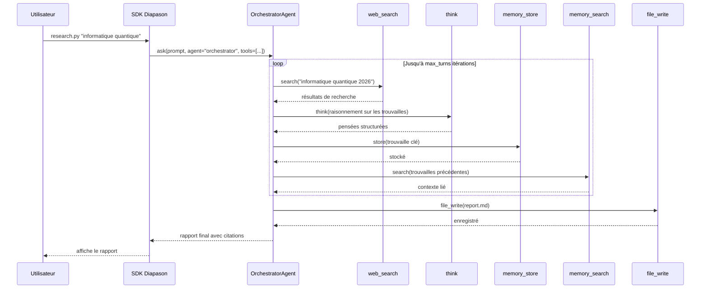

# Assistant de recherche approfondie

Ce tutoriel parcourt `examples/deep_research/research.py` — un script autonome qui confie à un agent orchestrateur la recherche sur un sujet, la collecte de sources au fil de plusieurs tours d'appels d'outils, et la production d'un rapport sourcé. Il montre comment composer la recherche web, la mémoire et l'écriture de fichiers en un seul flux de recherche cohérent.

!!! tip "Prérequis"
    - Python 3.10 ou plus récent
    - Diapason installé : `uv sync --extra dev` depuis la racine du dépôt
    - Un moteur d'inférence en marche — Ollama en local (voir plus bas), ou une clé d'API cloud dans ton fichier `.env`

## Démarrage rapide

Lance le script de recherche depuis la racine du dépôt, en passant ton sujet en argument positionnel :

```bash title="Terminal"
python examples/deep_research/research.py "avancées de l'informatique quantique 2026"
```

Enregistrer le rapport dans un fichier :

```bash title="Terminal"
python examples/deep_research/research.py "avancées de l'informatique quantique 2026" \
    --output report.md
```

Se servir d'un modèle cloud plutôt que d'un moteur local :

```bash title="Terminal"
source .env  # charge les clés d'API
python examples/deep_research/research.py "tendances des politiques climatiques" \
    --model gpt-4o --engine cloud --max-turns 20
```

## Comment ça marche

Le script crée une instance `Diapason` et délègue la tâche de recherche à un `OrchestratorAgent` câblé avec cinq outils. L'orchestrateur enchaîne plusieurs tours d'appels d'outils et décide à chaque étape s'il faut chercher, stocker, réfléchir ou synthétiser.



À chaque tour, l'orchestrateur choisit l'outil à appeler d'après ce qu'il a appris jusque-là. L'outil `think` laisse le modèle raisonner sans effet de bord, tandis que `memory_store` et `memory_search` offrent un brouillon persistant d'un tour à l'autre — une trouvaille du tour 3 peut donc encore nourrir la synthèse du tour 12.

## Le script

```python title="examples/deep_research/research.py" hl_lines="9 10 11 12 13"
from diapason import Diapason

tools = ["web_search", "think", "file_write", "memory_store", "memory_search"]

j = Diapason(model="qwen3:8b", engine_key="ollama")  # (1)!
try:
    response = j.ask(
        "Fais une recherche approfondie sur le sujet suivant et produis un rapport :\n\ninformatique quantique",
        agent="orchestrator",     # (2)!
        tools=tools,              # (3)!
        system_prompt=...,        # (4)!
        max_turns=15,             # (5)!
        temperature=0.5,
    )
finally:
    j.close()
```

1. Crée une instance `Diapason` pointée sur le moteur Ollama local avec `qwen3:8b`. Les deux paramètres sont facultatifs — sans eux, ce sont les valeurs par défaut détectées toutes seules dans `~/.diapason/config.toml` qui s'appliquent.
2. Choisit l'`OrchestratorAgent`, qui mène une boucle d'appels d'outils sur plusieurs tours plutôt qu'un seul aller-retour.
3. La liste d'outils est passée telle quelle à l'agent. Les cinq outils sont enregistrés dans le registre d'outils et ne demandent aucune autre configuration.
4. Le prompt système demande au modèle de citer ses sources et de distinguer les faits des affirmations encore fragiles.
5. La boucle s'arrête après 15 tours d'appels d'outils, ou quand l'agent estime qu'il en sait assez.

## Le choix du moteur

=== "Ollama (en local)"

    Démarre le démon Ollama et télécharge le modèle avant de lancer le script :

    ```bash title="Terminal"
    ollama serve
    ollama pull qwen3:8b
    python examples/deep_research/research.py "ton sujet ici"
    ```

    Aucune option à passer — `--engine ollama` et `--model qwen3:8b` sont les valeurs par défaut.

=== "API cloud"

    Mets ta clé d'API dans `.env`, puis passe `--engine cloud` et l'identifiant de modèle qui convient :

    ```bash title="Terminal"
    # .env (à la racine du dépôt, ignoré par git)
    OPENAI_API_KEY=sk-...

    source .env
    python examples/deep_research/research.py "ton sujet" \
        --model gpt-4o --engine cloud
    ```

=== "vLLM"

    Si tu fais tourner un serveur d'inférence vLLM (sur une machine multi-GPU, par exemple) :

    ```bash title="Terminal"
    python examples/deep_research/research.py "ton sujet" \
        --model meta-llama/Meta-Llama-3-8B-Instruct \
        --engine vllm
    ```

    Assure-toi que `VLLM_BASE_URL` est défini dans `.env` et pointe vers ton serveur vLLM.

## Référence de configuration

| Option | Défaut | Description |
|---|---|---|
| `--model` | `qwen3:8b` | Identifiant de modèle passé au moteur |
| `--engine` | `ollama` | Moteur d'inférence (`ollama`, `cloud`, `vllm`, `llamacpp`, `mlx`) |
| `--max-turns` | `15` | Nombre maximum d'itérations de la boucle de l'orchestrateur |
| `--output` | (aucun) | Chemin du fichier où enregistrer le rapport final ; sans lui, le rapport est affiché sur la sortie standard |

## La configuration par recette

Le fichier `research.toml` qui l'accompagne, dans `examples/deep_research/`, exprime la même configuration de façon déclarative. Tu peux le charger par programme avec `load_recipe()` et passer le résultat à `SystemBuilder` :

```python title="Se servir de la recette"
from diapason.recipes import load_recipe
from diapason import SystemBuilder

recipe = load_recipe("examples/deep_research/research.toml")
system = SystemBuilder(**recipe.to_builder_kwargs()).build()
response = system.ask("avancées de l'informatique quantique 2026")
system.close()
```

C'est pratique quand tu veux versionner la configuration de recherche, la partager avec d'autres, ou la donner au lanceur `diapason eval` pour mesurer les performances.

## Personnaliser

### Changer d'agent

Remplace `"orchestrator"` par `"native_react"` pour une boucle Pensée-Action-Observation, ou par `"native_openhands"` pour un agent façon CodeAct, capable d'écrire et d'exécuter du code :

```python
response = j.ask(prompt, agent="native_react", tools=tools)
```

### Ajouter des outils

Ajoute à la liste `tools` le nom de n'importe quel outil enregistré. Par exemple, pour interroger aussi une base de connaissances locale :

```python
tools = ["web_search", "think", "file_write",
         "memory_store", "memory_search", "knowledge_graph_query"]
```

Lance `diapason agent info orchestrator` pour voir le catalogue complet des outils.

### Ajuster la température

Les valeurs basses (0,2) donnent des rapports plus resserrés et plus factuels. Les valeurs hautes (0,7-0,8) encouragent une exploration plus large et une synthèse plus créative :

```bash title="Terminal"
python examples/deep_research/research.py "ton sujet" --max-turns 20
```

## Voir aussi

- [Architecture : les agents](../architecture/agents.md) — la hiérarchie des agents (`BaseAgent`, `ToolUsingAgent`, `OrchestratorAgent`) et le mécanisme `accepts_tools`
- [Architecture : les outils et la mémoire](../architecture/memory.md) — le registre d'outils, l'adaptateur MCP et la chaîne d'aiguillage de `ToolExecutor`
- [Premiers pas : la configuration](../getting-started/configuration.md) — comment configurer les moteurs et les modèles dans `~/.diapason/config.toml`
