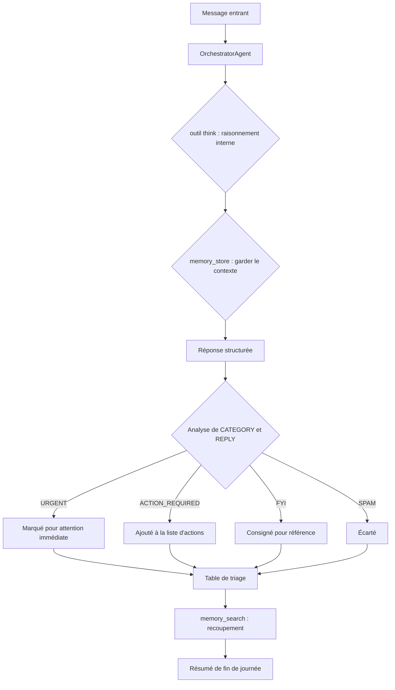

# Centre de messagerie

Ce tutoriel parcourt `examples/messaging_hub/smart_inbox.py` — un script qui relie Diapason aux plateformes de messagerie, trie les messages entrants par priorité, rédige des réponses qui tiennent compte du contexte et produit un résumé de fin de journée. Il montre l'intégration des canaux, la sortie structurée d'un agent et l'agrégation adossée à la mémoire sur plusieurs messages.

!!! tip "Prérequis"
    - Python 3.10 ou plus récent
    - Diapason installé : `uv sync --extra dev` depuis la racine du dépôt
    - Un moteur d'inférence en marche (Ollama avec `qwen3:8b` téléchargé, ou une clé d'API cloud)
    - Pour le mode canal réel : les identifiants propres au canal (voir [Brancher de vrais canaux](#setting-up-real-channels))

## Démarrage rapide : le mode démo

Le mode démo traite cinq messages d'exemple, sans aucune configuration de canal ni identifiants. C'est le chemin le plus court pour voir la chaîne de triage à l'œuvre :

```bash title="Terminal"
python examples/messaging_hub/smart_inbox.py --demo
```

Sortie attendue (abrégée) :

```
Smart Inbox — Demo Mode
Model: qwen3:8b  |  Engine: ollama
============================================================
Processing 5 messages...

  [1/5] Classifying: URGENT: Server is down in production...
           -> URGENT
  [2/5] Classifying: Hey, just wanted to share this interest...
           -> FYI
  [3/5] Classifying: Can you review my PR #42 by end of day...
           -> ACTION_REQUIRED
  [4/5] Classifying: Meeting reminder: Team standup at 10am...
           -> FYI
  [5/5] Classifying: Buy now! Limited time offer on premium...
           -> SPAM

  #   Category          Message                             Reply
  ---------------------------------------------------------------
  1   URGENT            URGENT: Server is down...           On it — escalating now.
  2   FYI               Hey, just wanted to share...        Thanks for sharing!
  3   ACTION_REQUIRED   Can you review my PR #42...         Will review before EOD.
  4   FYI               Meeting reminder: Team standup...   N/A
  5   SPAM              Buy now! Limited time offer...      N/A

Generating end-of-day summary...
```

Pour imposer un autre modèle ou un autre moteur :

```bash title="Terminal"
python examples/messaging_hub/smart_inbox.py --demo --model gpt-4o --engine cloud
```

## Comment se fait la classification des messages

Chaque message entrant passe par un prompt structuré qui demande à l'agent de rendre exactement deux champs — une catégorie et une réponse — dans un format analysable. Le script extrait ensuite ces champs et bâtit la table de triage.



Une fois tous les messages traités, un second appel à l'orchestrateur se sert de `memory_search` pour retrouver le journal de triage enregistré et produit un résumé groupé qui met en avant les actions restées ouvertes.

## Le prompt de classification

L'agent reçoit un prompt structuré qui fixe le format de sortie au détail près. La réponse en devient analysable de façon fiable, sans schéma compliqué :

```python title="examples/messaging_hub/smart_inbox.py"
CLASSIFICATION_PROMPT = (
    "You are a smart inbox assistant. Classify the following message into "
    "exactly one category: URGENT, ACTION_REQUIRED, FYI, or SPAM.\n"
    "Then draft a short reply if appropriate (not for SPAM).\n\n"
    "Respond in this exact format:\n"
    "CATEGORY: <category>\n"
    "REPLY: <reply or N/A>\n\n"
    "Message:\n{message}"
)
```

L'outil `think` laisse l'agent raisonner en interne avant de s'arrêter sur une catégorie, et `memory_store` garde chaque classification pour que le prompt du résumé puisse s'appuyer sur tout le journal de triage.

## Brancher de vrais canaux

=== "Slack"

    1. Ajoute le serveur MCP de Slack à ta configuration :

        ```bash title="Terminal"
        diapason add slack
        ```

    2. Pose tes identifiants dans `.env` (ignoré par git) :

        ```bash title=".env"
        SLACK_BOT_TOKEN=xoxb-...
        SLACK_APP_TOKEN=xapp-...
        ```

    3. Invite le bot dans le canal Slack visé, depuis les réglages de l'espace de travail Slack.

    4. Lance le script en mode canal réel :

        ```bash title="Terminal"
        python examples/messaging_hub/smart_inbox.py --channel slack
        ```

=== "WhatsApp"

    1. Assure-toi que Node.js 22 ou plus récent est installé.

    2. Configure le pont WhatsApp Baileys. Voir la [documentation des canaux](../architecture/overview.md) pour la mise en place complète.

    3. Démarre le pont — il affiche un QR code. Scanne-le avec l'app mobile WhatsApp pour t'authentifier.

    4. Lance le script :

        ```bash title="Terminal"
        python examples/messaging_hub/smart_inbox.py --channel whatsapp
        ```

=== "Les autres canaux"

    Diapason prend en charge LINE, Viber, Mastodon, Rocket.Chat, Zulip, XMPP, Twitch, Nostr, et d'autres encore. Pour lister tous les canaux disponibles :

    ```bash title="Terminal"
    diapason channel list
    diapason channel status
    ```

    Chaque canal réclame ses propres variables d'environnement. Lance `diapason add <channel>` quand c'est disponible pour générer le gabarit de configuration.

!!! warning "Le mode canal réel"
    Le mode canal réel demande les identifiants du canal et le sous-système de canal correspondant en marche. Sers-toi de `--demo` pour vérifier la logique de triage avant de te brancher à un vrai canal.

## Configurer le canal en TOML

La recette `messaging.toml` de `examples/messaging_hub/` fixe les valeurs par défaut de l'agent et du canal de façon déclarative :

```toml title="examples/messaging_hub/messaging.toml"
[channel]
default = "slack"

[agent]
type = "orchestrator"
max_turns = 5
temperature = 0.3
tools = ["think", "memory_store", "memory_search"]
```

Tu peux charger cette recette par programme :

```python title="Charger la recette de messagerie"
from diapason.recipes import load_recipe
from diapason import SystemBuilder

recipe = load_recipe("examples/messaging_hub/messaging.toml")
system = SystemBuilder(**recipe.to_builder_kwargs()).build()
response = system.ask(CLASSIFICATION_PROMPT.format(message=incoming_message))
system.close()
```

## Ajouter tes propres règles de triage

Élargis les catégories de classification en modifiant `CLASSIFICATION_PROMPT`. Par exemple, pour ajouter une catégorie `FOLLOW_UP` aux messages qui attendent une réponse sous 48 heures :

```python title="Prompt de classification personnalisé" hl_lines="2"
CLASSIFICATION_PROMPT = (
    "Classify into: URGENT, ACTION_REQUIRED, FOLLOW_UP, FYI, or SPAM.\n"
    "Then draft a short reply if appropriate (not for SPAM).\n\n"
    "Respond in this exact format:\n"
    "CATEGORY: <category>\n"
    "REPLY: <reply or N/A>\n\n"
    "Message:\n{message}"
)
```

Tu peux aussi poser des règles métier dans le prompt système via `messaging.toml` — par exemple aiguiller directement vers URGENT tout message contenant « P0 » ou « incident », quelle que soit la tournure.

## Programmer le résumé quotidien

Une fois tous les messages traités, l'appel du résumé de fin de journée part tout de suite dans le script. En production, programme-le à part avec le programmateur de Diapason :

```bash title="Terminal"
diapason scheduler create "Daily inbox summary" \
    --type cron --value "0 17 * * *"
```

Ou reprends le motif des recettes d'opérateur pour faire tourner un agent de triage persistant sur un horaire. Voir les recettes d'opérateur dans `src/diapason/recipes/data/operators/` pour des exemples tout faits.

## Voir aussi

- [Architecture : les agents](../architecture/agents.md) — `OrchestratorAgent` et la boucle d'outils multi-tours
- [Architecture : les outils et la mémoire](../architecture/memory.md) — `memory_store`, `memory_search` et les moteurs de stockage
- [Tutoriels : les opérations personnelles programmées](scheduled-ops.md) — combiner les scripts avec le programmateur cron
