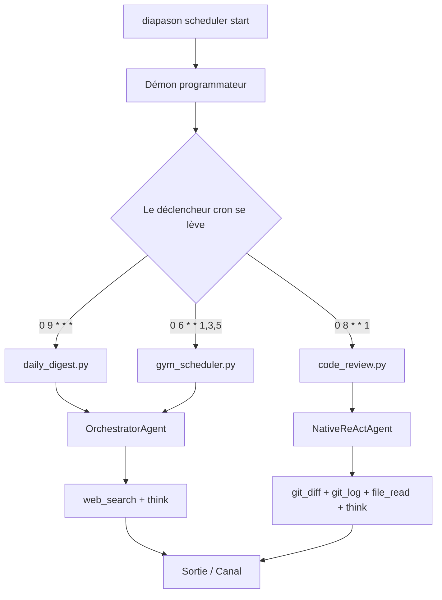

# Opérations personnelles programmées

Ce tutoriel parcourt `examples/scheduled_ops/` — trois scripts qui font tourner des agents autonomes sur des horaires à la cron pour prendre en charge les tâches personnelles qui reviennent. Ensemble, ils montrent comment combiner le SDK `Diapason`, la CLI du programmateur et l'API Python `TaskScheduler` pour bâtir une couche d'opérations personnelles qui tourne en arrière-plan.

!!! tip "Prérequis"
    - Python 3.10 ou plus récent
    - Diapason installé : `uv sync --extra dev` depuis la racine du dépôt
    - Un moteur d'inférence en marche (Ollama avec `qwen3:8b` téléchargé, ou une clé d'API cloud)
    - Pour la prise en charge complète des expressions cron, installe `croniter` : `uv add croniter`

## Les trois scripts

| Script | Agent | Outils | Horaire par défaut | À quoi il sert |
|---|---|---|---|---|
| `daily_digest.py` | `orchestrator` | `web_search`, `think` | Tous les jours à 9 h | Chercher et résumer l'actualité sur les sujets choisis |
| `code_review.py` | `native_react` | `git_log`, `git_diff`, `file_read`, `think` | Le lundi à 8 h | Relire la semaine de commits écoulée dans un dépôt |
| `gym_scheduler.py` | `orchestrator` | `web_search`, `think` | Lun/mer/ven à 6 h | Vérifier les horaires de la salle et les places en cours |

Chaque script suit le même motif SDK : créer une instance `Diapason`, appeler `j.ask()` avec un agent et des outils, afficher le résultat, fermer l'instance. L'horaire, lui, est géré de l'extérieur par le démon programmateur de Diapason.

## Démarrage rapide : lancer les scripts à la main

Teste chaque script sans programmateur en marche, en l'appelant directement :

```bash title="Terminal"
# Résumé matinal de l'actualité sur l'IA et la robotique
uv run python examples/scheduled_ops/daily_digest.py --topics "AI,robotics"

# Revue de code du dépôt courant (les 7 derniers jours de commits)
uv run python examples/scheduled_ops/code_review.py --repo-path .

# Vérification des horaires de la salle de sport
uv run python examples/scheduled_ops/gym_scheduler.py --gym "24 Hour Fitness"
```

Tous les scripts acceptent les drapeaux `--model` et `--engine` :

```bash title="Terminal"
uv run python examples/scheduled_ops/daily_digest.py \
    --model qwen3:8b --engine ollama --topics "AI,finance"
```

## Comment fonctionne le programmateur



Le démon programmateur lit les tâches enregistrées dans SQLite, les déclenche à l'heure dite et passe à l'agent le prompt configuré. Chaque script peut aussi se lancer directement — le programmateur ne sert qu'au fonctionnement récurrent et sans surveillance.

## Poser les horaires avec la CLI

Enregistre chaque script comme tâche récurrente avec `diapason scheduler create` :

```bash title="Terminal"
# Résumé matinal tous les jours à 9 h
diapason scheduler create "Run daily news digest" \
    --type cron --value "0 9 * * *"

# Revue de code hebdomadaire, tous les lundis à 8 h
diapason scheduler create "Run weekly code review" \
    --type cron --value "0 8 * * 1"

# Vérification de la salle les lundi, mercredi et vendredi à 6 h
diapason scheduler create "Check gym schedule" \
    --type cron --value "0 6 * * 1,3,5"
```

Démarre ensuite le démon programmateur au premier plan (ou comme service en arrière-plan) :

```bash title="Terminal"
diapason scheduler start
```

Liste les tâches enregistrées quand tu veux :

```bash title="Terminal"
diapason scheduler list
```

!!! note "La syntaxe des expressions cron"
    Diapason emploie la syntaxe cron standard à cinq champs : `minute heure jour-du-mois mois jour-de-la-semaine`. Installe `croniter` (`uv add croniter`) pour la prise en charge complète des expressions, plages et pas compris. Sans lui, les motifs simples `heure:minute` fonctionnent quand même.

## Configurer les horaires en TOML

Le fichier `schedules.toml` de `examples/scheduled_ops/` définit les trois horaires de façon déclarative. Pratique pour versionner la configuration de tes opérations personnelles, ou pour la partager d'une machine à l'autre :

```toml title="examples/scheduled_ops/schedules.toml"
[schedules.daily_digest]
type = "cron"
value = "0 9 * * *"
description = "Morning news and social media digest"
script = "daily_digest.py"

[schedules.code_review]
type = "cron"
value = "0 8 * * 1"
description = "Weekly code review"
script = "code_review.py"

[schedules.gym_scheduler]
type = "cron"
value = "0 6 * * 1,3,5"
description = "Gym hours and class check"
script = "gym_scheduler.py"
```

Pointe ton propre outillage, ou un chargeur maison, sur ce fichier pour enregistrer les tâches en lot.

## Enregistrer des tâches par l'API Python

Le script `gym_scheduler.py` porte un drapeau `--register` qui montre l'enregistrement d'une tâche par programme, en passant directement par `TaskScheduler` :

```bash title="Terminal"
uv run python examples/scheduled_ops/gym_scheduler.py \
    --register --gym "Planet Fitness"
```

Le code Python équivalent :

```python title="Enregistrement d'une tâche par programme"
from diapason.scheduler import TaskScheduler
from diapason.scheduler.store import SchedulerStore

store = SchedulerStore()
scheduler = TaskScheduler(store)

task = scheduler.create_task(  # (1)!
    prompt="Check gym schedule for 'Planet Fitness'",
    schedule_type="cron",
    schedule_value="0 6 * * 1,3,5",
    agent="orchestrator",
    tools="web_search,think",
)
print(f"Tâche enregistrée  : {task.id}")
print(f"Prochain lancement : {task.next_run}")
```

1. `create_task()` écrit la tâche dans SQLite et calcule l'heure du prochain déclenchement. Le démon programmateur la reprend sans redémarrer.

## Le script du résumé quotidien

Le script du résumé est le plus simple des trois. Il construit un prompt daté et le passe à un orchestrateur muni de `web_search` et de `think` :

```python title="examples/scheduled_ops/daily_digest.py" hl_lines="5 6 7 8"
from diapason import Diapason

j = Diapason()  # reprend les valeurs par défaut de ~/.diapason/config.toml
response = j.ask(
    f"Today is {today}. Search and summarize the top news on: {topics}",
    agent="orchestrator",
    tools=["web_search", "think"],
)
j.close()
```

L'orchestrateur cherche chaque sujet dans un tour distinct, se sert de `think` pour faire la synthèse d'un sujet à l'autre, et rend un résumé structuré : des points par sujet et une perspective en un paragraphe.

## Envoyer les résultats vers un canal

Pour aiguiller la sortie d'un script vers Slack ou n'importe quel autre canal pris en charge, passe la sortie standard dans `diapason channel send` :

```bash title="Terminal"
uv run python examples/scheduled_ops/daily_digest.py \
    --topics "AI,finance" | diapason channel send slack
```

Ou ajoute la sortie vers le canal à l'intérieur du script :

```python title="Sortie vers un canal depuis le script"
from diapason.channels import ChannelRegistry

channel = ChannelRegistry.create("slack", webhook_url="https://hooks.slack.com/...")
channel.send(response)
```

Liste tous les canaux disponibles :

```bash title="Terminal"
diapason channel list
```

!!! warning "Les identifiants des canaux"
    Une sortie réelle vers un canal demande les identifiants propres à ce canal. Lance `diapason add slack` (ou le fournisseur voulu) pour poser le serveur MCP et le coffre à identifiants, puis règle les variables d'environnement dans ton fichier `.env` avant de démarrer le démon programmateur.

## Conseils de personnalisation

- **Changer les sujets** : passe `--topics "finance,healthcare,sports"` à `daily_digest.py` pour un autre résumé.
- **La fenêtre de revue** : passe `--days 14` à `code_review.py` pour un cycle de revue de deux semaines au lieu d'une.
- **Échanger les agents** : remplace `orchestrator` par `native_react` dans n'importe quel script pour comparer le comportement des agents sur la même tâche.
- **Écrire dans un fichier** : ajoute `"file_write"` à la liste `tools` et mets le prompt à jour pour enregistrer les rapports sur le disque au lieu de les afficher.
- **Les tâches uniques** : emploie `--type once --value "2026-04-01T09:00:00"` avec `diapason scheduler create` pour les tâches qui ne se répètent pas.

## Voir aussi

- [Architecture : les agents](../architecture/agents.md) — les rouages de `OrchestratorAgent` et de `NativeReActAgent`
- [Architecture : les outils et la mémoire](../architecture/memory.md) — le registre d'outils et `ToolExecutor`
- [Démarrer : la configuration](../getting-started/configuration.md) — le moteur et le modèle par défaut
