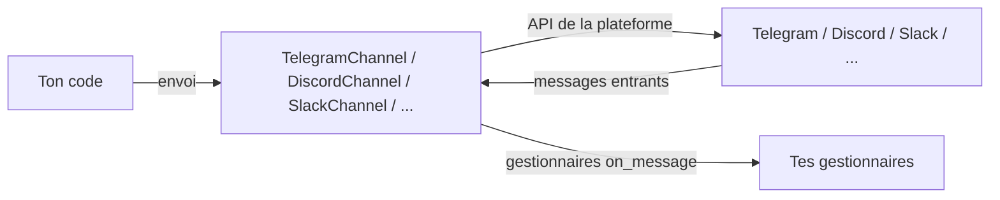

# Canaux

Le module des canaux permet à Diapason d'envoyer et de recevoir des messages par des plateformes de messagerie externes. Chaque plateforme a sa propre implémentation de canal, qui se connecte directement à l'API de la plateforme — il n'y a aucune passerelle intermédiaire.

!!! note "Les canaux sont désactivés par défaut"
    La section `[channel]` de la configuration vaut `enabled = false` par défaut. Tu dois poser `enabled = true` et configurer les identifiants propres à chaque plateforme avant que les fonctions de canal s'activent.

---

## Vue d'ensemble

La messagerie par canaux est bâtie autour de la classe abstraite `BaseChannel`. Chaque plateforme (Telegram, Discord, Slack, WhatsApp, etc.) a son implémentation, enregistrée par `@ChannelRegistry.register("name")`. Les canaux se connectent directement aux API de leur plateforme, enregistrent des gestionnaires pour les messages entrants et envoient les messages sortants.



---

## Les canaux pris en charge

| Canal | Clé de registre | Plateforme | Extra pip | Authentification |
|---------|-------------|----------|-----------|------|
| `SendBlueChannel` | `sendblue` | API iMessage/SMS de SendBlue | — | Clé d'API + secret |
| `TelegramChannel` | `telegram` | API des robots Telegram | `channel-telegram` | Jeton de robot |
| `DiscordChannel` | `discord` | API des robots Discord | `channel-discord` | Jeton de robot |
| `SlackChannel` | `slack` | API web de Slack | `channel-slack` | Jetons de robot et d'application |
| `WhatsAppChannel` | `whatsapp` | API WhatsApp Business | — | Jeton d'API |
| `WhatsAppBaileysChannel` | `whatsapp_baileys` | WhatsApp (Baileys) | — | Authentification par code QR |
| `WebhookChannel` | `webhook` | Webhook HTTP générique | — | URL + secret facultatif |
| `EmailChannel` | `email` | Courriel SMTP/IMAP | — | Identifiants de courriel |
| `SignalChannel` | `signal` | Signal Messenger | — | Signal CLI |
| `GoogleChatChannel` | `google_chat` | Google Chat | — | Compte de service |
| `IRCChannel` | `irc` | IRC | — | Identifiants du serveur |
| `WebChatChannel` | `webchat` | Discussion dans le navigateur | — | Aucune |
| `TeamsChannel` | `teams` | Microsoft Teams | — | Identifiants du robot |
| `MatrixChannel` | `matrix` | Protocole Matrix | — | Homeserver + jeton |
| `MattermostChannel` | `mattermost` | Mattermost | — | Jeton de robot |
| `FeishuChannel` | `feishu` | Feishu/Lark | — | Identifiants d'application |
| `BlueBubblesChannel` | `bluebubbles` | iMessage (BlueBubbles) | — | Serveur BlueBubbles |
| `LineChannel` | `line` | API de messagerie LINE | `channel-line` | Jeton d'accès au canal |
| `ViberChannel` | `viber` | API des robots Viber | `channel-viber` | Jeton d'authentification |
| `MessengerChannel` | `messenger` | Facebook Messenger | `channel-messenger` | Jeton d'accès à la page |
| `RedditChannel` | `reddit` | API de Reddit | `channel-reddit` | Identifiants OAuth |
| `MastodonChannel` | `mastodon` | API de Mastodon | `channel-mastodon` | Jeton d'accès |
| `XMPPChannel` | `xmpp` | XMPP/Jabber | `channel-xmpp` | JID + mot de passe |
| `RocketChatChannel` | `rocketchat` | API de Rocket.Chat | `channel-rocketchat` | Identifiants utilisateur |
| `ZulipChannel` | `zulip` | API de Zulip | `channel-zulip` | Courriel du robot + clé d'API |
| `TwitchChannel` | `twitch` | IRC/API de Twitch | `channel-twitch` | Jeton OAuth |
| `NostrChannel` | `nostr` | Protocole Nostr | `channel-nostr` | Clé privée (nsec) |

---

## Se servir d'un canal

### Se connecter

```python title="connect.py"
from diapason.channels.telegram import TelegramChannel

channel = TelegramChannel(
    bot_token="TON_JETON_DE_ROBOT",  # (1)!
)
channel.connect()

print(channel.status())  # ChannelStatus.CONNECTED
```

1. Retombe sur la variable d'environnement `TELEGRAM_BOT_TOKEN` quand il n'est pas fourni.

### Envoyer des messages

```python title="send_message.py"
from diapason.channels.telegram import TelegramChannel

channel = TelegramChannel()
channel.connect()

# Envoyer à une discussion, par son identifiant
ok = channel.send(
    "123456789",
    "Analyse terminée. Les résultats sont prêts.",
    conversation_id="thread-abc123",  # facultatif, pour le fil de discussion
)

if ok:
    print("Message remis")
else:
    print("La remise a échoué")

channel.disconnect()
```

### Recevoir des messages

Enregistre les fonctions de rappel avant d'appeler `connect()`. Chaque gestionnaire reçoit un `ChannelMessage` et peut, s'il le veut, rendre une chaîne en réponse.

```python title="receive_messages.py"
from diapason.channels._stubs import ChannelMessage
from diapason.channels.discord_channel import DiscordChannel

channel = DiscordChannel()


def handle_incoming(msg: ChannelMessage) -> None:
    print(f"[{msg.channel}] {msg.sender} : {msg.content}")
    print(f"  conversation_id={msg.conversation_id}")
    print(f"  message_id={msg.message_id}")


channel.on_message(handle_incoming)  # (1)!
channel.connect()                    # (2)!

# Les messages arrivent maintenant de façon asynchrone, par le fil d'écoute
# en arrière-plan. Ton fil principal peut continuer à faire autre chose.
```

1. Enregistre un ou plusieurs gestionnaires. Tous les gestionnaires enregistrés sont appelés pour chaque message entrant.
2. `connect()` démarre le fil d'écoute en arrière-plan une fois la connexion à la plateforme établie.

### Lister les canaux disponibles

```python title="list_channels.py"
from diapason.channels.slack import SlackChannel

channel = SlackChannel()
channel.connect()
channels = channel.list_channels()
print(channels)  # ["general", "random", "dev"]
```

### Se déconnecter

```python title="disconnect.py"
channel.disconnect()
# Arrête le fil d'écoute et ferme la connexion à la plateforme.
# L'état devient ChannelStatus.DISCONNECTED
```

---

## Les champs de `ChannelMessage`

Chaque message entrant est remis aux gestionnaires sous la forme d'une dataclasse `ChannelMessage`.

| Champ | Type | Description |
|-------|------|-------------|
| `channel` | `str` | Nom du canal par lequel le message est arrivé |
| `sender` | `str` | Identifiant de l'expéditeur du message |
| `content` | `str` | Texte du message |
| `message_id` | `str` | Identifiant unique du message (peut être vide) |
| `conversation_id` | `str` | Identifiant du fil ou de la conversation (peut être vide) |
| `session_id` | `str` | Identifiant de session (peut être vide) |
| `metadata` | `dict[str, Any]` | Métadonnées supplémentaires, propres à la plateforme |

---

## L'intégration au bus d'événements

Passe un `EventBus` pour publier les événements de canal au reste du système :

```python title="channel_events.py"
from diapason.core.events import EventBus, EventType
from diapason.channels.telegram import TelegramChannel

bus = EventBus()


def on_received(event):
    print(f"Message reçu sur {event.data['channel']} : {event.data['content']}")


def on_sent(event):
    print(f"Message envoyé à {event.data['channel']}")


bus.subscribe(EventType.CHANNEL_MESSAGE_RECEIVED, on_received)
bus.subscribe(EventType.CHANNEL_MESSAGE_SENT, on_sent)

channel = TelegramChannel(bus=bus)
channel.connect()
```

| Événement | Publié quand | Clés de données |
|-------|----------------|-----------|
| `CHANNEL_MESSAGE_RECEIVED` | Un message arrive de la plateforme | `channel`, `sender`, `content`, `message_id` |
| `CHANNEL_MESSAGE_SENT` | Un message part avec succès | `channel`, `content`, `conversation_id` |

---

## Les commandes en ligne de commande

Le groupe de sous-commandes `diapason channel` donne un accès rapide aux opérations sur les canaux.

### Lister les canaux

```bash
diapason channel list
```

### Envoyer un message

```bash
# Envoyer à un canal, par son nom
diapason channel send telegram "Construction terminée avec succès"
```

### Afficher l'état

```bash
diapason channel status
```

---

## Les routes du serveur d'API

Quand `diapason serve` tourne, trois routes de canal sont disponibles. Les canaux doivent être configurés et activés dans `[channel]` pour que ces routes rendent des données.

### `GET /v1/channels`

Rend la liste des canaux enregistrés et leur état.

```bash
curl http://localhost:8000/v1/channels
```

```json
{
  "channels": ["telegram", "discord", "slack"],
  "status": "connected"
}
```

Si aucun canal n'est configuré :
```json
{"channels": [], "message": "No channels configured"}
```

### `POST /v1/channels/send`

Envoie un message à un canal.

```bash
curl -X POST http://localhost:8000/v1/channels/send \
  -H "Content-Type: application/json" \
  -d '{"channel": "telegram", "content": "Bonjour !", "conversation_id": "conv-1"}'
```

```json
{"status": "sent", "channel": "telegram"}
```

Champs obligatoires : `channel`, `content`. `conversation_id` est facultatif.

### `GET /v1/channels/status`

Rend l'état de connexion de chaque canal configuré.

```bash
curl http://localhost:8000/v1/channels/status
```

```json
{"status": "connected"}
```

Les valeurs possibles : `connected`, `disconnected`, `connecting`, `error`, `not_configured`.

---

## La configuration

Les réglages des canaux vivent dans la section `[channel]` de `~/.diapason/config.toml`. Chaque plateforme a sa propre sous-section imbriquée.

```toml title="~/.diapason/config.toml"
[channel]
enabled = true
default_channel = ""
default_agent = "simple"

[channel.telegram]
bot_token = "TON_JETON_DE_ROBOT_TELEGRAM"

[channel.discord]
bot_token = "TON_JETON_DE_ROBOT_DISCORD"

[channel.slack]
bot_token = "TON_JETON_DE_ROBOT_SLACK"
app_token = "TON_JETON_D_APPLICATION_SLACK"
```

### La référence de configuration

| Clé | Type | Défaut | Description |
|-----|------|---------|-------------|
| `enabled` | `bool` | `false` | Active la messagerie par canaux |
| `default_channel` | `str` | `""` | Canal utilisé par défaut quand aucun n'est précisé |
| `default_agent` | `str` | `simple` | Agent chargé de traiter les messages entrants |

Les réglages propres à chaque plateforme se configurent dans les sous-sections imbriquées (`[channel.telegram]`, `[channel.discord]`, par exemple).

---

## Un exemple complet

Cet exemple connecte un canal Telegram, enregistre un gestionnaire qui renvoie les messages en écho, envoie un message d'essai, puis se déconnecte après une courte attente.

```python title="full_example.py"
import time
from diapason.channels._stubs import ChannelMessage
from diapason.channels.telegram import TelegramChannel
from diapason.core.events import EventBus

bus = EventBus()
channel = TelegramChannel(
    bot_token="TON_JETON_DE_ROBOT",
    bus=bus,
)

received_messages = []


def on_message(msg: ChannelMessage) -> None:
    received_messages.append(msg)
    print(f"Reçu de {msg.sender} sur #{msg.channel} : {msg.content}")


channel.on_message(on_message)
channel.connect()

# Lister les canaux disponibles
channels = channel.list_channels()
print(f"Canaux disponibles : {channels}")

# Envoyer un message
if channels:
    channel.send(channels[0], "Bonjour de la part de Diapason !")

# Attendre les messages entrants
time.sleep(10)

channel.disconnect()
print(f"Total de messages reçus : {len(received_messages)}")
```

---

## SendBlue (iMessage / SMS)

`SendBlueChannel` est enregistré sous `"sendblue"` dans le `ChannelRegistry` et donne à ton agent un **numéro de téléphone dédié**, auquel les gens peuvent écrire par iMessage (les bulles bleues) ou par SMS. Il passe par l'[API SendBlue](https://docs.sendblue.com/) — aucun matériel Apple ni serveur BlueBubbles n'est nécessaire.

### Comment ça marche

```
Ton téléphone  ──texto──▶  SendBlue  ──webhook──▶  tunnel ngrok  ──▶  Diapason
                                                                              │
Ton téléphone  ◀──iMessage──  SendBlue  ◀──appel d'API──  agent DeepResearch ◀┘
```

Quand quelqu'un écrit au numéro SendBlue, SendBlue POSTe le message à ton webhook. Diapason envoie aussitôt un accusé « Message received! », fait tourner l'agent DeepResearch, et renvoie la réponse par iMessage.

### L'installation (par l'interface du navigateur)

Le plus simple passe par l'interface des Agents :

1. Va dans **Agents → ton agent → onglet Canaux de messagerie**
2. Clique **Configurer** sur « iMessage / SMS »
3. Clique **Ouvrir l'inscription SendBlue** — crée un compte gratuit (aucune carte de crédit demandée)
4. Dans le tableau de bord SendBlue, copie ton **API Key ID** et ta **API Secret Key**
5. Colle-les dans le formulaire et clique **Vérifier et trouver le numéro**
6. Sur l'offre gratuite (ligne partagée), copie le numéro de téléphone affiché sous « Send from » dans ton tableau de bord SendBlue et colle-le
7. Clique **Activer le numéro**

### Le tunnel (obligatoire)

Comme Diapason tourne chez toi, il te faut un tunnel pour que SendBlue puisse joindre ton webhook :

```bash
# Installer ngrok (une seule fois)
brew install ngrok

# Inscris-toi sur https://dashboard.ngrok.com/signup (gratuit)
# Puis configure ton jeton d'authentification :
ngrok config add-authtoken TON_JETON

# Démarrer le tunnel (à laisser tourner)
ngrok http 8222
```

Enregistre l'URL ngrok comme webhook SendBlue. Tu peux le faire par l'API :

```bash
curl -X PUT https://api.sendblue.co/api/account/webhooks \
  -H "sb-api-key-id: TA_CLE" \
  -H "sb-api-secret-key: TON_SECRET" \
  -H "Content-Type: application/json" \
  -d '{"webhooks": {"receive": ["https://TON-URL-NGROK.ngrok-free.dev/webhooks/sendblue"]}}'
```

Ou pose-le dans le tableau de bord SendBlue, sous **Webhooks**.

### Ce qu'il faut savoir de l'offre gratuite de SendBlue

- **Ligne partagée** : ton agent se sert d'un numéro de téléphone partagé (pas de numéro dédié)
- **Contacts vérifiés seulement** : les destinataires doivent d'abord être ajoutés comme contacts vérifiés dans le tableau de bord SendBlue
- **10 contacts au plus** : l'offre gratuite accepte jusqu'à 10 contacts vérifiés
- **iMessage d'abord** : SendBlue envoie par iMessage quand c'est possible, et retombe sur le SMS

Pour obtenir un numéro dédié, passe à une offre SendBlue payante.

### L'installation par programme

```python title="sendblue_setup.py"
from diapason.channels.sendblue import SendBlueChannel

channel = SendBlueChannel(
    api_key_id="TON_API_KEY_ID",           # ou la variable SENDBLUE_API_KEY_ID
    api_secret_key="TA_API_SECRET_KEY",    # ou la variable SENDBLUE_API_SECRET_KEY
    from_number="+16452468235",            # ou la variable SENDBLUE_FROM_NUMBER
)
channel.connect()

# Envoyer un message
ok = channel.send("+15551234567", "Bonjour de la part de Diapason !")
```

### La route du webhook

Le serveur expose `POST /webhooks/sendblue`, qui :

1. Envoie un accusé immédiat : « Message received! Researching your data now... »
2. Achemine le message vers l'agent DeepResearch, par le `ChannelBridge`
3. Si le traitement dépasse 45 secondes, envoie : « Still working -- complex query, hang tight... »
4. Renvoie la réponse de recherche complète par iMessage/SMS

### Les paramètres du constructeur

| Paramètre | Type | Défaut | Description |
|-----------|------|---------|-------------|
| `api_key_id` | `str` | `""` | Identifiant de clé d'API SendBlue (retombe sur la variable `SENDBLUE_API_KEY_ID`) |
| `api_secret_key` | `str` | `""` | Clé secrète d'API SendBlue (retombe sur la variable `SENDBLUE_API_SECRET_KEY`) |
| `from_number` | `str` | `""` | Numéro de téléphone SendBlue d'où partent les messages (retombe sur la variable `SENDBLUE_FROM_NUMBER`) |
| `webhook_secret` | `str` | `""` | Secret facultatif, pour vérifier les requêtes de webhook entrantes |
| `bus` | `EventBus` | `None` | Bus d'événements pour publier les événements de canal |

### La configuration

```toml title="~/.diapason/config.toml"
[channel.sendblue]
api_key_id = "TON_API_KEY_ID"
api_secret_key = "TA_API_SECRET_KEY"
from_number = "+16452468235"
```

### En ligne de commande

```bash
# Poser les identifiants par des variables d'environnement
export SENDBLUE_API_KEY_ID="ta_cle"
export SENDBLUE_API_SECRET_KEY="ton_secret"
export SENDBLUE_FROM_NUMBER="+16452468235"

# Vérifier l'état du canal
diapason channel status --channel-type sendblue

# Envoyer un message
diapason channel send sendblue "+15551234567" "Bonjour de la part de Diapason !"
```

### Ce qui se passe au redémarrage du serveur

Les liaisons SendBlue sont **rétablies automatiquement au redémarrage du serveur**. Quand `diapason serve` démarre :

1. Le serveur cherche dans la base les liaisons de canal SendBlue existantes
2. Il recrée l'instance de `SendBlueChannel` avec les identifiants conservés
3. Il recâble le `ChannelBridge` avec un `DeepResearchAgent`
4. Les webhooks entrants se remettent à marcher aussitôt

**En revanche, si tu utilises ngrok :** l'URL du tunnel change à chaque redémarrage de ngrok. Tu dois réenregistrer la nouvelle URL auprès de SendBlue :

```bash
# Démarrer ngrok (nouvelle URL)
ngrok http 8222

# Enregistrer la nouvelle URL de webhook
curl -X PUT https://api.sendblue.co/api/account/webhooks \
  -H "sb-api-key-id: TA_CLE" \
  -H "sb-api-secret-key: TON_SECRET" \
  -H "Content-Type: application/json" \
  -d '{"webhooks": {"receive": ["https://NOUVELLE-URL-NGROK.ngrok-free.dev/webhooks/sendblue"]}}'
```

!!! tip "Une URL de tunnel stable"
    Les offres ngrok payantes donnent un sous-domaine fixe, qui survit aux redémarrages. Autrement, sers-toi de [Cloudflare Tunnel](https://developers.cloudflare.com/cloudflare-one/connections/connect-networks/) pour une URL stable et gratuite.

### Dépannage

| Symptôme | Cause | Remède |
|---------|-------|-----|
| L'accusé « Message received! » part, mais aucune réponse ne suit | L'agent DeepResearch a dépassé son délai ou a échoué | Regarde les journaux du serveur |
| Ni accusé, ni réponse | L'URL du webhook n'est pas joignable | Vérifie que ngrok tourne ; réenregistre l'URL du webhook |
| Badge « Déconnecté » dans l'onglet Canaux de messagerie | Le serveur a redémarré sans rétablir les liaisons | Clique « Reconnecter » dans l'interface |
| SendBlue rend un 401 | Identifiants d'API invalides | Ressaisis la clé et le secret d'API dans l'onglet Canaux de messagerie |
| « Contacts must text this number first » | L'offre gratuite exige des contacts vérifiés | Ajoute le destinataire dans le tableau de bord SendBlue, sous Contacts |
| Les messages arrivent mais ne sont pas traités | Le pont de canal n'est pas câblé | Retire puis rajoute la liaison SendBlue dans l'onglet Canaux de messagerie |

### Le contrôle de santé

Le serveur expose `GET /v1/channels/sendblue/health`, qui rend :

```json
{
  "channel_connected": true,
  "bridge_wired": true,
  "ready": true
}
```

Quand `ready` vaut `false`, l'onglet Canaux de messagerie affiche un badge « Déconnecté » avec un bouton « Reconnecter ».

---

## WhatsAppBaileysChannel

`WhatsAppBaileysChannel` est enregistré sous `"whatsapp_baileys"` dans le `ChannelRegistry` et offre une **messagerie WhatsApp bidirectionnelle**, par le protocole Baileys. Il lance un sous-processus de pont Node.js, qui s'occupe de l'authentification par code QR, du renvoi des messages entrants et de la remise des messages sortants.

!!! warning "Node.js 22+ obligatoire"
    Le pont Baileys est une application Node.js compilée, livrée dans le paquet. Il s'installe tout seul dans `~/.diapason/whatsapp_baileys_bridge/` au premier appel de `connect()`. Si `node` est introuvable dans le `PATH`, `connect()` consigne une erreur et met le canal en `ChannelStatus.ERROR`.

!!! note "Un compte WhatsApp est nécessaire"
    WhatsApp n'offre aucune API officielle pour les comptes personnels. Baileys s'appuie sur le protocole de WhatsApp Web. Tu dois scanner un code QR avec l'app WhatsApp de ton téléphone pour t'authentifier la première fois.

### Se connecter

```python title="whatsapp_connect.py"
from diapason.channels.whatsapp_baileys import WhatsAppBaileysChannel

channel = WhatsAppBaileysChannel(
    assistant_name="Diapason",         # (1)!
    assistant_has_own_number=False,    # (2)!
)
channel.connect()  # lance le sous-processus du pont Node.js
```

1. Le nom affiché dans le contexte de la conversation.
2. Pose `True` si l'assistant a un numéro WhatsApp dédié et ne doit pas filtrer ses propres messages.

À la première connexion, le pont affiche un code QR dans le terminal. Scanne-le avec l'app WhatsApp de ton téléphone pour t'authentifier. L'état d'authentification est enregistré dans `~/.diapason/whatsapp_baileys_bridge/auth/` et réutilisé aux connexions suivantes.

### Recevoir des messages

```python title="whatsapp_receive.py"
from diapason.channels._stubs import ChannelMessage
from diapason.channels.whatsapp_baileys import WhatsAppBaileysChannel

channel = WhatsAppBaileysChannel()


def on_message(msg: ChannelMessage) -> None:
    print(f"[{msg.sender}] {msg.content}")
    # msg.conversation_id est le JID WhatsApp (« 15551234567@s.whatsapp.net »)


channel.on_message(on_message)
channel.connect()

# Le fil de lecture en arrière-plan tourne ; ton code continue ici
```

### Envoyer des messages

Les messages s'adressent par **JID** WhatsApp (Jabber ID) — l'identifiant canonique d'un contact ou d'un groupe WhatsApp.

```python title="whatsapp_send.py"
# Format du JID d'un contact : <indicatif-pays><numéro>@s.whatsapp.net
# Format du JID d'un groupe : <identifiant-du-groupe>@g.us

ok = channel.send(
    "15551234567@s.whatsapp.net",      # le JID du destinataire
    "Bonjour de la part de Diapason !",
)

if not ok:
    print("L'envoi a échoué — vérifie que le pont est connecté")
```

### Se déconnecter

```python title="whatsapp_disconnect.py"
channel.disconnect()
# Envoie la commande de déconnexion au pont, termine le sous-processus,
# arrête le fil de lecture
```

### Les paramètres du constructeur

| Paramètre                  | Type       | Défaut      | Description                                            |
|----------------------------|------------|-------------|--------------------------------------------------------|
| `auth_dir`                 | `str`      | `~/.diapason/whatsapp_baileys_bridge/auth` | Dossier de l'état d'authentification Baileys |
| `assistant_name`           | `str`      | `"Diapason"` | Nom affiché de l'assistant                            |
| `assistant_has_own_number` | `bool`     | `False`     | Si l'assistant a un numéro WhatsApp dédié             |
| `bus`                      | `EventBus` | `None`      | Bus d'événements pour publier les événements de canal  |

### Les événements du pont

Le pont Node.js parle à Python par des lignes JSON sur l'entrée-sortie standard. Python interprète les types d'événements suivants :

| Type d'événement du pont | Effet                                                    |
|-------------------|-------------------------------------------------------------|
| `status`          | Met à jour le `ChannelStatus` (`connected` / `disconnected`) |
| `qr`              | Consigne « QR code received -- scan to authenticate »        |
| `message`         | Distribue à tous les gestionnaires `on_message` enregistrés  |
| `error`           | Consigne l'erreur et met l'état à `ChannelStatus.ERROR`      |

### L'intégration au bus d'événements

Quand un `bus` est fourni, `WhatsAppBaileysChannel` publie les mêmes événements que les autres canaux :

| Événement | Publié quand | Clés de données |
|-------|----------------|-----------|
| `CHANNEL_MESSAGE_RECEIVED` | Un message WhatsApp entrant arrive | `channel`, `sender`, `content`, `message_id` |
| `CHANNEL_MESSAGE_SENT` | Un message part avec succès | `channel`, `content`, `conversation_id` |

### La configuration

Les réglages du canal WhatsApp Baileys vivent dans la sous-section `[channel.whatsapp_baileys]` :

```toml title="~/.diapason/config.toml"
[channel.whatsapp_baileys]
auth_dir = "/home/user/.diapason/whatsapp_baileys_bridge/auth"
assistant_name = "Diapason"
assistant_has_own_number = false
```

---

## À lire aussi

- [Architecture : les canaux](../architecture/channels.md) — les rouages de la boucle d'écoute et la conception des canaux
- [Référence d'API : les canaux](../api-reference/diapason/channels/index.md) — les signatures complètes des classes et des types
- [Démarrer : la configuration](../getting-started/configuration.md) — la référence complète de la configuration
- [Guide d'utilisation : les agents](agents.md) — la documentation du système d'agents
